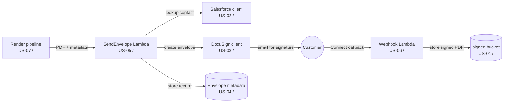

# Decomposition Diagrams

Enrich an already-pushed decomposition with **architecture diagrams**: a small
per-story diagram showing what each user story *builds* and where it's *used*, plus a
high-level *service-interaction* diagram on the epic — then **embed each diagram inline
at the top of the matching Jira issue** and mirror the explanatory sections back into
the editable tree. Idempotent: re-running never duplicates an attachment or an embed.

This is the **optional final polish** step of the pipeline, run after the issues exist:

```
spec-to-stories → decomposition-to-jira → jira-tree → jira-push → [decomposition-diagrams]
(decompose)        (build jira-plan.json) (edit mirror) (push to Jira)   (diagram + embed — this skill)
```

Like its siblings it is a **hybrid skill**: a deterministic **engine** turns
`graph.yaml` into baseline mermaid sources and rewrites cross-references to live Jira
keys; the **agent** refines the diagrams, pushes the enrichment prose via the Atlassian
Jira MCP, and embeds the rendered PNGs by delegating to the **jira-image-embed** skill.
The engine never touches Jira.

## Why this exists (and the core learning)

Jira Cloud **cannot** embed an image from a markdown description: the Atlassian MCP
writes markdown → ADF, and a markdown image reference to an attachment filename becomes
an image node pointing at a bare path, which Cloud renders as a broken placeholder.
True inline embedding needs the description written as **raw ADF** with a `media` node
— which is exactly what the **jira-image-embed** skill does over the REST API. So this
skill *authors and renders* the diagrams, *attaches + embeds* them via jira-image-embed,
and uses the MCP only for the text (prose) parts of the description.

## Self-sufficient bundle

```
.kiro/skills/decomposition-diagrams/
  SKILL.md                 this file
  USER-README.md           user-facing guide
  requirements.txt         pyyaml, playwright, hypothesis, pytest
  engine/
    graph.py               load graph.yaml; delivers / depends_on / consumers queries
    mermaid.py             build_story_diagram, build_epic_overview (baseline .mmd)
    keymap.py              load_key_map + remap (US-xx -> live Jira key, protected)
    generate.py            write all .mmd for a decomposition (CLI: python -m engine.generate)
    render.py              render *.mmd -> *.png via headless Chromium (CLI: python -m engine.render)
  tests/
    test_engine.py         graph queries, baseline mermaid, remap (incl. property-based)
```

Run the engine from the bundle root (`python -m pytest`). It depends only on the target
decomposition's `graph.yaml` and (for live keys + summaries) its `jira-tree/`.

## Inputs

- A decomposition dir `.kiro/specs/<parent>/decomposition/` containing:
  - **`graph.yaml`** — the source of truth for components (`"<kind>:<name>" -> US-xx`)
    and dependency `edges` (`from` depends on `to`, `via` components). **Reverse the
    edges to answer "where is this used?"** (see `graph.consumers`).
  - **`jira-tree/`** — the editable mirror; `_placeholders.md` holds the
    `tree-key -> Jira-key` map (written by jira-push), and each `US-xx/story.md`
    front-matter gives the story `summary`.
- Live Jira issues already pushed (epic + a story per `US-xx`), carrying the set label
  `s2s-<parent>`. If they don't exist yet, run **jira-push** first.
- The **jira-image-embed** skill available at `.kiro/skills/jira-image-embed/`, and the
  **Atlassian Jira MCP** connected (tool prefix `mcp_atlassian_jira_*`).

## Steps

### 1. Verify the engines

```
python -m pytest                                   # this skill's engine
python -m pytest ../jira-image-embed               # the embed engine you delegate to
```

Sanity-check the MCP with a read before any write (e.g.
`jira_get_user_profile martin.whipp@d55.co.uk`). If disconnected, ensure
`.kiro/settings/atlassian.env` holds a valid token and reconnect the `atlassian`
server.

### 2. Generate baseline mermaid sources

```
python -m engine.generate .kiro/specs/<parent>/decomposition
```

Writes `<decomposition>/diagrams/`:

- `epic-service-interaction.mmd` — a component/story **overview** with a TODO banner.
- `<US-xx>.mmd` — per story: a `builds` subgraph of the components it delivers, the
  foundation stories it depends on feeding in, and the consuming stories fanning out,
  each arrow labelled with the `via` components. Grounded entirely in `graph.yaml`, so
  the "where used" arrows are accurate rather than guessed.

### 3. Refine the diagrams (agent)

The per-story baselines are usually good enough to ship after a quick read. **The epic
diagram is not** — `graph.yaml` encodes build dependencies, not the runtime flow — so
rewrite `epic-service-interaction.mmd` into the real end-to-end sequence
(render → send → sign → webhook → store), annotating each participant with its
delivering story (`US-xx / <key>`). Worked example (from the DocuSign pipeline):



Keep each story's own key in its diagram title (`US-xx / <key> builds`) so the image is
self-identifying. Commit the `.mmd` sources — they are the regenerable source of truth.

### 4. Render to PNG

```
python -m engine.render .kiro/specs/<parent>/decomposition/diagrams
```

Renders every `*.mmd` to a sibling full-resolution `*.png`. **Verify before shipping:**
mermaid renders a *syntax-error* graphic instead of failing loudly, and a container can
cap the width — the renderer already sizes each SVG to its intrinsic `viewBox`, but
eyeball the PNGs (or serve the folder over `http.server` and open them; the `file:`
scheme is blocked in the headless browser). Distinct, sensibly-sized PNGs = good.

### 5. Enrich the tree mirror + push the prose to Jira

For each issue, add an **`## Architecture`** section (stories) or
**`## Service interaction`** section (epic) that explains the diagram in prose. Do it in
the **tree mirror first** (`jira-tree/<US-xx>/story.md`, `jira-tree/epic.md`) so the
repo stays the source of truth — using tree keys (`US-04`), matching the mirror's
convention.

Then push each description to Jira via the MCP. Because the mirror uses tree keys but
live descriptions use clickable Jira keys, rewrite before pushing:

```python
from engine.keymap import load_key_map, remap
key_map = load_key_map(".kiro/specs/<parent>/decomposition/jira-tree/_placeholders.md")
body_for_jira = remap(mirror_body_without_frontmatter, key_map)   # US-xx -> [KEY](url)
# jira_update_issue(<key>, fields={"description": body_for_jira})
```

`remap` only rewrites whole `US-xx` tokens and leaves identity labels
(`s2s-<parent>-US-01`) and diagram filenames (`US-04.png`) untouched; it is idempotent.

> **Round-trip note.** Re-pushing a full body via the MCP reproduces the same content
> (the reader's `\*\*`, `{{…}}` and dropped `+` are *serialization artifacts*, not new
> corruption — compare a get before/after). Prefer building the body from the **clean
> mirror markdown**, not from a `jira_get_issue` read, which is lossier.

### 6. Embed each diagram inline — delegate to jira-image-embed

**Order matters:** push the prose (step 5) *first*, then embed — the MCP write replaces
the whole description and would wipe a media node added earlier.

From the **jira-image-embed** bundle root:

```
python -m engine.embed <ISSUE_KEY> <diagrams>/<US-xx>.png --position top --heading "Overview"
```

- `--position top` puts the diagram at the top of the description (an at-a-glance
  overview); `--heading "Overview"` adds a labelled H3 above it (only if not already
  present).
- Reuses an existing attachment of the same name — no duplicate upload.
- Each line ends `adf=True img=True` on success (media node persisted **and** the
  rendered description contains an ``).

Repeat for the epic (`epic-service-interaction.png`) and every story.

### 7. Verify

- Every embed reported `adf=True img=True`. If any is `skipped (already embedded)`
  (e.g. from a re-run), confirm separately that the media node + `` are present.
- Spot-check an issue in Jira: diagram at the top under "Overview", prose section in
  the body, cross-references are live links, no duplicate attachments.
- Re-run steps 6 against the same issues and confirm everything reports already-embedded
  (idempotency).

### 8. Commit

Commit the `diagrams/` folder (`.mmd` **and** `.png`) and the updated `jira-tree`
bodies. The Jira embeds are a snapshot that can drift; the repo copy stays canonical.

## Gotchas (learned the hard way)

1. **Markdown can't embed on Cloud.** Use jira-image-embed (raw-ADF media node), not a
   markdown/`!file!` image — those render as broken placeholders. This is the whole
   reason the skill exists.
2. **Push prose before embedding.** An MCP description update replaces the body and
   removes any media node; always embed *after* the last MCP write. To *reposition* an
   existing embed, strip the media node first (idempotency dedupes by URL, so a plain
   re-run won't move it).
3. **`graph.yaml` edges are build dependencies, not runtime flow.** Per-story diagrams
   derive cleanly; the epic service-interaction flow must be authored by hand.
4. **Attachments don't dedupe by filename.** jira-image-embed reuses by name; never
   blind-upload the same PNG twice.
5. **Protect identity labels + filenames when remapping.** `remap` won't touch
   `s2s-<parent>-US-01` or `US-04.png`. Don't hand-roll the substitution.
6. **Mermaid fails quietly.** A syntax error renders as a bomb graphic, not an
   exception — verify the PNGs. The renderer raises on `window.__err`, but still look.
7. **Don't reintroduce estimates.** If the decomposition scrubbed `Est (days)` from
   descriptions, keep it that way; `estimate_days` stays internal (front-matter only).

## Hard rules

- **Read before write.** Sanity-check the MCP with a read; embeds/writes are **not**
  auto-approved. Trial on a throwaway issue before bulk-embedding a real project.
- **Idempotent.** Attachments dedupe by filename, embeds by media URL, prose by clean
  re-push. Re-running adds nothing.
- **Faithful & non-destructive.** One diagram per story + one epic diagram; embed into
  the existing description (jira-image-embed inserts, never overwrites). Push the tree
  as reviewed; don't invent content.
- **Source of truth is the repo.** `.mmd` sources + tree bodies are canonical; Jira
  embeds are a snapshot. Commit them.
- **Never emit secrets.** The Jira token lives only in `.kiro/settings/atlassian.env`
  (git-ignored); nothing this skill writes or prints may contain it.
