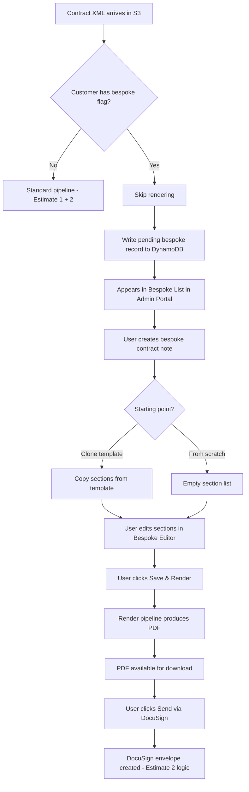
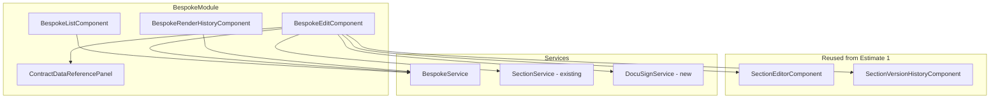

# Design Document: Contract Note Bespoke Contracts

## Overview

This design covers Estimate 4 of the Bryt Energy Contract Note Rework: enabling business users to create and manage bespoke (custom) contract notes for customers that don't fit the standard automated template pipeline.

The system introduces:
1. A pipeline skip mechanism for bespoke-flagged customers (Salesforce integration)
2. A Bespoke Contract Notes section in the Admin Portal (list, editor, render, DocuSign trigger)
3. On-demand rendering using the same section-render-and-stitch pipeline from Estimate 1
4. Manual DocuSign integration reusing the envelope logic from Estimate 2
5. Version history for both section edits and rendered outputs

## Architecture

### High-Level Flow



### Key Architecture Decisions

| Decision | Choice | Rationale |
|----------|--------|-----------|
| Bespoke flag source | Salesforce field lookup during pipeline processing | Single source of truth for customer data; avoids duplicating customer config |
| Section storage | Independent copies (not template references) | Bespoke edits must not affect standard templates; full isolation |
| Render mechanism | Reuse existing render pipeline Lambda (invoked synchronously) | Avoid code duplication; same section-render-and-stitch logic |
| DocuSign integration | Reuse Estimate 2's envelope creation logic | Same flow, just triggered manually instead of automatically |
| Contract data access | Store original contract JSON alongside the bespoke record | Available for reference panel and for render-time field resolution |
| Version history | Same pattern as standard sections (Estimate 1, Req 16) | Consistent UX; same DynamoDB version records |

## Components and Interfaces

### Frontend Components (Angular)



#### BespokeListComponent
- Table of all bespoke contract notes (filterable by status)
- Columns: Customer Name, BrytNumber, Offer Ref, Status, Created, Modified, User, Actions
- Actions: Edit, Download PDF (if rendered), Send via DocuSign (if rendered)
- Pending bespoke requests (from pipeline skip) highlighted for attention

#### BespokeEditComponent
- Reuses section management from TemplateEditComponent (add, remove, reorder, edit in designer)
- Additional panels: Contract Data Reference (right side), Render History (bottom)
- "Save & Render" button triggers on-demand rendering
- "Send via DocuSign" button (visible after render) triggers manual DocuSign flow
- Clone from template picker on creation

#### ContractDataReferencePanel
- Collapsible right panel showing the customer's contract JSON
- Grouped by category (offer, customer, pricing, MPANs, sites)
- Searchable/filterable
- Shows field name + current value

#### BespokeRenderHistoryComponent
- List of previous renders (version number, timestamp, user, PDF link)
- Current/latest version highlighted

### Backend API (Lambda Functions)

#### Bespoke API (`lambdas-rest-api/contract-note-bespoke/`)

| Method | Path | Handler | Description |
|--------|------|---------|-------------|
| GET | /contract-note-bespoke | list-bespoke | Lists all bespoke contract notes (filterable) |
| POST | /contract-note-bespoke | create-bespoke | Creates bespoke from pending request (clone or empty) |
| GET | /contract-note-bespoke/{id} | get-bespoke | Returns bespoke contract note with sections and metadata |
| PUT | /contract-note-bespoke/{id} | update-bespoke | Updates metadata |
| DELETE | /contract-note-bespoke/{id} | delete-bespoke | Deletes bespoke contract note |
| POST | /contract-note-bespoke/{id}/render | render-bespoke | Triggers on-demand render, returns PDF location |
| GET | /contract-note-bespoke/{id}/renders | list-renders | Returns render history |
| POST | /contract-note-bespoke/{id}/send-docusign | send-docusign | Triggers DocuSign envelope creation |
| GET | /contract-note-bespoke/{id}/contract-data | get-contract-data | Returns the customer's contract JSON for the reference panel |

### Render Pipeline Extension

The existing render-contract-note Lambda is extended with:
1. **Bespoke flag check** — queries Salesforce for the customer flag; if set, writes a pending record and halts
2. **On-demand render mode** — can be invoked synchronously (not just via S3 trigger) with a bespoke section configuration and contract data

The on-demand render follows the same flow: resolve sections → fetch schemas → render each via @pdfme/generator → stitch via pdf-lib → write to S3.

### DocuSign Integration (Reuse)

The `send-docusign` handler reuses the same logic as Estimate 2's Send Envelope Lambda:
1. Look up customer contact in Salesforce (using BrytNumber)
2. Create DocuSign envelope with the rendered PDF
3. Store envelope metadata
4. Webhook handler (Estimate 2) processes the completion as normal

## Data Models

### DynamoDB Records (in existing `ContractNoteTemplates` table or new `BespokeContracts` table)

#### Pending Bespoke Record (written by pipeline skip)

| Attribute | Type | Description |
|-----------|------|-------------|
| PK | String | `BESPOKE_PENDING#{brytNumber}` |
| SK | String | `OFFER#{offerReference}` |
| brytNumber | String | Customer BrytNumber |
| offerReference | String | Offer reference from contract data |
| customerName | String | Customer name |
| contractDataS3Key | String | S3 key of the original contract JSON |
| receivedAt | String | ISO 8601 timestamp when the pipeline received it |
| status | String | `pending` |

#### Bespoke Contract Note Record

| Attribute | Type | Description |
|-----------|------|-------------|
| PK | String | `BESPOKE#{bespokeId}` |
| SK | String | `METADATA` |
| bespokeId | String | UUID |
| brytNumber | String | Customer BrytNumber |
| offerReference | String | Offer reference |
| customerName | String | Customer name |
| contractDataS3Key | String | S3 key of the contract JSON |
| clonedFromTemplateId | String | (optional) Template ID if cloned |
| status | String | draft, rendering, rendered, failed |
| currentRenderS3Key | String | (optional) S3 key of latest rendered PDF |
| currentRenderVersion | Number | Current render version number |
| docusignEnvelopeId | String | (optional) Envelope ID if sent to DocuSign |
| docusignStatus | String | (optional) sent, completed, declined, expired |
| createdAt | String | ISO 8601 timestamp |
| updatedAt | String | ISO 8601 timestamp |
| createdBy | String | Cognito username |
| updatedBy | String | Cognito username |

#### Bespoke Section Record

| Attribute | Type | Description |
|-----------|------|-------------|
| PK | String | `BESPOKE#{bespokeId}` |
| SK | String | `SECTION#{sortOrder}#{sectionId}` |
| sectionId | String | UUID |
| name | String | Section display name |
| sortOrder | Number | Position within bespoke contract |
| isShared | Boolean | Whether this references a shared section |
| sharedSectionId | String | (optional) Reference to shared section |
| schemaS3Key | String | S3 key for schema JSON |
| versionNumber | Number | Current version number |
| createdAt | String | ISO 8601 timestamp |
| updatedAt | String | ISO 8601 timestamp |

#### Bespoke Render History Record

| Attribute | Type | Description |
|-----------|------|-------------|
| PK | String | `BESPOKE#{bespokeId}` |
| SK | String | `RENDER#{version}` |
| version | Number | Render version number |
| pdfS3Key | String | S3 key of the rendered PDF |
| renderedAt | String | ISO 8601 timestamp |
| renderedBy | String | Cognito username |
| status | String | success, failed |
| errorMessage | String | (optional) Error details if failed |

### TypeScript Interfaces

```typescript
interface BespokeContractNote {
  bespokeId: string;
  brytNumber: string;
  offerReference: string;
  customerName: string;
  contractDataS3Key: string;
  clonedFromTemplateId?: string;
  status: BespokeStatus;
  currentRenderS3Key?: string;
  currentRenderVersion: number;
  docusignEnvelopeId?: string;
  docusignStatus?: string;
  createdAt: string;
  updatedAt: string;
  createdBy: string;
  updatedBy: string;
}

type BespokeStatus = 'pending' | 'draft' | 'rendering' | 'rendered' | 'failed';

interface BespokeRender {
  version: number;
  pdfS3Key: string;
  renderedAt: string;
  renderedBy: string;
  status: 'success' | 'failed';
  errorMessage?: string;
}

interface PendingBespokeRequest {
  brytNumber: string;
  offerReference: string;
  customerName: string;
  contractDataS3Key: string;
  receivedAt: string;
}
```

## Correctness Properties

### Property 1: Bespoke-flagged customers produce no automated output

*For any* customer with the Bespoke_Flag set in Salesforce, the render pipeline SHALL NOT produce an output PDF and SHALL NOT trigger DocuSign.

**Validates: Requirements 1.1, 1.2, 1.3**

### Property 2: Pipeline skip creates pending record

*For any* bespoke-flagged customer whose contract data arrives in the pipeline, a pending bespoke record SHALL be created with the correct BrytNumber, offer reference, and contract data reference.

**Validates: Requirements 1.4**

### Property 3: Clone from template produces independent copies

*For any* bespoke contract note cloned from a template, the resulting sections SHALL be independent copies. Modifying the bespoke sections SHALL NOT affect the original template, and modifying the template SHALL NOT affect the bespoke contract.

**Validates: Requirements 3.3**

### Property 4: On-demand render produces valid PDF

*For any* bespoke contract note with valid sections and contract data, invoking "Save & Render" SHALL produce a non-empty PDF and update the status to "rendered".

**Validates: Requirements 5.1, 5.2, 5.3**

### Property 5: Render history is append-only

*For any* sequence of renders on a bespoke contract note, the render history SHALL contain all previous versions and the version numbers SHALL be monotonically increasing.

**Validates: Requirements 6.1, 6.2, 6.3**

### Property 6: DocuSign trigger uses correct rendered PDF

*For any* "Send via DocuSign" action, the system SHALL use the latest rendered PDF (current version) for the DocuSign envelope.

**Validates: Requirements 7.1, 7.2**

### Property 7: Bespoke list reflects current state

*For any* set of bespoke contract notes, the list SHALL reflect the most recent status, render state, and DocuSign state for each.

**Validates: Requirements 2.1, 2.2, 2.4**

## Error Handling

### Pipeline Skip

| Scenario | Handling |
|----------|----------|
| Salesforce lookup fails | Log error; proceed with standard pipeline (fail-safe: don't block if we can't check the flag) |
| Pending record write fails | Log error to error bucket; contract data is still in S3 for manual recovery |

### Bespoke API

| Scenario | Handling | HTTP Status |
|----------|----------|-------------|
| Pending request not found | Return 404 | 404 |
| Bespoke not found | Return 404 | 404 |
| Render while already rendering | Return 409 (conflict) | 409 |
| Render failure | Update status to "failed", store error message | 200 (async result) |
| DocuSign send without rendered PDF | Return 400 | 400 |
| DocuSign send failure | Log error, return error details | 500 |

### On-Demand Render

| Scenario | Handling |
|----------|----------|
| Section schema missing | Update status to "failed" with section details |
| Section render fails (pdf-me) | Update status to "failed" with error |
| PDF stitching fails | Update status to "failed" with error |
| S3 write fails | Update status to "failed" with error |

## Testing Strategy

### Unit Testing

- **Pipeline skip logic** — Salesforce flag check, pending record creation
- **Bespoke CRUD** — create from pending, clone from template, section management
- **On-demand render orchestration** — section resolution, pipeline invocation, status updates
- **Render history management** — version tracking, append-only behaviour

### Property-Based Testing

Key generators:
1. **Bespoke contract note generator** — random valid bespoke records
2. **Section configuration generator** — random valid section lists
3. **Contract data generator** — random valid contract JSON payloads
4. **Render result generator** — success/failure outcomes

### Integration Testing

- **Pipeline skip flow** — send contract data for bespoke customer → verify no PDF output, pending record created
- **Create and render flow** — create bespoke → add sections → render → verify PDF in S3
- **DocuSign flow** — render → send via DocuSign → verify envelope created
- **Clone flow** — clone from template → verify independent sections → edit bespoke → verify template unchanged
