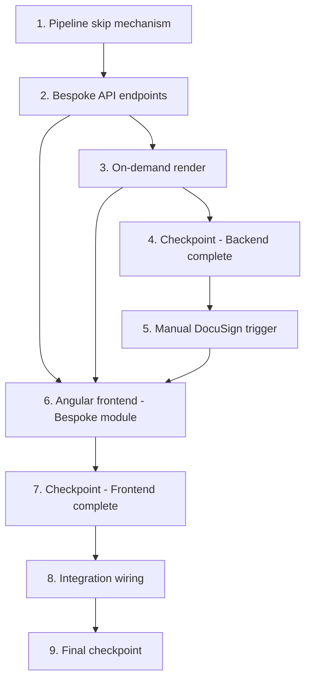

# Implementation Plan: Contract Note Bespoke Contracts

## Overview

Implement bespoke (custom) contract note management within the BrytAdminPortal, enabling business users to create one-off contract notes for customers that require non-standard documents. The system skips these customers in the automated pipeline, provides a manual editing and rendering workflow, and integrates with DocuSign for manual e-signature triggering.

## Tasks

- [ ] 1. Pipeline skip mechanism
  - [ ] 1.1 Implement Salesforce bespoke flag check in render pipeline
    - Before rendering, query Salesforce using customersalesforceref to check for bespoke flag
    - If flag is set: skip rendering, write pending bespoke record to DynamoDB, halt
    - If flag is not set: continue with standard pipeline
    - If Salesforce lookup fails: log warning and continue with standard pipeline (fail-safe)
    - _Requirements: 1.1, 1.2, 1.3_

  - [ ] 1.2 Implement pending bespoke record creation
    - Write record to DynamoDB with BrytNumber, offer reference, customer name, contract data S3 key, timestamp
    - Store the original contract JSON in S3 for later use by the bespoke editor
    - _Requirements: 1.4_

  - [ ]* 1.3 Write property tests for pipeline skip
    - **Property 1: Bespoke-flagged customers produce no automated output**
    - **Property 2: Pipeline skip creates pending record**
    - **Validates: Requirements 1.1, 1.2, 1.3, 1.4**

- [ ] 2. Bespoke API endpoints
  - [ ] 2.1 Implement `list-bespoke` handler
    - Return all bespoke contract notes, including pending requests
    - Support status filter query parameter
    - Return: customer name, BrytNumber, offer ref, status, dates, user, PDF link (if rendered)
    - _Requirements: 2.1, 2.2, 2.3, 2.4_

  - [ ] 2.2 Implement `create-bespoke` handler
    - Accept pending request reference (BrytNumber + offer reference) and starting point (template ID or empty)
    - If cloning: copy all sections from template as independent records (new section IDs, own schema S3 keys)
    - Set status to "draft", record creating user
    - Remove/update the pending record status
    - _Requirements: 3.1, 3.2, 3.3, 3.4_

  - [ ] 2.3 Implement `get-bespoke` handler
    - Return bespoke metadata with section list, render history, DocuSign status
    - _Requirements: 4.1_

  - [ ] 2.4 Implement `update-bespoke` and `delete-bespoke` handlers
    - Update metadata, delete bespoke and associated sections
    - _Requirements: 4.1_

  - [ ] 2.5 Implement bespoke section management
    - Reuse section add/remove/reorder/schema logic from Estimate 1 (task 3.x)
    - Sections stored under PK `BESPOKE#{bespokeId}` instead of `TEMPLATE#{id}`
    - Support adding shared sections by reference
    - Support version history (same pattern as Estimate 1, Req 16)
    - _Requirements: 4.1, 4.2, 4.3, 4.5_

  - [ ] 2.6 Implement `get-contract-data` handler
    - Read the stored contract JSON from S3
    - Return parsed and categorised for the reference panel
    - _Requirements: 8.1, 8.2_

  - [ ]* 2.7 Write property tests for bespoke API
    - **Property 3: Clone from template produces independent copies**
    - **Property 7: Bespoke list reflects current state**
    - **Validates: Requirements 3.3, 2.1, 2.2, 2.4**

- [ ] 3. On-demand render (reuses the template-preview render pipeline)
  - [ ] 3.1 Extend the render pipeline to resolve bespoke sections
    - The on-demand render mode already exists (direct `contractData`, explicit target, custom `outputKey`, startable via StartExecution) — reuse it
    - Extend the `select-template` entry step to accept a `bespokeId` (or an explicit section-reference list) so the pipeline can render bespoke section copies stored under `BESPOKE#{bespokeId}` rather than only `TEMPLATE#{templateId}`
    - _Requirements: 5.1, 5.2_

  - [ ] 3.2 Implement `render-bespoke` handler (async start)
    - Set status to "rendering"
    - Start a render state-machine execution (reuse the `start-template-preview` pattern) with the bespoke section reference, stored contract data, and a versioned `outputKey`
    - Return 202 with the execution reference; increment render version number
    - _Requirements: 5.1, 5.2, 5.5_

  - [ ] 3.3 Implement `get-render` handler (poll + persist)
    - Poll the execution via DescribeExecution (reuse the `get-template-preview` pattern, including structured error extraction from the error bucket)
    - On success: persist PDF to the versioned render-history key, create render history record, update status to "rendered", set currentRenderS3Key
    - On failure: update status to "failed", store error message in render history
    - _Requirements: 5.3, 5.4_

  - [ ] 3.4 Implement `list-renders` handler
    - Return render history records ordered by version descending
    - Include PDF download links (pre-signed S3 URLs)
    - _Requirements: 6.1, 6.2, 6.3_

  - [ ]* 3.5 Write property tests for on-demand render
    - **Property 4: On-demand render produces valid PDF**
    - **Property 5: Render history is append-only**
    - **Validates: Requirements 5.1, 5.2, 5.3, 6.1, 6.2, 6.3**

- [ ] 4. Checkpoint - Backend complete
  - Ensure all tests pass, ask the user if questions arise.

- [ ] 5. Manual DocuSign trigger
  - [ ] 5.1 Implement `send-docusign` handler
    - Validate bespoke has status "rendered" and a current PDF
    - Reuse Estimate 2's logic: Salesforce contact lookup, DocuSign JWT auth, envelope creation
    - Store envelope ID on the bespoke record
    - Update DocuSign status field on status changes (via existing webhook from Estimate 2)
    - _Requirements: 7.1, 7.2, 7.3, 7.4_

  - [ ]* 5.2 Write property tests for DocuSign trigger
    - **Property 6: DocuSign trigger uses correct rendered PDF**
    - **Validates: Requirements 7.1, 7.2**

- [ ] 6. Angular frontend - Bespoke module
  - [ ] 6.1 Create BespokeModule with routing and BespokeService
    - Routes: bespoke list, bespoke edit
    - BespokeService: list, create, get, update, delete, render, poll render status, list renders, send DocuSign, get contract data
    - Reuse the existing `ContractNoteGroupGuardService` (CONTRACT_NOTE_ADMINS) for route guarding — already built
    - _Requirements: 9.1_

  - [ ] 6.2 Implement BespokeListComponent
    - Table with columns: Customer, BrytNumber, Offer Ref, Status, Created, Modified, User, Actions
    - Status filter (pending, draft, rendered, failed)
    - Row actions: Edit, Download PDF, Send via DocuSign
    - Pending requests highlighted with "Create Bespoke" action
    - _Requirements: 2.1, 2.2, 2.3, 2.4_

  - [ ] 6.3 Implement BespokeEditComponent
    - Section management (reuse patterns from TemplateEditComponent)
    - Section editor integration (reuse SectionEditorComponent)
    - Version history per section (reuse SectionVersionHistoryComponent)
    - "Save & Render" button with loading state and success/error feedback (reuse the template-edit poll loop and base64 → blob → new-tab PDF rendering)
    - "Send via DocuSign" button (visible when status = rendered)
    - DocuSign status display (sent, completed, declined, expired)
    - _Requirements: 4.1, 4.2, 4.3, 4.5, 5.1, 7.1_

  - [ ] 6.4 Implement ContractDataReferencePanel
    - Collapsible right panel showing customer's contract JSON
    - Grouped by category (offer, customer, pricing, MPANs, sites)
    - Search/filter input
    - Shows field name + current value
    - _Requirements: 8.1, 8.2, 8.3, 8.4_

  - [ ] 6.5 Implement BespokeRenderHistoryComponent
    - List of renders with version, timestamp, user, status, download link
    - Current version highlighted
    - _Requirements: 6.1, 6.2, 6.3_

  - [ ] 6.6 Implement creation flow (template picker dialog)
    - Select pending request
    - Choose starting point: clone from template (template picker) or start empty
    - _Requirements: 3.1, 3.2_

  - [ ]* 6.7 Write unit tests for bespoke components
    - BespokeListComponent: rendering, filtering, action triggers
    - BespokeEditComponent: render button states, DocuSign button visibility
    - ContractDataReferencePanel: search/filter, category grouping
    - _Requirements: 2.1, 5.3, 8.3_

- [ ] 7. Checkpoint - Frontend complete
  - Ensure all tests pass, ask the user if questions arise.

- [ ] 8. Integration wiring
  - [ ] 8.1 Wire CDK deployment
    - Add API Gateway routes for bespoke endpoints
    - Ensure Lambda IAM permissions for DynamoDB, S3, Salesforce (secrets), DocuSign (secrets)
    - Grant the bespoke render handler permission to start and describe the render state machine execution (StartExecution/DescribeExecution), and read the output/error buckets — mirroring the template-preview handler permissions
    - _Requirements: 1.1, 5.1, 7.2, 9.1_

  - [ ] 8.2 Add navigation entry in Admin Portal sidebar for Bespoke Contract Notes
    - Add menu item linking to bespoke list route
    - Ensure visibility gated by Cognito group membership
    - _Requirements: 9.1_

  - [ ]* 8.3 Write integration tests
    - Test: contract data for bespoke customer → verify pending record, no PDF output
    - Test: create bespoke from pending → add sections → render → verify PDF in S3
    - Test: clone from template → edit bespoke section → verify template unchanged
    - Test: render → send via DocuSign → verify envelope created
    - _Requirements: 1.1, 3.3, 5.1, 7.2_

- [ ] 9. Final checkpoint
  - Ensure all tests pass, ask the user if questions arise.

## Task Dependency Graph



Execution waves (tasks in the same wave have no dependency on each other and may run in parallel):

```json
{
  "waves": [
    { "wave": 1, "tasks": ["1"] },
    { "wave": 2, "tasks": ["2"] },
    { "wave": 3, "tasks": ["3"] },
    { "wave": 4, "tasks": ["4"] },
    { "wave": 5, "tasks": ["5"] },
    { "wave": 6, "tasks": ["6"] },
    { "wave": 7, "tasks": ["7"] },
    { "wave": 8, "tasks": ["8"] },
    { "wave": 9, "tasks": ["9"] }
  ]
}
```

Notes on ordering:
- Task 1 (pipeline skip + pending record) is independent and can start first; it feeds the pending requests the rest of the flow consumes.
- Task 3 (on-demand render) reuses the render state machine and start+poll pattern already built for template preview; its only pipeline change is extending section resolution (3.1), so it can start as soon as the bespoke section storage from Task 2 exists.
- Task 5 (manual DocuSign) reuses Estimate 2's envelope logic and depends only on a rendered PDF existing (Task 3).
- Task 6 (frontend) needs the API (Task 2), the render flow (Task 3), and the DocuSign trigger (Task 5) to wire the full editor; the group guard is reused from Estimate 1 and needs no new work.

## Notes

- Tasks marked with `*` are optional and can be skipped for faster MVP
- The bespoke editor reuses many components from Estimate 1 (section editor, version history, shared sections)
- On-demand render reuses the render state machine and the start-execution + poll pattern already built for template preview (not a synchronous Lambda invoke); the only render-pipeline change is extending section resolution to bespoke section copies
- DocuSign integration reuses Estimate 2's envelope creation — the existing webhook handler handles completion
- The pipeline skip is fail-safe: if Salesforce is unreachable, we proceed with standard rendering rather than blocking
- Clone from template creates fully independent copies to ensure bespoke edits never affect standard templates
