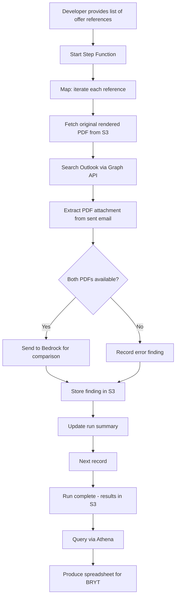
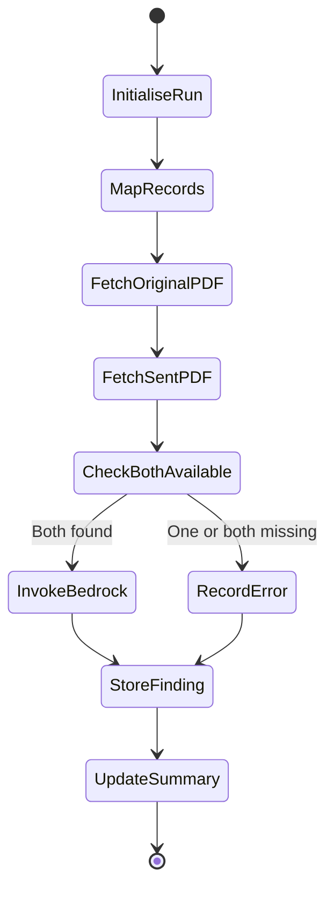

# Design Document: Contract Note Comparison Audit

## Overview

This design covers Estimate 5 of the Bryt Energy Contract Note Rework: an audit tool to detect whether contract note PDFs have been manually edited between rendering and sending to customers.

The system is a developer-operated Step Function pipeline that:
1. Accepts a batch of contract note references
2. Fetches the original rendered PDF from S3
3. Retrieves the actually-sent PDF from Outlook (via Microsoft Graph API)
4. Compares both using AWS Bedrock (Claude)
5. Stores findings in S3 (Athena-queryable)

This is not a user-facing product — it's an analytical tool run ad-hoc (e.g., monthly) with results delivered as a spreadsheet to BRYT.

## Architecture

### High-Level Flow



### Step Function Architecture



### Key Architecture Decisions

| Decision | Choice | Rationale |
|----------|--------|-----------|
| Orchestration | Step Functions (Map state) | Built-in iteration, error handling, retry; proven pattern from past D55 work |
| PDF source (original) | S3 (existing pipeline output bucket) | Already stored by the current system |
| PDF source (sent) | Microsoft Graph API (Outlook search) | The sent email is the source of truth for what the customer received |
| Comparison engine | AWS Bedrock (Claude) | Can compare PDFs visually/textually; handles nuance; proven in D55's past work |
| Results storage | S3 (JSON, date-partitioned) | Athena-queryable; simple; no database needed; matches established D55 pattern |
| Prompt management | SSM Parameter Store | Easy to update without redeployment; versioned |
| Operation model | Developer-operated, ad-hoc | Not a production system; monthly batch runs with manual analysis |

## Components

### Step Function: `CompareContractNotes`

**Input:**
```json
{
  "runId": "uuid",
  "references": [
    { "offerReference": "OP-56412", "documentId": "2000896" },
    { "offerReference": "OP-57234", "documentId": "2001660" }
  ]
}
```

**States:**

1. **InitialiseRun** (Lambda)
   - Create run summary record in S3
   - Set all records to "queued" status

2. **MapRecords** (Map state, max concurrency: 5)
   - Iterates each reference

3. **FetchOriginalPDF** (Lambda)
   - Look up original PDF in S3 by offer reference / document ID
   - Store temporarily for comparison

4. **FetchSentPDF** (Lambda)
   - Authenticate to Graph API
   - Search mailbox for sent email containing the offer reference
   - Download PDF attachment
   - Store temporarily for comparison

5. **InvokeBedrock** (Lambda)
   - Load comparison prompt from SSM Parameter Store
   - Convert PDFs to base64 or extract text (depending on prompt strategy)
   - Invoke Bedrock (Claude) with both documents + prompt
   - Parse response into structured finding

6. **StoreFinding** (Lambda)
   - Write finding JSON to S3 at partitioned path
   - Update record status

7. **UpdateSummary** (Lambda)
   - Increment counters in run summary

### Lambda Functions

| Function | Purpose |
|----------|---------|
| `comparison-init` | Creates run record, validates input |
| `comparison-fetch-original` | Locates and reads original PDF from S3 |
| `comparison-fetch-sent` | Authenticates to Graph API, searches mail, extracts attachment |
| `comparison-invoke-bedrock` | Builds prompt, invokes Bedrock, parses response |
| `comparison-store-finding` | Writes finding record to S3 |
| `comparison-update-summary` | Updates run-level counters |

### Microsoft Graph API Integration

**Authentication:** OAuth 2.0 client credentials flow
- Tenant ID, Client ID, Client Secret stored in Secrets Manager
- Scope: `https://graph.microsoft.com/.default`
- Permission: `Mail.Read` (application-level, granted by BRYT's M365 admin)

**Mail Search:**
```
GET /users/{mailboxId}/messages?$filter=contains(subject, '{offerReference}')&$select=id,subject,hasAttachments
```

**Attachment Retrieval:**
```
GET /users/{mailboxId}/messages/{messageId}/attachments
```

Filter attachments by content type (application/pdf) and filename pattern.

### Bedrock Integration

**Model:** Claude (via Bedrock InvokeModel)

**Prompt strategy (initial — subject to iteration):**
```
You are comparing two versions of a contract note PDF.
Document A is the original rendered version.
Document B is the version that was actually sent to the customer.

Compare these two documents and determine:
1. Are they identical? (YES/NO)
2. If NO, describe each difference you can identify (text changes, added/removed content, formatting changes, etc.)

Respond in JSON format:
{
  "identical": true/false,
  "differences": [
    { "location": "page/section", "description": "what changed", "severity": "minor|major" }
  ],
  "summary": "one sentence summary"
}
```

**Note:** This prompt is the starting point. The developer will iterate on it over multiple cycles until the output quality meets BRYT's expectations. Budget time for 3-5 prompt iterations.

## Data Models

### S3 Structure

```
s3://bryt-comparison-results/
  runs/
    {runId}/
      summary.json          # Run-level summary
      input.json            # Original input list
  results/
    date={YYYY-MM-DD}/
      {runId}/
        {offerReference}.json   # Individual finding
```

### Finding Record

```json
{
  "offerReference": "OP-56412",
  "documentId": "2000896",
  "runId": "uuid",
  "status": "match|mismatch|error",
  "processedAt": "ISO-8601",
  "originalPdfS3Key": "s3://bucket/path/to/original.pdf",
  "sentPdfS3Key": "s3://bucket/path/to/sent.pdf (if found)",
  "emailSubject": "Contract Note - OP-56412 (if found)",
  "emailSentDate": "ISO-8601 (if found)",
  "comparison": {
    "identical": false,
    "differences": [
      { "location": "Page 2, pricing table", "description": "TPI commission rate changed from 0.355 to 0.400", "severity": "major" }
    ],
    "summary": "Pricing values were modified on page 2"
  },
  "promptVersion": "v3",
  "errorMessage": "null or error details"
}
```

### Run Summary Record

```json
{
  "runId": "uuid",
  "startedAt": "ISO-8601",
  "completedAt": "ISO-8601 (or null)",
  "totalRecords": 50,
  "processed": 50,
  "matches": 42,
  "mismatches": 5,
  "errors": 3,
  "promptVersion": "v3"
}
```

### Secrets Manager

**Graph API credentials:**
Secret name: `contract-note/graph-api`
```json
{
  "tenantId": "Azure AD tenant ID",
  "clientId": "App registration client ID",
  "clientSecret": "App registration client secret",
  "mailboxId": "user@bryt.energy or shared mailbox ID"
}
```

## Error Handling

| Scenario | Handling |
|----------|----------|
| Original PDF not in S3 | Record error finding, continue |
| Graph API auth failure | Record error finding, continue (may affect entire batch if token issue) |
| No matching email found | Record error finding, continue |
| Multiple emails found | Use most recent, log warning |
| PDF attachment not on email | Record error finding, continue |
| Bedrock invocation failure | Record error finding, retry once, continue |
| Bedrock response unparseable | Record raw response as finding, flag for manual review |
| Step Function state failure | Built-in retry (2 attempts), then record error |

## Estimation Notes

This estimate should include:
- **Infrastructure build:** Step Function, Lambdas, S3 buckets, IAM roles, Secrets Manager (~3-4 days)
- **Graph API integration:** OAuth flow, mail search, attachment extraction (~2-3 days)
- **Bedrock integration:** Initial prompt, invocation, response parsing (~1-2 days)
- **Prompt iteration:** 3-5 cycles of refining the comparison prompt based on real results (~3-5 days)
- **Results analysis & reporting:** Running batches, querying Athena, producing spreadsheets for BRYT (~2-3 days per cycle)
- **Buffer:** Unexpected Graph API limitations, Bedrock output tuning (~2-3 days)

Total estimate range: **13-20 developer days** (including iteration cycles)
