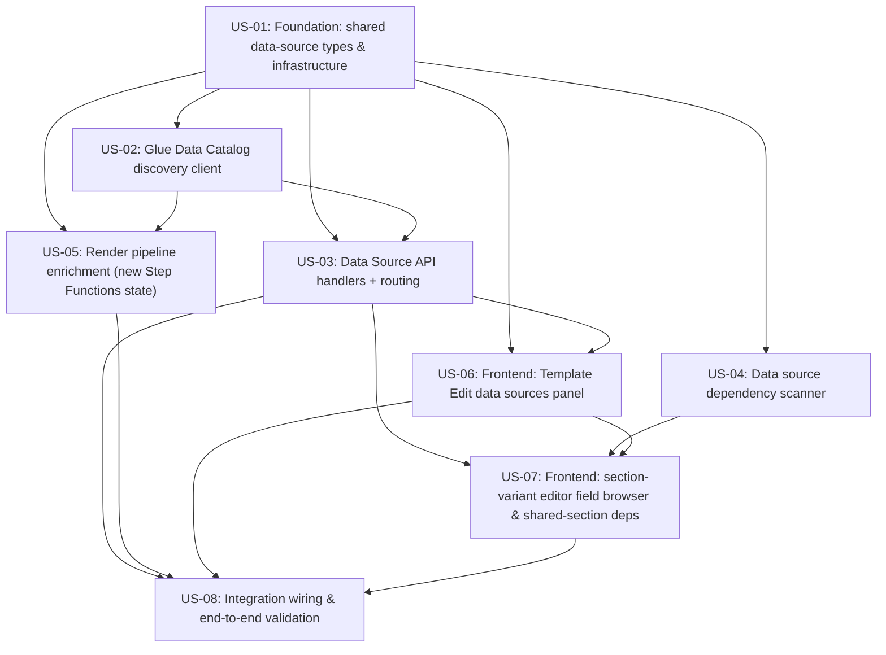

# Decomposition: contract-note-data-source-extensibility

This folder decomposes the parent spec into independently deliverable user stories. Each `stories/<id>/` folder is a self-contained Kiro spec a developer can copy into their own `.kiro/specs/`. `graph.yaml` holds the machine-readable dependency graph; `jira-import.csv` is ready for Jira's CSV importer.

**Status:** OK - no blocking issues

## Implementation waves

Stories in the same wave have no dependency on each other and can be built in parallel. Each wave depends only on earlier waves.

- **Wave 1:** US-01
- **Wave 2:** US-02, US-04
- **Wave 3:** US-03, US-05
- **Wave 4:** US-06
- **Wave 5:** US-07
- **Wave 6:** US-08

## Dependency graph

## Stories

| Story | Title | Exports | Depends on | Requirements |
|-------|-------|---------|-----------|--------------|
| US-01 | Foundation: shared data-source types & infrastructure | shared-lib:data-source-types cdk-construct:project-role-trust-policy cdk-construct:athena-workgroup | - | 6 |
| US-02 | Glue Data Catalog discovery client | shared-lib:glue-catalog-client | shared-lib:data-source-types cdk-construct:project-role-trust-policy | 1 |
| US-04 | Data source dependency scanner | shared-lib:dependency-scanner | shared-lib:data-source-types | 4 |
| US-03 | Data Source API handlers + routing | api-endpoint:GET /contract-note-data-sources api-endpoint:GET /contract-note-data-sources/{database}/{table}/columns api-endpoint:GET /contract-note-templates/{templateId}/data-sources api-endpoint:POST /contract-note-templates/{templateId}/data-sources api-endpoint:DELETE /contract-note-templates/{templateId}/data-sources/{database}/{table} api-endpoint:GET /contract-note-shared-sections/{sharedSectionId}/data-source-dependencies cdk-construct:DataSourceApi | shared-lib:data-source-types shared-lib:glue-catalog-client cdk-construct:project-role-trust-policy | 2, 7 |
| US-05 | Render pipeline enrichment (new Step Functions state) | shared-lib:athena-client lambda:enrich-data-sources state-machine:render-pipeline-enrichment | shared-lib:data-source-types shared-lib:glue-catalog-client cdk-construct:project-role-trust-policy cdk-construct:athena-workgroup | 5 |
| US-06 | Frontend: Template Edit data sources panel | service:DataSourceService frontend-component:template-edit-data-sources-panel frontend-component:data-source-picker-dialog | shared-lib:data-source-types api-endpoint:GET /contract-note-data-sources api-endpoint:GET /contract-note-templates/{templateId}/data-sources api-endpoint:POST /contract-note-templates/{templateId}/data-sources api-endpoint:DELETE /contract-note-templates/{templateId}/data-sources/{database}/{table} | 2 |
| US-07 | Frontend: section-variant editor field browser & shared-section deps | frontend-component:section-variant-field-browser frontend-component:shared-section-dependency-check frontend-component:shared-section-deps-display | service:DataSourceService api-endpoint:GET /contract-note-data-sources/{database}/{table}/columns api-endpoint:GET /contract-note-shared-sections/{sharedSectionId}/data-source-dependencies shared-lib:dependency-scanner | 3, 4 |
| US-08 | Integration wiring & end-to-end validation | cdk-instance:deployment | cdk-construct:DataSourceApi lambda:enrich-data-sources state-machine:render-pipeline-enrichment frontend-component:template-edit-data-sources-panel frontend-component:section-variant-field-browser | 6 |
