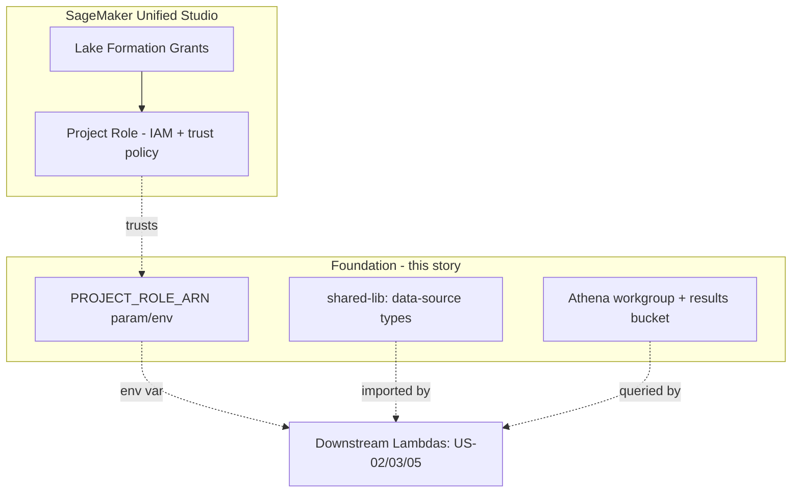

# Design Document

**Story US-01 — Foundation: shared data-source types & infrastructure**

> Mini-spec derived from parent spec **contract-note-data-source-extensibility**, story **US-01**.
> This design is an excerpt of the parent design scoped to this story's components.

## Overview

This story implements the base layer of Estimate 3b: the shared data-source type surface, the Project Role trust-policy change that lets the data-source and enrichment Lambdas inherit Lake Formation grants, and the Athena workgroup + results bucket used at render time. It adds no discovery, attachment, or enrichment behaviour itself — those are delivered by downstream stories that consume this foundation. It extends the landed Estimate 1 system (`BrytBusinessServices` `shared-lib/` and `cdk/`) rather than replacing any of it.

## Architecture

This story owns the IAM trust seam and the Athena configuration that the data-source Lambdas (US-02, US-03) and the enrichment state (US-05) assume/use, plus the shared types that all downstream stories import.



### Project Role trust policy

The Project Role's trust policy is modified to allow the data source Lambda execution roles (the API list/columns handlers and the `enrich-data-sources` handler) to assume it, alongside the existing `sagemaker.amazonaws.com` service principal:

```json
{
  "Version": "2012-10-17",
  "Statement": [
    {
      "Effect": "Allow",
      "Principal": { "Service": "sagemaker.amazonaws.com" },
      "Action": "sts:AssumeRole"
    },
    {
      "Effect": "Allow",
      "Principal": {
        "AWS": [
          "arn:aws:iam::{account}:role/{prefix}list-available-data-sources-role",
          "arn:aws:iam::{account}:role/{prefix}get-data-source-columns-role",
          "arn:aws:iam::{account}:role/{prefix}enrich-data-sources-role"
        ]
      },
      "Action": "sts:AssumeRole"
    }
  ]
}
```

The Project Role ARN is exposed as a CDK parameter / environment variable (`PROJECT_ROLE_ARN`) so downstream handler constructs can pass it to the Glue/Athena-backed Lambdas.

## Components and Interfaces

### `cdk-construct:project-role-trust-policy`

Modifies the Unified Studio Project Role trust policy to add the relevant Lambda execution roles as trusted principals, grants those roles `sts:AssumeRole` for the Project Role ARN, and exposes `PROJECT_ROLE_ARN` as a CDK parameter/env var. Assumption: the Project Role is managed by/importable into this stack; if it is externally owned, the trust-policy edit is applied via its owning stack (**assumption** — the parent spec does not state which stack owns the Project Role).

### `cdk-construct:athena-workgroup`

Creates/configures an Athena workgroup for contract note queries plus an S3 results location, and grants the Project Role access to both. These are consumed at render time by the enrichment state (US-05) and passed as Athena config env vars to the data-source Lambdas.

### `shared-lib:data-source-types`

Extends `shared-lib/types.ts`:
- Adds `TemplateDataSource` and `SharedSectionDataSourceDependency` to `ContractNoteEntityType`.
- Adds `TemplateDataSourceRecord` and `SharedSectionDataSourceDependencyRecord` DynamoDB shapes.
- Adds `AvailableDataSource`, `DataSourceColumn`, `TemplateDataSource`, `SectionDataSourceDependency` interfaces.
- Adds SK type aliases (`DataSourceSortKey`, `DataSourceDepSortKey`) and extends `ContractNoteDynamoDbRecord`.

### Interfaces consumed (dependencies)

None — this is a wave-1 foundation story.

### Touch points with other stories

- Exposes `PROJECT_ROLE_ARN` and the Athena workgroup/results config for US-02 (discovery), US-03 (data source API), and US-05 (enrichment) to consume as env vars.
- Exposes the shared data-source types imported by US-02, US-03, US-04, US-05, and US-06.
- Assumes downstream stories create the named Lambda execution roles referenced in the trust policy; the concrete ARNs are wired when those constructs are instantiated.

## Data Models

This story defines the record shapes but writes no data itself. Two new entity types are added to the existing single DynamoDB table via `shared-lib/types.ts`:

### Template Data Source Record

| Attribute | Type | Description |
|-----------|------|-------------|
| PK | `TEMPLATE#{templateId}` | Existing template partition |
| SK | `DATASOURCE#{database}#{tableName}` | Data source attachment |
| entityType | `"TemplateDataSource"` | |
| database | String | Glue database name |
| tableName | String | Glue table name |
| displayName | String | User-friendly name (defaults to table name) |
| attachedAt | String | ISO 8601 timestamp |
| attachedBy | String | Cognito username |

### Shared Section Dependency Record

| Attribute | Type | Description |
|-----------|------|-------------|
| PK | `SHARED_SECTION#{sharedSectionId}` | Existing shared section partition |
| SK | `DATASOURCE_DEP#{database}#{tableName}` | Dependency |
| entityType | `"SharedSectionDataSourceDependency"` | |
| database | String | Glue database name |
| tableName | String | Glue table name |

### TypeScript Interfaces (added to `shared-lib/types.ts`)

```typescript
interface AvailableDataSource {
  database: string;
  tableName: string;
  columns: DataSourceColumn[];
  location?: string;
}

interface DataSourceColumn {
  name: string;
  type: string;
}

interface TemplateDataSource {
  database: string;
  tableName: string;
  displayName: string;
  attachedAt: string;
  attachedBy: string;
}

interface SectionDataSourceDependency {
  database: string;
  tableName: string;
}
```

## Correctness Properties

> This foundation story has no natural parent correctness property (parent properties 1–11 concern discovery, attachment, and enrichment behaviour delivered by downstream stories). One story-local property is added, continuing the parent numbering.

### Property 12: Project Role assumption is least-privilege

*For any* Lambda execution role listed as a trusted principal on the Project Role, that role SHALL be able to assume the Project Role, and *for any* role not listed, assumption SHALL be denied. **Validates: Requirements 6.1, 6.2**

## Error Handling

| Scenario | Handling |
|----------|----------|
| Project Role ARN not resolvable at synth time | CDK synth fails fast with a clear message; deployment blocked |
| Trusted Lambda role ARN missing/misconfigured | The downstream `AssumeRole` call fails at runtime and is surfaced by the consuming story (US-02/03/05) as a 500/`handle-failure`; not handled here |
| Athena workgroup/results bucket misconfigured | Detected by downstream query execution; this story ensures the workgroup and bucket exist with Project Role access |

## Testing Strategy

### Unit / build testing
- Type-check `shared-lib/types.ts` to confirm the new entity types, records, interfaces, and SK aliases compile and integrate with `ContractNoteDynamoDbRecord`.
- CDK synth/build to confirm the trust policy renders the expected principals and the Athena workgroup + results bucket are created with Project Role grants.

### Integration testing
- Deploy the stack to a test account and confirm each named Lambda execution role can assume the Project Role while an unlisted role cannot (validates Property 12).
- Confirm the Project Role can run a trivial query in the configured workgroup and write results to the results bucket.
