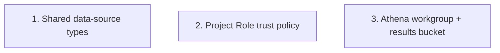

# Implementation Plan: Foundation: shared data-source types & infrastructure

> Mini-spec derived from parent spec **contract-note-data-source-extensibility**, story **US-01**.
> Implement only after the stories this one depends on (see `manifest.yaml` /
> `../../graph.yaml`) are complete. This is a wave-1 foundation story with no upstream
> dependencies, so it can start immediately.

## Overview

This story implements the shared data-source type surface plus the two CDK infrastructure changes (Project Role trust policy and Athena workgroup + results bucket) that underpin every other story in the decomposition. Its tasks correspond to parent tasks 1.1–1.3 and belong to wave 1 of the parent wave plan; US-02 through US-06 all depend on the outputs here.

## Tasks

- [ ] 1. Extend `shared-lib/types.ts` with data source entities
  - Add `TemplateDataSource` and `SharedSectionDataSourceDependency` to `ContractNoteEntityType`
  - Add records: `TemplateDataSourceRecord` (`PK: TEMPLATE#{id}`, `SK: DATASOURCE#{db}#{table}`) and `SharedSectionDataSourceDependencyRecord` (`PK: SHARED_SECTION#{id}`, `SK: DATASOURCE_DEP#{db}#{table}`)
  - Add `AvailableDataSource`, `DataSourceColumn`, `TemplateDataSource`, `SectionDataSourceDependency` interfaces
  - Add SK type aliases (`DataSourceSortKey`, `DataSourceDepSortKey`) and extend `ContractNoteDynamoDbRecord`
  - _Requirements: 2.1, 2.2 (parent 2.1, 4.1)_

- [ ] 2. Modify Project Role trust policy to allow Lambda assumption
  - Add the data source API + `enrich-data-sources` Lambda execution roles as trusted principals on the Unified Studio Project Role
  - Ensure those Lambda roles have `sts:AssumeRole` for the Project Role ARN
  - Expose Project Role ARN as a CDK parameter / env var (`PROJECT_ROLE_ARN`)
  - _Requirements: 1.1, 1.2 (parent 6.1, 6.2)_

- [ ] 3. Configure Athena workgroup and results bucket
  - Create/configure an Athena workgroup for contract note queries and an S3 results location
  - Ensure the Project Role has access to the workgroup and results location
  - _Requirements: 3.1, 3.2 (parent 5.3)_

## Task Dependency Graph



Execution waves (tasks in the same wave have no dependency on each other and may run in parallel):

```json
{
  "waves": [
    { "wave": 1, "tasks": ["1", "2", "3"] }
  ]
}
```

Notes on ordering:
- All three tasks are independent of one another and can run in parallel within this story.

## Upstream story dependencies

None — this is a wave-1 foundation story.

## Notes

- Tasks marked with `*` are optional and can be deferred for a faster MVP. (This story has no optional tasks.)
- Task requirement ids are local; they annotate their parent requirement ids for
  traceability back to contract-note-data-source-extensibility.
- Downstream stories (US-02, US-03, US-04, US-05, US-06) all depend on the exports of this story: the shared types, the `PROJECT_ROLE_ARN`, and the Athena workgroup/results bucket.
