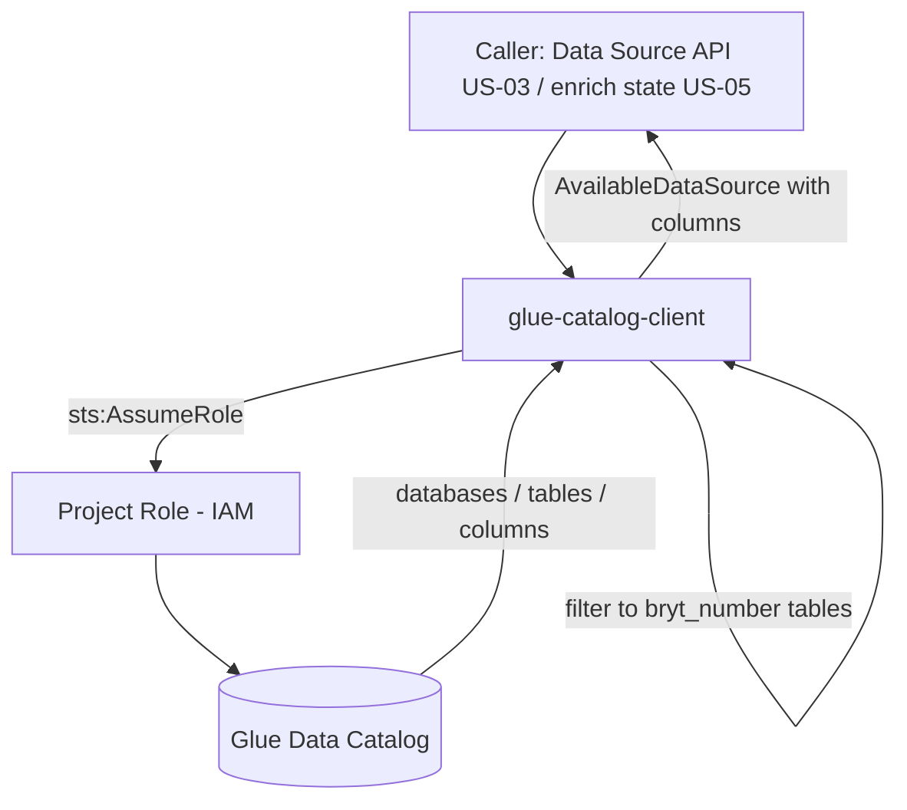

# Design Document

**Story US-02 — Glue Data Catalog discovery client**

> Mini-spec derived from parent spec **contract-note-data-source-extensibility**, story **US-02**.
> This design is an excerpt of the parent design scoped to this story's components.

## Overview

This story implements the Glue Data Catalog discovery slice of the architecture: a shared backend client (`shared-lib:glue-catalog-client`, living under `api/src/data-sources/`) that assumes the Unified Studio Project Role and reads catalog metadata. Discovery is the "read side" that feeds both the Admin Portal's available-data-sources list (via the API in US-03) and the render-time enrichment step (US-05). Because access is via the Project Role, any table the project is subscribed to in Unified Studio becomes discoverable with no per-table IAM change and no redeployment.

## Architecture

The client sits between the API/render Lambdas and AWS Glue. It assumes the Project Role once, then uses the temporary credentials to call the Glue Data Catalog. Only tables containing a `bryt_number` column are returned, since that column is the mandatory join key.



Key decisions inherited from the parent design:

| Decision | Choice | Rationale |
|----------|--------|-----------|
| Data source access | Assume Unified Studio Project Role | Inherits all Lake Formation grants automatically; no per-table IAM config |
| Catalog discovery | Glue Data Catalog API | Standard AWS metadata layer; Unified Studio uses Glue under the hood |
| BrytNumber constraint | Table must have `bryt_number` column | Enforces join-ability; filters out irrelevant tables |

## Components and Interfaces

### `shared-lib:glue-catalog-client` (exported)

Module under `api/src/data-sources/` providing two capabilities:

- **Discovery** — assume the Project Role to obtain temporary credentials, list the databases/tables in the project's Glue catalog, filter to tables containing a `bryt_number` column, and return `AvailableDataSource[]` (each with its `database`, `tableName`, and `columns`).
- **Column detail fetcher** — return the full column list (name and type) for a specific `{database}/{table}`, used by the Section Editor field browser and shared-section dependency checks.

```typescript
// discovery: list all joinable data sources visible to the Project Role
function listAvailableDataSources(): Promise<AvailableDataSource[]>;

// column detail for one table
function getDataSourceColumns(database: string, table: string): Promise<DataSourceColumn[]>;
```

### Interfaces consumed (dependencies)

- `shared-lib:data-source-types` (from US-01) — the `AvailableDataSource` and `DataSourceColumn` interfaces this client returns.
- `cdk-construct:project-role-trust-policy` (from US-01) — the Project Role trust policy modified to allow this module's Lambda execution role to `sts:AssumeRole`. Without it, discovery fails at AssumeRole.

### Touch points with other stories

- **Exposes** the `listAvailableDataSources` and `getDataSourceColumns` functions consumed by US-03 (`list-available` and `get-columns` handlers) and by US-05 (the enrichment state validates/reads catalog metadata).
- **Assumes** US-01 has published the data source type definitions and applied the trust-policy change and Project Role ARN configuration (`PROJECT_ROLE_ARN`).

## Data Models

This story defines no persistent data. It reads Glue Data Catalog metadata and maps it to the shared interfaces owned by US-01:

```typescript
interface AvailableDataSource {
  database: string;
  tableName: string;
  columns: DataSourceColumn[];
  location?: string;
}

interface DataSourceColumn {
  name: string;
  type: string; // Glue/Athena type: string, int, bigint, double, boolean, etc.
}
```

## Correctness Properties

### Property 1: Only bryt_number tables are discoverable

*For any* Glue table accessible via the Project Role, it SHALL appear in the available data sources list if and only if it contains a `bryt_number` column. **Validates: Requirements 1.4**

### Property 11: New subscriptions are immediately discoverable

*For any* data source subscribed to the Unified Studio project, it SHALL appear in the available data sources list without code changes or redeployment. **Validates: Requirements 1.3**

## Error Handling

| Scenario | Handling |
|----------|----------|
| AssumeRole failure (Project Role) | Log error and throw/propagate so the caller returns 500 |
| Glue catalog unreachable | Log error and propagate so the caller returns 503 |
| Table not found in catalog (column fetcher) | Propagate a not-found signal so the caller returns 404 |
| Table missing `bryt_number` column | Excluded from discovery results (filtered out) |

## Testing Strategy

### Unit Testing
- Table discovery — lists databases/tables via the assumed Project Role credentials.
- Column extraction — maps Glue column metadata to `DataSourceColumn` (name, type).
- `bryt_number` filtering — tables with the column are kept; tables without it are excluded.

### Property-Based Testing
Generator: random Glue table schemas with and without a `bryt_number` column.
- Property 1 — only `bryt_number` tables are discoverable.
- Property 11 — a newly subscribed table is discoverable on the next call with no code change.

### Integration Testing
- End-to-end discovery — subscribe a Glue table in Unified Studio, then verify it appears in the available list; remove the `bryt_number` column and verify it is filtered out.
