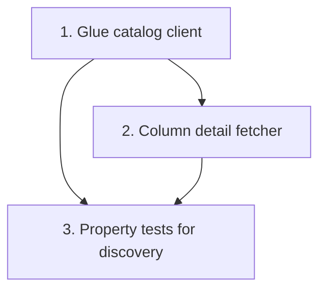

# Implementation Plan: Glue Data Catalog discovery client

> Mini-spec derived from parent spec **contract-note-data-source-extensibility**, story **US-02**.
> Implement only after the stories this one depends on (see `manifest.yaml` /
> `../../graph.yaml`) are complete.

## Overview

This story implements the Glue Data Catalog discovery client (`shared-lib:glue-catalog-client`) under `api/src/data-sources/`: it assumes the Unified Studio Project Role, lists the accessible Glue tables, filters to those containing a `bryt_number` column, and returns `AvailableDataSource[]` with columns, plus a per-table column detail fetcher. It is a Wave 2 story that builds on US-01's shared types and trust-policy change, and its output is consumed downstream by US-03 (Data Source API) and US-05 (render enrichment).

## Tasks

- [ ] 1. Implement Glue catalog client (assumes Project Role)
  - AssumeRole → temporary credentials for the Project Role
  - List databases/tables in the project's Glue catalog
  - Filter to tables containing a `bryt_number` column; return structured `AvailableDataSource[]` with columns
  - _Requirements: 1.1, 1.2, 1.4_

- [ ] 2. Implement column detail fetcher
  - Return full column list (name, type) for a specific `{database}/{table}`
  - _Requirements: 2.1, 2.2_

- [ ]* 3. Property tests for discovery
  - **Property 1: Only bryt_number tables are discoverable**
  - **Property 11: New subscriptions are immediately discoverable**
  - _Requirements: 1.3, 1.4_

## Task Dependency Graph



Execution waves (tasks in the same wave have no dependency on each other and may run in parallel):

```json
{
  "waves": [
    { "wave": 1, "tasks": ["1"] },
    { "wave": 2, "tasks": ["2"] },
    { "wave": 3, "tasks": ["3"] }
  ]
}
```

## Upstream story dependencies

- US-01 — provides `shared-lib:data-source-types` (the `AvailableDataSource` / `DataSourceColumn` interfaces) and `cdk-construct:project-role-trust-policy` (the trust-policy change that lets this module assume the Project Role).

## Notes

- Tasks marked with `*` are optional and can be deferred for a faster MVP.
- Task requirement ids are local; they annotate their parent requirement ids for
  traceability back to contract-note-data-source-extensibility (local Req 1 = parent Req 1; local Req 2 = parent Reqs 3.4/7.4).
