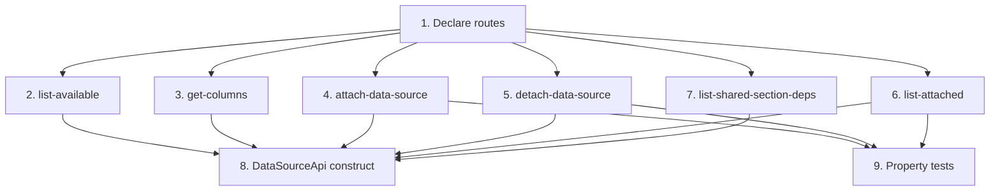

# Implementation Plan: Data Source API handlers + routing

> Mini-spec derived from parent spec **contract-note-data-source-extensibility**, story **US-03**.
> Implement only after the stories this one depends on (see `manifest.yaml` /
> `../../graph.yaml`) are complete.
>
> NOTE: Kiro's spec-format checks require the `## Task Dependency Graph` section to
> include BOTH a mermaid graph and a JSON `waves` block. `## Overview` and `## Notes`
> are recommended. Keep them all so the folder is a valid, pullable Kiro spec.

## Overview

This story implements the Data Source API: route declarations in `contract-note-foundation.ts`, six per-operation Lambda handlers under `api/src/data-sources/`, and the `DataSourceApi` CDK construct that wires them. It is a **Wave 3** story that depends on the shared data source types (US-01), the Glue catalog client (US-02), and the Project Role trust policy (US-01). Its endpoints are consumed downstream by the frontend and integration stories (US-06, US-07, US-08).

## Tasks

- [ ] 1. Declare routes in `contract-note-foundation.ts`
  - Add a `contract-note-data-sources` root resource (+ `{database}/{table}/columns`)
  - Add `data-sources` (collection) under the existing `contract-note-templates/{templateId}` resource
  - Add `data-source-dependencies` under `contract-note-shared-sections/{sharedSectionId}`
  - Extend `ContractNoteApiRoutes` with `DataSourceRouteResources`
  - _Requirements: 2.2_

- [ ] 2. Implement `list-available` handler
  - Call the Glue client (assumes Project Role); return `[{ database, tableName, columnCount }]`
  - _Requirements: 2.1_

- [ ] 3. Implement `get-columns` handler
  - Return column names and types for a specific `{database}/{table}`
  - _Requirements: 2.4_

- [ ] 4. Implement `attach-data-source` handler
  - Validate the table exists and has a `bryt_number` column; write the `DATASOURCE` record under the template
  - _Requirements: 1.2, 2.2, 2.5_

- [ ] 5. Implement `detach-data-source` handler
  - Scan all sections' variants for referencing fields; return 409 with the affected section+variant list, else remove the record
  - _Requirements: 1.3, 1.4, 2.2_

- [ ] 6. Implement `list-attached` handler
  - Query the `DATASOURCE` records for a template
  - _Requirements: 1.1, 2.3_

- [ ] 7. Implement `list-shared-section-deps` handler
  - Query the `DATASOURCE_DEP` records for a shared section
  - _Requirements: 3.1_

- [ ] 8. Create `DataSourceApi` CDK construct
  - Mirror `template-api.ts`: per-op `NodejsFunction`s, grant table/Glue/Athena/AssumeRole, wire `LambdaIntegration`s, pass `PROJECT_ROLE_ARN` + Athena config
  - Instantiate the construct in `contract-note-stack.ts`
  - _Requirements: 2.6_

- [ ]* 9. Property tests for data source API
  - **Property 2: attachment round-trip**, **Property 3: detachment with variant-field-in-use warning**
  - _Requirements: 1.1, 1.2, 1.4_

## Task Dependency Graph



Execution waves (tasks in the same wave have no dependency on each other and may run in parallel):

```json
{
  "waves": [
    { "wave": 1, "tasks": ["1"] },
    { "wave": 2, "tasks": ["2", "3", "4", "5", "6", "7"] },
    { "wave": 3, "tasks": ["8", "9"] }
  ]
}
```

## Upstream story dependencies

- **US-01** — `shared-lib:data-source-types` and `cdk-construct:project-role-trust-policy`.
- **US-02** — `shared-lib:glue-catalog-client`.

## Notes

- Tasks marked with `*` are optional and can be deferred for a faster MVP.
- Task requirement ids are local; they annotate their parent requirement ids for
  traceability back to contract-note-data-source-extensibility.
- One Lambda per operation under `api/src/data-sources/`; routes declared centrally in `contract-note-foundation.ts`; construct mirrors `template-api.ts`.
- The `detach-data-source` in-use check scans all of a template's sections' variants for namespaced field references before allowing removal.
