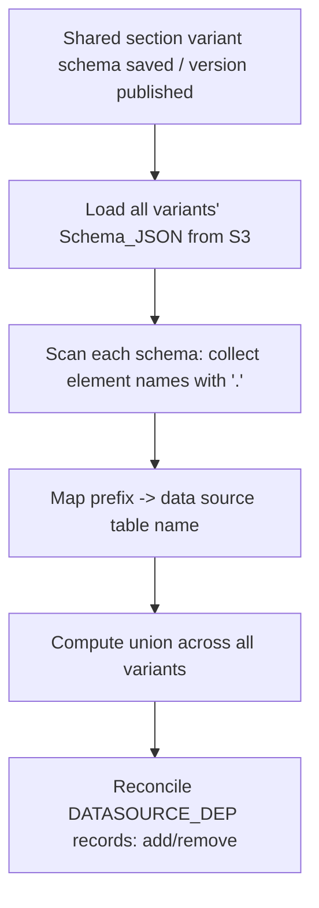

# Design Document

**Story US-04 — Data source dependency scanner**

> Mini-spec derived from parent spec **contract-note-data-source-extensibility**, story **US-04**.
> This design is an excerpt of the parent design scoped to this story's components.
>
> NOTE: the sections `## Overview`, `## Architecture`, `## Components and Interfaces`
> and `## Data Models` are REQUIRED by Kiro's spec-format checks; the sections
> `## Correctness Properties`, `## Error Handling` and `## Testing Strategy` are
> recommended. Keep all of them so the folder is a valid, pullable Kiro spec.

## Overview

This story implements the shared dependency scanner (`shared-lib:dependency-scanner`).
It is a shared utility that derives a shared section's data source dependencies from
the pdf-me Schema_JSON of its variants. Dependencies are auto-tracked (no manual
config): the scanner reads the namespaced pdf-me element `name`s (`{table}.{column}`),
maps the prefix to a data source table, and — on schema save or version publish —
reconciles the shared section's `DATASOURCE_DEP` records to equal the union of data
sources referenced across all of the section's variants.

## Architecture

Dependencies are scoped **per shared section, aggregated across all its variants'
schemas** (a shared section depends on the union of data sources any variant
references), matching the parent design's dependency-scope decision. The scanner is a
shared library surface hooked into the existing `save-section-schema` /
`publish-section-version` flow for shared sections.



## Components and Interfaces

`shared-lib:dependency-scanner` exposes two responsibilities lifted from the parent
design's "Dependency scanner (shared util)":

- **pdf-me schema field-reference scanner** — given schema JSON (`{ schemas: [[...]] }`),
  walk all page arrays, collect element `name`s containing a `.`, and map the prefix to
  a data source table name. The `.`-namespaced name is the dependency-scan marker.
- **Shared section dependency recompute** — on a shared section variant schema save or
  version publish, scan all variants' current schemas, compute the union of referenced
  data sources, and reconcile (add/remove) the shared section's `DATASOURCE_DEP`
  records. Hooks into the existing `save-section-schema` / `publish-section-version`
  flow for shared sections.

### Interfaces consumed (dependencies)

- `shared-lib:data-source-types` (from US-01) — the `SharedSectionDataSourceDependency`
  entity type and record shape (`PK: SHARED_SECTION#{id}`, `SK: DATASOURCE_DEP#{database}#{tableName}`)
  and the `SectionDataSourceDependency` interface used when reconciling records.

### Touch points with other stories

- **Exposes to US-07:** the scanner and the recompute hook, so the shared-section
  attachment dependency check (missing-dependency enforcement) has authoritative
  `DATASOURCE_DEP` data to read.
- **Assumes from US-01:** the shared data source types and record definitions exist in
  `shared-lib/types.ts`.

## Data Models

This story reads pdf-me Schema_JSON from S3 and writes the shared section dependency
records. It defines no new record shapes of its own (the shape is owned by US-01).

### Shared Section Dependency Record (reconciled by this story)

Keyed per shared section, aggregated across variants.

| Attribute | Type | Description |
|-----------|------|-------------|
| PK | `SHARED_SECTION#{sharedSectionId}` | Existing shared section partition |
| SK | `DATASOURCE_DEP#{database}#{tableName}` | Dependency |
| entityType | `"SharedSectionDataSourceDependency"` | |
| database | String | Glue database name |
| tableName | String | Glue table name |

### Field Reference Format in pdf-me Schema JSON (read)

A data source field is a normal pdf-me element whose `name` is namespaced:

```json
{
  "schemas": [
    [
      { "name": "credit_data.credit_score", "type": "text", "position": { "x": 120, "y": 200 }, "width": 50, "height": 12 }
    ]
  ]
}
```

The scanner walks every page array, collects element `name`s containing a `.`, and maps
the prefix (`credit_data`) to a data source table name.

## Correctness Properties

### Property 5: Shared section dependency = union across variants

*For any* shared section, its dependency list SHALL equal the set of distinct data sources referenced by the fields across all of its variants' schemas. **Validates: Requirements 4.1, 4.2, 4.5**

## Error Handling

- **Malformed / non-namespaced element names** — element `name`s without a `.` are core
  contract fields and are ignored; they never produce a dependency.
- **Prefix not matching a known data source** — a namespaced prefix that maps to no
  known/attached data source is scanned but should not create a spurious record; the
  reconcile step only persists resolvable table names.
- **Missing or unreadable variant schema in S3** — surfaced by the calling
  save/publish flow; the recompute should fail loudly rather than persisting a partial
  union that could drop a real dependency.

## Testing Strategy

### Unit Testing
- **Dependency scanner** — extracting namespaced field references from pdf-me
  `{ schemas: [[...]] }` across multiple pages and multiple variants; ignoring core
  (non-`.`) names; de-duplicating repeated references.
- **Recompute/reconcile** — adding newly-referenced data sources and removing dependencies
  no longer referenced by any variant.

### Property-Based Testing
- **pdf-me schema generator** — random multi-page schemas with variant field references
  (namespaced and core) to exercise Property 5.

### Integration Testing
- Save a shared section variant schema referencing a new data source → verify the
  `DATASOURCE_DEP` records reconcile to the union across all variants.
