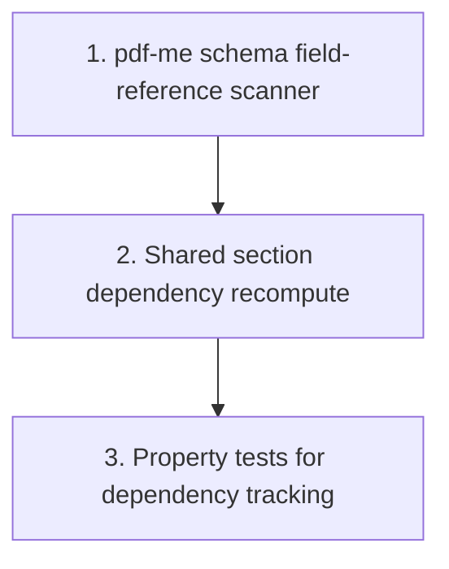

# Implementation Plan: Data source dependency scanner

> Mini-spec derived from parent spec **contract-note-data-source-extensibility**, story **US-04**.
> Implement only after the stories this one depends on (see `manifest.yaml` /
> `../../graph.yaml`) are complete.
>
> NOTE: Kiro's spec-format checks require the `## Task Dependency Graph` section to
> include BOTH a mermaid graph and a JSON `waves` block. `## Overview` and `## Notes`
> are recommended. Keep them all so the folder is a valid, pullable Kiro spec.

## Overview

This story implements the shared dependency scanner util (`shared-lib:dependency-scanner`):
the pdf-me schema field-reference scanner and the shared-section dependency recompute
that reconciles `DATASOURCE_DEP` records as the union across all variants' schemas. It
is a Wave 2 story that depends on the shared data source types from US-01 and feeds the
shared-section dependency checks in US-07.

## Tasks

- [ ] 1. Implement pdf-me schema field-reference scanner
  - Given schema JSON (`{ schemas: [[...]] }`), walk all pages, collect element `name`s containing a `.`, map prefix → table name
  - _Requirements: 1.1_

- [ ] 2. Implement shared section dependency recompute
  - On shared section variant schema save / version publish: scan all variants' current schemas, compute the union of referenced data sources, and reconcile `DATASOURCE_DEP` records (add/remove)
  - Hook into the existing `save-section-schema` / `publish-section-version` flow for shared sections
  - _Requirements: 1.1, 1.2, 1.3_

- [ ]* 3. Property tests for dependency tracking
  - **Property 5: dependency = union across variants**
  - _Requirements: 1.1, 1.2, 1.3_

## Task Dependency Graph



Execution waves (tasks in the same wave have no dependency on each other and may run in parallel):

```json
{
  "waves": [
    { "wave": 1, "tasks": ["1"] },
    { "wave": 2, "tasks": ["2"] },
    { "wave": 3, "tasks": ["3"] }
  ]
}
```

## Upstream story dependencies

- US-01 (`shared-lib:data-source-types`) — shared TypeScript interfaces and the `SharedSectionDataSourceDependency` record shape used to reconcile `DATASOURCE_DEP` records.

## Notes

- Tasks marked with `*` are optional and can be deferred for a faster MVP.
- Task requirement ids are local; they annotate their parent requirement ids (parent Requirement 4) for traceability back to contract-note-data-source-extensibility.
- Dependencies are tracked at the **shared-section level** as the union across its variants' schemas; per-template checks stay simple.
- Field namespacing (`table.column`) both avoids collisions and acts as the dependency-scan marker in pdf-me element names.
