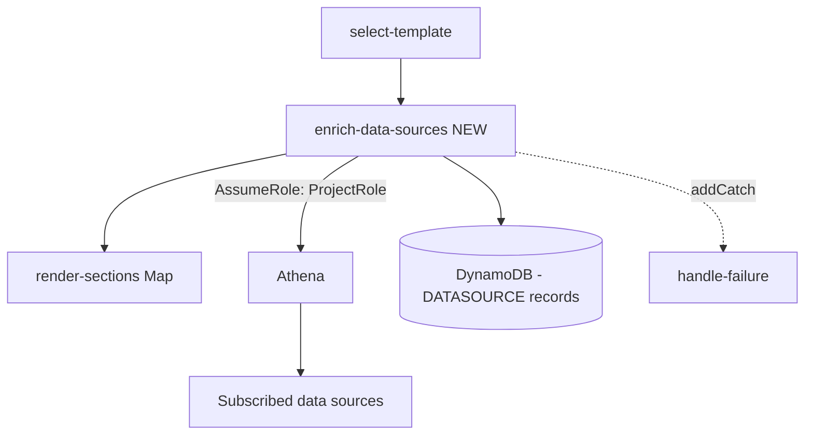

# Design Document

**Story US-05 — Render pipeline enrichment (new Step Functions state)**

> Mini-spec derived from parent spec **contract-note-data-source-extensibility**, story **US-05**.
> This design is an excerpt of the parent design scoped to this story's components.

## Overview

This story implements Athena-based enrichment as a **new Step Functions state**, keyed on BrytNumber. The landed render pipeline (Estimate 1) is a Step Functions state machine, not a single Lambda. This story adds an `enrich-data-sources` Lambda and inserts it as a state between `select-template` and `render-sections`, so enrichment happens once and the enriched `ContractData` fans into every section-render Map iteration. `render-section` and `variant-selection` need no changes.

## Architecture

The existing pipeline is extended with one new state that reuses the existing `handle-failure` catch:

```
Existing:
  parse-input → select-template → RenderSections(Map) → stitch → write-output

Extended:
  parse-input → select-template → enrich-data-sources → RenderSections(Map) → stitch → write-output
                                        ↘ (addCatch) handle-failure
```



The new state is added to the `[parseInput, selectTemplate, renderSections, stitch, writeOutput]` catch-registration array so failures route to `handle-failure` like every other state.

## Components and Interfaces

### `shared-lib:athena-client` (`api/src/render/athena-client.ts`)

Athena query executor:
- Assume the Project Role → temporary credentials.
- Run `SELECT * FROM {database}.{table} WHERE bryt_number = ? LIMIT 1`.
- Await completion; parse the result set to a key-value map.
- No rows → return empty. Multiple rows → use the first row and log a warning. Athena error/timeout → throw.

### `lambda:enrich-data-sources` (`api/src/render/enrich-data-sources.ts`)

Handler contract:
- **Input:** `SelectTemplateResult` (`{ contractData, template, sections, inputFile, contractSummary }`).
- **Behaviour:**
  1. Read the template's attached data sources (`DATASOURCE` records) from DynamoDB.
  2. If none, return the event unchanged (no Athena calls — Requirement 1.7).
  3. Extract BrytNumber from `contractData` (`customerreference`).
  4. Assume the Project Role once; for each data source run the lookup query via Athena (queries issued concurrently).
  5. Merge each result into `contractData` under `{table}.{column}`.
  6. On zero rows: log warning, leave namespace absent/empty. On Athena error/timeout: throw (caught → `handle-failure`).
- **Output:** the same event shape with an enriched `contractData`, so `RenderSections` and `render-section` need no changes.

### `state-machine:render-pipeline-enrichment` (`cdk/lib/contract-notes/render-pipeline.ts`)

- Add an `EnrichDataSourcesHandler` `NodejsFunction` (table read, Project Role assume, Athena env config).
- Insert `enrichDataSources` between `selectTemplate` and `renderSections` in the chain.
- Add it to the array that registers the `handle-failure` catch.
- Grant `props.table.grantReadData` and Athena/AssumeRole permissions.

### Interfaces consumed (dependencies)

- `shared-lib:data-source-types` (US-01) — `TemplateDataSource` records/interfaces and the `EnrichedContractData` shape.
- `shared-lib:glue-catalog-client` (US-02) — Project Role assumption pattern reused by the Athena client.
- `cdk-construct:project-role-trust-policy` (US-01) — trust policy listing the `enrich-data-sources` execution role as an allowed principal.
- `cdk-construct:athena-workgroup` (US-01) — Athena workgroup + S3 results location the executor targets.

### Touch points with other stories

- **Exposes:** an enriched `ContractData` (namespaced fields) flowing into the render Map — consumed downstream by US-08 integration wiring.
- **Assumes others expose:** the `DATASOURCE` attachment records (written by the Data Source API), the shared data source types, the trust policy, and the Athena workgroup.

## Data Models

This story defines no new persisted records. It **reads** the Template Data Source attachment record created by US-01/US-03:

| Attribute | Type | Description |
|-----------|------|-------------|
| PK | `TEMPLATE#{templateId}` | Existing template partition |
| SK | `DATASOURCE#{database}#{tableName}` | Data source attachment |
| entityType | `"TemplateDataSource"` | |
| database | String | Glue database name |
| tableName | String | Glue table name |

At render time it produces the enriched shape:

```typescript
type EnrichedContractData = ContractData & {
  [tableName: string]: { [columnName: string]: unknown } | unknown;
};
```

## Correctness Properties

### Property 7: Enrichment produces namespaced data

*For any* template with attached data sources, and contract data containing a valid BrytNumber, the enrichment state SHALL produce `ContractData` where each data source's columns are accessible under the `{tableName}.{columnName}` namespace. **Validates: Requirements 5.3, 5.4**

### Property 8: Empty enrichment is a pass-through

*For any* template with no attached data sources, the enrichment state SHALL return the contract data unchanged and issue no Athena queries. **Validates: Requirements 5.7**

### Property 9: Missing data source rows produce empty fields (not failure)

*For any* data source query that returns zero rows for the given BrytNumber, the enrichment state SHALL continue with those fields empty rather than halting. **Validates: Requirements 5.5**

### Property 10: Data source query failure routes to handle-failure

*For any* data source query that fails with an Athena error or timeout, the enrichment state SHALL throw so the state machine routes to `handle-failure`. **Validates: Requirements 5.6**

## Error Handling

### Render Pipeline Error Handling (`enrich-data-sources` state)

| Scenario | Handling |
|----------|----------|
| AssumeRole failure | Throw → caught by `handle-failure`; error written to error bucket |
| Athena query timeout (>30s) | Throw → `handle-failure` |
| Athena query returns error | Throw with query details → `handle-failure` |
| No rows returned for BrytNumber | Log warning; continue with empty namespace |
| Multiple rows returned | Use first row; log warning |
| No attached data sources | Return event unchanged; no Athena calls |

## Testing Strategy

### Unit Testing
- **Athena query builder** — correct SQL generation, BrytNumber parameterization.
- **Data enrichment merger** — correct namespacing, empty result handling, no-attachment pass-through.

### Property-Based Testing
Key generators:
1. **Template attachment generator** — random valid attachments.
2. **Athena result generator** — random results including empty/null values.

Validates Properties 7, 8, 9, and 10.

### Integration Testing
- **Enrichment flow** — attach data source → drop XML → verify `enrich-data-sources` populates namespaced fields → verify they render in the stitched PDF.
- **Missing data graceful handling** — render with a BrytNumber that has no matching row → empty fields, no crash, pipeline completes.
- **Failure routing** — force an Athena error → verify the state machine reaches `handle-failure` and writes to the error bucket.
