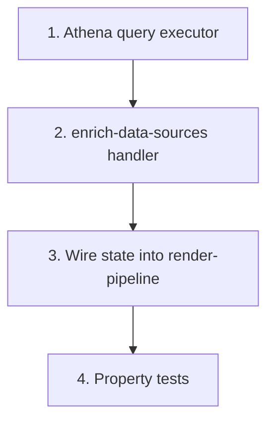

# Implementation Plan: Render pipeline enrichment (new Step Functions state)

> Mini-spec derived from parent spec **contract-note-data-source-extensibility**, story **US-05**.
> Implement only after the stories this one depends on (see `manifest.yaml` /
> `../../graph.yaml`) are complete.

## Overview

This story implements render-time enrichment as a new Step Functions state. It is a Wave 3 backend story: it builds the Athena query executor, the `enrich-data-sources` handler, and the pipeline wiring that inserts the state between `select-template` and `render-sections`. It depends on the shared types, Glue catalog client, Project Role trust policy, and Athena workgroup delivered by earlier waves (US-01, US-02). Downstream, US-08 integration wiring depends on it.

## Tasks

- [ ] 1. Implement Athena query executor (`api/src/render/athena-client.ts`): assume Project Role; run `SELECT * FROM {db}.{table} WHERE bryt_number = ? LIMIT 1`; parse rows; no rows -> empty, multiple -> first+warn, error -> throw
  - _Requirements: 1.3, 1.5, 1.6 (parent 5)_

- [ ] 2. Implement `enrich-data-sources` handler (`api/src/render/enrich-data-sources.ts`): read template `DATASOURCE` records; none -> pass through; extract `customerreference`; query each source concurrently; merge under `{table}.{column}`
  - _Requirements: 1.1, 1.2, 1.3, 1.4, 1.7 (parent 5)_

- [ ] 3. Wire the state into `render-pipeline.ts`: add `EnrichDataSourcesHandler` `NodejsFunction`, insert between `selectTemplate` and `renderSections`, add to `handle-failure` catch array, grant table read + Athena/AssumeRole
  - _Requirements: 1.2, 1.6 (parent 5)_

- [ ]* 4. Property tests for enrichment (Property 7: namespaced data; 8: empty pass-through; 9: empty rows continue; 10: failure routes to handle-failure)
  - _Requirements: 1.3, 1.4, 1.5, 1.6, 1.7 (parent 5)_

## Task Dependency Graph



Execution waves (tasks in the same wave have no dependency on each other and may run in parallel):

```json
{
  "waves": [
    { "wave": 1, "tasks": ["1"] },
    { "wave": 2, "tasks": ["2"] },
    { "wave": 3, "tasks": ["3"] },
    { "wave": 4, "tasks": ["4"] }
  ]
}
```

## Upstream story dependencies

- US-01 — shared data source types, Project Role trust policy, Athena workgroup.
- US-02 — Glue catalog client (Project Role assumption pattern reused by the Athena client).

## Notes

- Tasks marked with `*` are optional and can be deferred for a faster MVP.
- Task requirement ids are local; they annotate their parent requirement ids for
  traceability back to contract-note-data-source-extensibility.
- Enrichment is a **new Step Functions state**, not inline in a single Lambda — it enriches once and the `RenderSections` Map fans the enriched `ContractData` to each `render-section`, so `render-section`/`variant-selection` need no changes.
- Data source attachments live on the template and are read at render time, so enrichment is independent of section version pinning.
- BrytNumber = `customerreference` in the contract payload.
