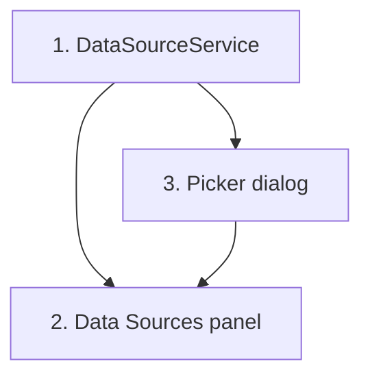

# Implementation Plan: Frontend: Template Edit data sources panel

> Mini-spec derived from parent spec **contract-note-data-source-extensibility**, story **US-06**.
> Implement only after the stories this one depends on (see `manifest.yaml` /
> `../../graph.yaml`) are complete.

## Overview

This story (Wave 4) delivers the Admin Portal front end for template data source
attachment: a `DataSourceService` wired to the US-03 API endpoints, a Data Sources panel
on the `template-edit` component, and a data source picker dialog. It covers parent
Requirement 2 from the frontend side and exposes `DataSourceService` for downstream
US-07 and US-08.

## Tasks

- [ ] 1. Implement `DataSourceService`
  - List available, get columns, attach/detach, list attached, list shared-section deps
  - Wire to the API Gateway endpoints (`GET /contract-note-data-sources`, `GET/POST/DELETE` on `/contract-note-templates/{templateId}/data-sources`)
  - _Requirements: 1.1, 1.5_

- [ ] 2. Extend template-edit component with a Data Sources panel
  - Show attached data sources with name and column count
  - [+ Attach] opens the picker of available (unattached) sources
  - Detach with confirmation warning if a variant references its fields (driven by the DELETE 409 affected section+variant list)
  - Available regardless of DRAFT/PUBLISHED
  - _Requirements: 1.1, 1.2, 1.3, 1.4, 1.6_

- [ ] 3. Implement data source picker dialog
  - Show available sources excluding attached, with table, database, and column count
  - Selecting a source attaches it via `DataSourceService` and refreshes the panel
  - _Requirements: 1.2_

## Task Dependency Graph



Execution waves (tasks in the same wave have no dependency on each other and may run in parallel):

```json
{
  "waves": [
    { "wave": 1, "tasks": ["1"] },
    { "wave": 2, "tasks": ["3"] },
    { "wave": 3, "tasks": ["2"] }
  ]
}
```

## Upstream story dependencies

- US-01 — `shared-lib:data-source-types` (shared TypeScript interfaces).
- US-03 — the data source API endpoints (`GET /contract-note-data-sources`, `GET/POST/DELETE` on `/contract-note-templates/{templateId}/data-sources`).

## Notes

- Tasks marked with `*` are optional and can be deferred for a faster MVP (this story has none).
- Task requirement ids are local; they annotate their parent requirement ids for
  traceability back to contract-note-data-source-extensibility (parent Requirement 2).
- `DataSourceService` is the shared client consumed downstream by US-07 and US-08.
