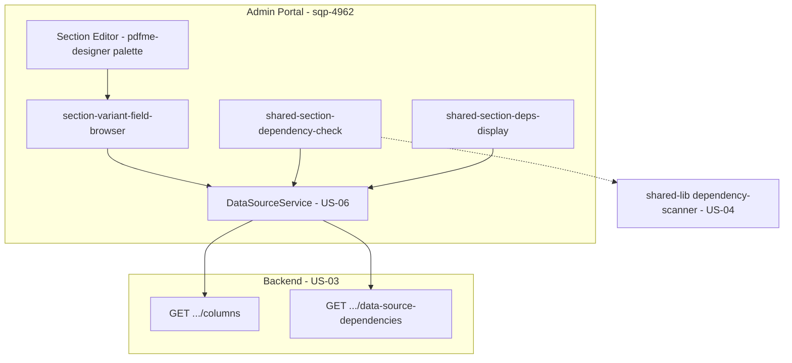

# Design Document

**Story US-07 — Frontend: section-variant editor field browser & shared-section deps**

> Mini-spec derived from parent spec **contract-note-data-source-extensibility**, story **US-07**.
> This design is an excerpt of the parent design scoped to this story's components.
>
> NOTE: the sections `## Overview`, `## Architecture`, `## Components and Interfaces`
> and `## Data Models` are REQUIRED by Kiro's spec-format checks; the sections
> `## Correctness Properties`, `## Error Handling` and `## Testing Strategy` are
> recommended. Keep all of them so the folder is a valid, pullable Kiro spec.

## Overview

This story implements the Admin Portal (`sqp-4962` baseline) frontend for data source fields. It extends the Section Editor's `pdfme-designer` field palette to show data source columns for the edited variant, adds a missing-dependency prompt when a shared section is added to a template, and shows a shared section's tracked data source dependencies on its detail screen. It is a pure frontend slice built on top of the `DataSourceService` (US-06), the backend API (US-03), and the shared dependency scanner (US-04).

## Architecture

The Section Editor edits a **variant's** schema and embeds the `pdfme-designer` web component (`portal/src/app/web-components/pdfme-designer/`). This story extends the field palette and the shared-section add/detail flows; it introduces no backend or storage. All data flows through `DataSourceService`.

## Components and Interfaces

### `frontend-component:section-variant-field-browser`

Extends the `pdfme-designer` field palette for the variant being edited:

- Fetch the template's attached data sources and their columns via `DataSourceService` (list-attached + get-columns per data source).
- Render a **collapsible group per attached data source**, each column shown as a draggable field labelled `{table}.{column}` with its column type.
- Data source fields are visually distinct from core contract fields (different colour/icon).
- Placed fields use the namespaced name `{table_name}.{column_name}` as the pdf-me element `name`, so the same key is what enrichment populates at render time.
- For a shared section opened in a template context, the union of that template's attachments applies (parent Requirement 3.5).

### `frontend-component:shared-section-dependency-check`

When a Business_User adds a shared section to a template:

- Read the shared section's `DATASOURCE_DEP` records via `DataSourceService.listSharedSectionDeps`.
- Compare against the template's currently attached data sources.
- If any required data source is missing, prompt the user to add the missing Data_Source(s) to the template before the section can be attached (parent Requirement 4.3/4.4).

### `frontend-component:shared-section-deps-display`

- On the shared section detail screen, list the shared section's tracked data source dependencies (database + table name) fetched via `DataSourceService.listSharedSectionDeps` (parent Requirement 4.5).

### Interfaces consumed (dependencies)

- `service:DataSourceService` (US-06) — provides list-available, get-columns, attach/detach, list-attached, and list-shared-section-deps calls; this story calls get-columns, list-attached, and list-shared-section-deps.
- `api-endpoint:GET /contract-note-data-sources/{database}/{table}/columns` (US-03) — column names/types backing the field browser.
- `api-endpoint:GET /contract-note-shared-sections/{sharedSectionId}/data-source-dependencies` (US-03) — dependency records backing the check and the detail display.
- `shared-lib:dependency-scanner` (US-04) — reference for how namespaced field names map to data source tables.

### Touch points with other stories

- Exposes the field browser and shared-section dependency UI that US-08 (integration wiring) validates end-to-end.
- Assumes US-06 exposes `DataSourceService` and US-03 exposes the column and dependency endpoints; assumes US-04's scanner defines the `{table}.{column}` namespacing convention this palette writes.

## Data Models

This story defines no persisted data. It reads:

- **Column details** — `DataSourceColumn { name: string; type: string }` per attached data source (from get-columns).
- **Attached data sources** — `TemplateDataSource { database, tableName, displayName, attachedAt, attachedBy }` (from list-attached), used to scope the palette groups.
- **Shared section dependencies** — `SectionDataSourceDependency { database, tableName }` (from list-shared-section-deps), used by the check and the detail display.

Placed fields are written into the variant's Schema_JSON as pdf-me elements whose `name` is the namespaced `{table_name}.{column_name}`.

## Correctness Properties

### Property 4: Field availability scoped to attached data sources

*For any* template with N attached data sources, the section editor for any variant in that template SHALL expose fields from exactly those N data sources (not more, not fewer). **Validates: Requirements 3.1, 2.5**

### Property 6: Missing dependency enforcement

*For any* shared section being added to a template, if the section has data source dependencies not present on the template, the system SHALL require those data sources be added before the section can be attached. **Validates: Requirements 4.3, 4.4**

## Error Handling

| Scenario | Handling |
|----------|----------|
| get-columns / list-attached call fails | Surface a non-blocking error in the palette; core contract fields remain usable |
| list-shared-section-deps call fails during add | Block the add with a retry prompt rather than attaching without a dependency check |
| Shared section has no dependencies | Attach proceeds with no prompt; detail screen shows an empty dependencies list |
| Data source attached but columns empty/unavailable | Show the group with a "no columns" placeholder rather than a broken palette |

## Testing Strategy

### Unit Testing
- Palette grouping — attached data sources render one collapsible group each, columns labelled `{table}.{column}` with type and visual distinction.
- Placed-field naming — a dropped data source field writes the namespaced `name` into the schema.
- Dependency check — computes the missing-source set from `DATASOURCE_DEP` vs template attachments and drives the prompt.
- Deps display — renders the fetched dependency list on the shared section detail screen.

### Property-Based Testing
- **Property 4** — for random attachment sets, the palette exposes exactly the attached data sources' fields.
- **Property 6** — for random shared-section dependency sets and template attachments, the add flow prompts iff a required source is missing.

### Integration Testing
- Deferred to US-08: attach a data source, open the variant editor, confirm the field appears and renders; add a shared section missing a dependency, confirm the prompt.
