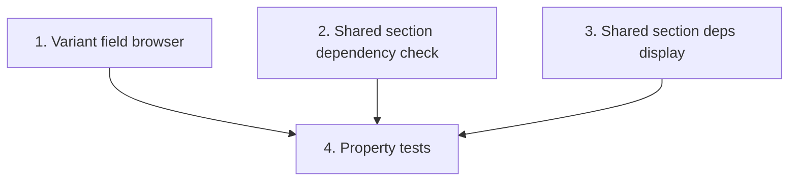

# Implementation Plan: Frontend: section-variant editor field browser & shared-section deps

> Mini-spec derived from parent spec **contract-note-data-source-extensibility**, story **US-07**.
> Implement only after the stories this one depends on (see `manifest.yaml` /
> `../../graph.yaml`) are complete.
>
> NOTE: Kiro's spec-format checks require the `## Task Dependency Graph` section to
> include BOTH a mermaid graph and a JSON `waves` block. `## Overview` and `## Notes`
> are recommended. Keep them all so the folder is a valid, pullable Kiro spec.

## Overview

This story implements the Admin Portal frontend for data source fields: the section-variant editor field browser, the shared-section missing-dependency check, and the shared-section dependencies display. It is a Wave 5 story that builds on the `DataSourceService` (US-06), the column and dependency API endpoints (US-03), and the shared dependency scanner (US-04). US-08 depends on it.

## Tasks

- [ ] 1. Surface data source fields in the pdfme-designer palette for the edited variant: collapsible groups per data source; fields labelled `{table}.{column}` with type, visually distinct; placed fields use the namespaced name
  - For the variant being edited, fetch the template's attached data sources + columns via `DataSourceService`
  - Show collapsible groups per data source; fields labelled `{table}.{column}` with type; visually distinct from core fields; placed fields use the namespaced `name`
  - _Requirements: 1.1, 1.2, 1.3, 1.4, 1.5_

- [ ] 2. Implement shared section attachment dependency check: on adding a shared section, read its DATASOURCE_DEP records; if the template is missing required sources, prompt to add them first
  - When adding a shared section to a template, read its `DATASOURCE_DEP` records via `DataSourceService`
  - If the template is missing required data sources, prompt the user to add them before proceeding
  - _Requirements: 2.1, 2.2_

- [ ] 3. Display data source dependencies on the shared section detail screen
  - List the shared section's tracked data source dependencies (database + table name)
  - _Requirements: 2.3_

- [ ]* 4. Property tests for frontend logic (Property 4: field availability scoped to attachments; Property 6: missing dependency enforcement)
  - **Property 4: field availability scoped to attachments**, **Property 6: missing dependency enforcement**
  - _Requirements: 1.1, 2.1, 2.2_

## Task Dependency Graph



Execution waves (tasks in the same wave have no dependency on each other and may run in parallel):

```json
{
  "waves": [
    { "wave": 1, "tasks": ["1", "2", "3"] },
    { "wave": 2, "tasks": ["4"] }
  ]
}
```

## Upstream story dependencies

- US-03 — backend column endpoint (`GET /contract-note-data-sources/{database}/{table}/columns`) and shared-section dependencies endpoint (`GET /contract-note-shared-sections/{sharedSectionId}/data-source-dependencies`)
- US-04 — `shared-lib:dependency-scanner`
- US-06 — `service:DataSourceService`

## Notes

- Tasks marked with `*` are optional and can be deferred for a faster MVP.
- Task requirement ids are local; they annotate their parent requirement ids for
  traceability back to contract-note-data-source-extensibility.
- Tasks 1–3 are independent frontend components and may run in parallel; the optional property tests (4) come after them.
