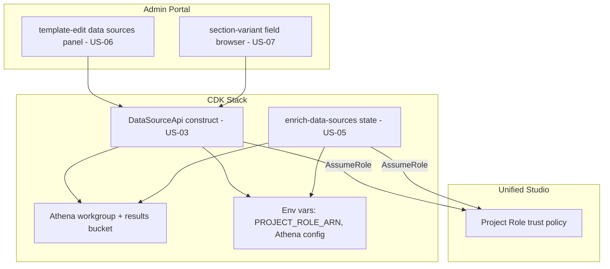

# Design Document

**Story US-08 — Integration wiring & end-to-end validation**

> Mini-spec derived from parent spec **contract-note-data-source-extensibility**, story **US-08**.
> This design is an excerpt of the parent design scoped to this story's components.

## Overview

This story deploys and wires together the components delivered by the earlier waves into one working CDK stack, and validates the feature end to end. There is no new business logic here: the work is finalising the deployment surface (API Gateway routes, Lambda→Project Role assume, Athena workgroup and results bucket, environment variables) that parent Requirement 6 describes, and confirming the discovery (Requirement 1) and enrichment (Requirement 5) paths function through the deployed system.

## Architecture

This story owns the deployment/wiring seam that binds the `DataSourceApi` construct, the `enrich-data-sources` state, and the frontend components into `contract-note-stack.ts`, with the Project Role trust policy modified to allow the relevant Lambda execution roles to assume it.

The Project Role's trust policy adds the data source API list/columns handler roles and the `enrich-data-sources` handler role as trusted `sts:AssumeRole` principals, alongside the existing `sagemaker.amazonaws.com` service principal. The Athena workgroup and S3 results location are configured for contract note queries, with the Project Role granted access to both.

## Components and Interfaces

### `cdk-instance:deployment`

The finalised deployment confirms, in `contract-note-stack.ts` and `cdk/lib/contract-notes/`:

- The `DataSourceApi` construct is instantiated and its `LambdaIntegration`s are wired to the routes declared in `contract-note-foundation.ts::createRoutes` (`contract-note-data-sources`, template-scoped `data-sources`, shared-section `data-source-dependencies`).
- The `enrich-data-sources` state is inserted between `select-template` and `render-sections` in `render-pipeline.ts` and is registered in the `handle-failure` catch array.
- The Project Role trust policy trusts the `list-available`, `get-columns`, and `enrich-data-sources` Lambda execution roles; those roles hold `sts:AssumeRole` on the Project Role ARN.
- The Athena workgroup and results bucket exist and the Project Role can use them.
- `PROJECT_ROLE_ARN` and Athena config are passed as environment variables to the Glue/Athena-backed handlers and the enrichment state.

### Interfaces consumed (dependencies)

- `cdk-construct:DataSourceApi` (US-03) — the construct, its per-op handlers, and route resources being wired into the stack.
- `lambda:enrich-data-sources` + `state-machine:render-pipeline-enrichment` (US-05) — the enrichment handler and the state-machine chain edit it sits in.
- `frontend-component:template-edit-data-sources-panel` (US-06) — consumes the deployed API Gateway endpoints.
- `frontend-component:section-variant-field-browser` (US-07) — consumes the deployed API Gateway endpoints.

### Touch points with other stories

This story exposes nothing to downstream stories (it is terminal). It assumes US-03/US-05 expose deployable constructs/handlers and that US-06/US-07 target the API Gateway routes finalised here.

## Data Models

This story defines no new data. It reads and wires the records and resources defined by its dependencies: the `TemplateDataSource` / `SharedSectionDataSourceDependency` DynamoDB records (via the API), and the Athena workgroup and results bucket resources.

## Correctness Properties

### Property 12: Deployment wires Project Role trust end to end

*For any* deployed data source Lambda (API list/columns handlers and the `enrich-data-sources` handler), the Project Role trust policy SHALL list its execution role as an allowed `sts:AssumeRole` principal, so that a live subscription is discoverable and enrichable without manual IAM changes. **Validates: Requirements 6.1, 6.2, 6.3**

## Error Handling

| Scenario | Handling |
|----------|----------|
| Lambda role not trusted by Project Role | AssumeRole fails at runtime; caught by API 500 or the render `handle-failure` state — surfaced during integration validation |
| Athena workgroup / results bucket misconfigured | Query fails; enrichment throws → `handle-failure`; flagged in deployment validation |
| Missing `PROJECT_ROLE_ARN` / Athena env var | Handler startup/config error; caught in the CDK build and end-to-end tests |
| Forced Athena error during validation | State machine routes to `handle-failure` and writes to the error bucket (parent Requirement 5.6) |

## Testing Strategy

### Deployment validation
- Run the CDK build/synth; confirm the `DataSourceApi` construct, routes, `enrich-data-sources` state, Athena workgroup/results bucket, trust policy, and env vars are all present and wired.

### Integration testing (optional, US-08-2)
- **Discovery** — subscribe a Glue table → verify it appears in the available list (Requirement 1.3).
- **Filtering** — remove the `bryt_number` column → verify it is filtered from the available list (Requirement 1.4).
- **Enrichment flow** — attach a data source → drop XML → verify `enrich-data-sources` populates namespaced fields and they render in the stitched PDF (Requirement 5.1).
- **Failure routing** — force an Athena error → verify the state machine reaches `handle-failure` (Requirement 5.6).
