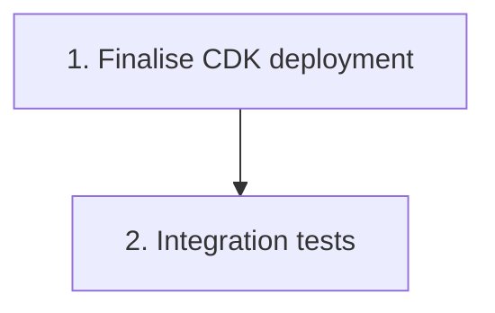

# Implementation Plan: Integration wiring & end-to-end validation

> Mini-spec derived from parent spec **contract-note-data-source-extensibility**, story **US-08**.
> Implement only after the stories this one depends on (see `manifest.yaml` /
> `../../graph.yaml`) are complete.

## Overview

This is the terminal, Wave 6 story. It finalises the CDK deployment — confirming API Gateway routes, Lambda→Project Role assume, the Athena workgroup/results bucket, and environment variables are all wired in the stack — and then validates the feature end to end. The optional integration tests exercise discovery and render-time enrichment through the deployed system. All backend and frontend components (US-03, US-05, US-06, US-07) must be complete first.

## Tasks

- [ ] 1. Finalise CDK deployment
  - Confirm API Gateway routes, Lambda→Project Role assume, Athena workgroup/results bucket, and env vars are all wired in the stack
  - _Requirements: 1.1, 1.2, 1.3_

- [ ]* 2. Integration tests
  - subscribe Glue table → appears in available list
  - attach → drop XML → enriched fields render in output PDF
  - remove `bryt_number` column → filtered from available list
  - force Athena error → state machine reaches `handle-failure`
  - _Requirements: 2.1, 2.2, 2.3, 2.4_

## Task Dependency Graph



Execution waves (tasks in the same wave have no dependency on each other and may run in parallel):

```json
{
  "waves": [
    { "wave": 1, "tasks": ["1"] },
    { "wave": 2, "tasks": ["2"] }
  ]
}
```

## Upstream story dependencies

- US-03 — `cdk-construct:DataSourceApi`
- US-05 — `lambda:enrich-data-sources` + `state-machine:render-pipeline-enrichment`
- US-06 — `frontend-component:template-edit-data-sources-panel`
- US-07 — `frontend-component:section-variant-field-browser`

## Notes

- Tasks marked with `*` are optional and can be deferred for a faster MVP.
- Task requirement ids are local; they annotate their parent requirement ids for
  traceability back to contract-note-data-source-extensibility (parent Requirement 6, and Requirements 1 & 5 for the optional integration tests).
