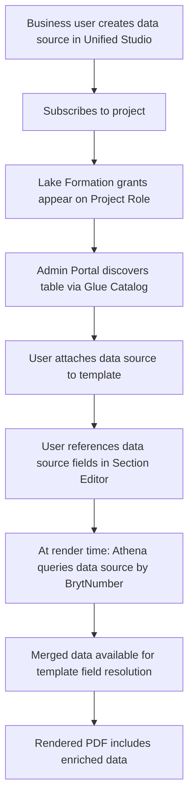
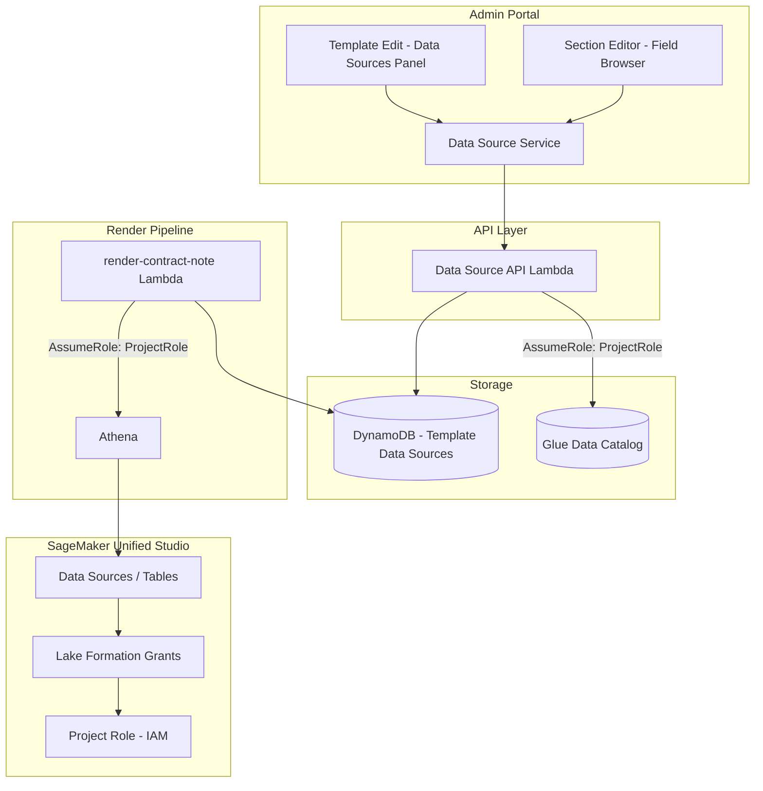

# Design Document: Contract Note Data Source Extensibility

## Overview

This design covers Estimate 3b of the Bryt Energy Contract Note Rework: enabling business users to enrich contract note templates with data from external sources managed in SageMaker Unified Studio, without developer involvement per data source.

The system extends Estimate 1's template management and render pipeline with:
1. Glue Data Catalog discovery via the Unified Studio Project Role
2. Template-level data source attachment (UI + storage)
3. Field browser in the Section Editor showing data source columns
4. Athena-based enrichment at render time, keyed on BrytNumber
5. Shared section dependency tracking

## Architecture

### High-Level Data Source Flow



### System Architecture



### Key Architecture Decisions

| Decision | Choice | Rationale |
|----------|--------|-----------|
| Data source access | Assume Unified Studio Project Role | Inherits all Lake Formation grants automatically; no per-table IAM config needed |
| Catalog discovery | Glue Data Catalog API | Standard AWS metadata layer; Unified Studio uses Glue under the hood |
| Render-time query | Athena | Works with Glue/Iceberg tables; serverless; supports SQL; handles various storage formats |
| Field namespacing | `{datasource_name}.{column_name}` | Avoids collisions between data sources and core contract fields |
| Template-level binding | Explicit attachment | Limits Athena queries to only what's needed; makes dependencies clear |
| BrytNumber constraint | Table must have `bryt_number` column | Enforces join-ability; filters out irrelevant tables |
| Section dependencies | Auto-tracked from field references | No manual config; derived from schema JSON analysis |

## Components and Interfaces

### Frontend Changes

#### Template Edit Screen (Extended)

New panel added to the existing Template Edit screen:

**Data Sources panel (right side, below Add Section controls):**
- Header: "Data Sources" with [+ Attach Data Source] button
- List of attached data sources with name and column count
- Detach button per data source (with warning if fields in use)
- Attach action opens a picker showing available (unattached) data sources

#### Section Editor (Extended)

New field group in the Section Editor field palette:

**Data Source Fields (grouped by data source name):**
- Collapsible group per attached data source
- Each column shown as a draggable field with name and type
- Fields prefixed with data source name when placed (e.g., `credit_data.score`)
- Visual distinction from core contract fields (different colour/icon)

### Backend API (Lambda Functions)

#### Data Source API (`lambdas-rest-api/contract-note-data-sources/`)

| Method | Path | Handler | Description |
|--------|------|---------|-------------|
| GET | /contract-note-data-sources | list-available | Lists all Glue tables accessible via Project Role with `bryt_number` column |
| GET | /contract-note-data-sources/{database}/{table}/columns | get-columns | Returns column names and types for a specific table |
| GET | /contract-note-templates/{id}/data-sources | list-attached | Returns data sources attached to a template |
| POST | /contract-note-templates/{id}/data-sources | attach-data-source | Attaches a data source to a template |
| DELETE | /contract-note-templates/{id}/data-sources/{database}/{table} | detach-data-source | Detaches a data source (with field-in-use check) |

### Render Pipeline Extension

Added enrichment step between template selection and section rendering:

```
Existing flow:
  parse → select template → render sections → stitch → output

Extended flow:
  parse → select template → ENRICH FROM DATA SOURCES → render sections → stitch → output

Enrichment step:
  1. Fetch template's attached data sources from DynamoDB
  2. Extract BrytNumber from contract data (customerreference field)
  3. For each data source:
     a. Assume Project Role
     b. Execute Athena query: SELECT * FROM {database}.{table} WHERE bryt_number = '{value}' LIMIT 1
     c. Merge results into contract data under namespace: {table_name}.{column} = value
  4. Continue to section rendering with enriched data
```

### IAM / Trust Policy

The Project Role's trust policy is modified to allow the Lambda execution roles to assume it:

```json
{
  "Version": "2012-10-17",
  "Statement": [
    {
      "Effect": "Allow",
      "Principal": {
        "Service": "sagemaker.amazonaws.com"
      },
      "Action": "sts:AssumeRole"
    },
    {
      "Effect": "Allow",
      "Principal": {
        "AWS": [
          "arn:aws:iam::{account}:role/contract-note-api-role",
          "arn:aws:iam::{account}:role/contract-note-render-role"
        ]
      },
      "Action": "sts:AssumeRole"
    }
  ]
}
```

## Data Models

### DynamoDB: Template Data Source Records

Added to the existing `ContractNoteTemplates` table (single-table design):

#### Template Data Source Record

| Attribute | Type | Description |
|-----------|------|-------------|
| PK | String | `TEMPLATE#{templateId}` |
| SK | String | `DATASOURCE#{database}#{tableName}` |
| database | String | Glue database name |
| tableName | String | Glue table name |
| displayName | String | User-friendly name (defaults to table name) |
| attachedAt | String | ISO 8601 timestamp |
| attachedBy | String | Cognito username |

#### Shared Section Dependency Record

| Attribute | Type | Description |
|-----------|------|-------------|
| PK | String | `SHARED_SECTION#{sectionId}` |
| SK | String | `DATASOURCE_DEP#{database}#{tableName}` |
| database | String | Glue database name |
| tableName | String | Glue table name |

### Field Reference Format in Schema JSON

When a data source field is placed in a section, it's stored in the schema JSON with a namespaced field name:

```json
{
  "name": "credit_data.credit_score",
  "type": "text",
  "position": { "x": 120, "y": 200 },
  "width": 50,
  "height": 12
}
```

The namespace prefix (`credit_data.`) maps to the table name in the attached data source.

### TypeScript Interfaces

```typescript
// Available data source (from Glue catalog)
interface AvailableDataSource {
  database: string;
  tableName: string;
  columns: DataSourceColumn[];
  location: string;
}

interface DataSourceColumn {
  name: string;
  type: string; // Glue/Athena type: string, int, bigint, double, boolean, etc.
}

// Template data source attachment
interface TemplateDataSource {
  database: string;
  tableName: string;
  displayName: string;
  attachedAt: string;
  attachedBy: string;
}

// Shared section dependency
interface SectionDataSourceDependency {
  database: string;
  tableName: string;
}

// Enriched data at render time
interface EnrichedContractData {
  [key: string]: any; // Core contract fields at top level
  [dataSourceName: string]: {  // Namespaced data source fields
    [columnName: string]: any;
  };
}
```

## Correctness Properties

### Property 1: Only bryt_number tables are discoverable

*For any* Glue table accessible via the Project Role, it SHALL appear in the available data sources list if and only if it contains a `bryt_number` column.

**Validates: Requirements 1.4, 7.5**

### Property 2: Data source attachment round-trip

*For any* valid data source attachment to a template, listing the template's data sources SHALL include that attachment with correct database, table name, and display name.

**Validates: Requirements 2.1, 2.2**

### Property 3: Detachment with field-in-use warning

*For any* attached data source that is referenced by section fields, detachment SHALL be blocked or warned with the affected section list.

**Validates: Requirements 2.4**

### Property 4: Field availability scoped to attached data sources

*For any* template with N attached data sources, the section editor SHALL expose fields from exactly those N data sources (not more, not fewer).

**Validates: Requirements 3.1, 2.5**

### Property 5: Shared section dependency tracking

*For any* shared section that uses data source fields, its dependency list SHALL contain exactly the set of data sources referenced by its fields.

**Validates: Requirements 4.1, 4.4**

### Property 6: Missing dependency enforcement

*For any* shared section being added to a template, if the section has data source dependencies not present on the template, the system SHALL require those data sources be added before the section can be attached.

**Validates: Requirements 4.2, 4.3**

### Property 7: Enrichment produces namespaced data

*For any* template with attached data sources, and contract data containing a valid BrytNumber, the enrichment step SHALL produce data where each data source's columns are accessible under the `{tableName}.{columnName}` namespace.

**Validates: Requirements 5.1, 5.2, 5.3**

### Property 8: Missing data source rows produce empty fields (not failure)

*For any* data source query that returns zero rows for the given BrytNumber, the render pipeline SHALL continue rendering with those fields empty rather than halting.

**Validates: Requirements 5.4**

### Property 9: Data source query failure halts rendering

*For any* data source query that fails with an Athena error, the render pipeline SHALL halt processing and log the error.

**Validates: Requirements 5.5**

### Property 10: New subscriptions are immediately discoverable

*For any* data source subscribed to the Unified Studio project, it SHALL appear in the available data sources list without code changes or redeployment.

**Validates: Requirements 1.3, 6.3**

## Error Handling

### API Error Handling

| Scenario | Handling | HTTP Status |
|----------|----------|-------------|
| AssumeRole failure (Project Role) | Log error, return 500 with message | 500 |
| Glue catalog unreachable | Log error, return 503 | 503 |
| Table not found in catalog | Return 404 | 404 |
| Table missing bryt_number column | Return 400 with validation message | 400 |
| Detach blocked by field references | Return 409 with affected section list | 409 |

### Render Pipeline Error Handling

| Scenario | Handling |
|----------|----------|
| AssumeRole failure | Log error to error bucket; halt rendering |
| Athena query timeout (>30s) | Log error to error bucket; halt rendering |
| Athena query returns error | Log error with query details to error bucket; halt rendering |
| No rows returned for BrytNumber | Log warning; continue with empty fields |
| Multiple rows returned | Use first row; log warning |

## Testing Strategy

### Unit Testing

- **Glue catalog client** — table discovery, column extraction, bryt_number filtering
- **Athena query builder** — correct SQL generation, BrytNumber parameterization
- **Data enrichment merger** — correct namespacing, handling of empty results
- **Dependency tracker** — extracting data source references from schema JSON
- **Detachment validator** — identifying fields in use

### Property-Based Testing

Key generators:
1. **Data source generator** — random table schemas with/without bryt_number column
2. **Template data source attachment generator** — random valid attachments
3. **Schema JSON with data source fields generator** — random sections referencing data sources
4. **Athena result generator** — random query results including empty/null values

### Integration Testing

- **End-to-end discovery** — verify Glue tables appear in available list
- **Enrichment flow** — attach data source to template → render → verify enriched fields appear in PDF
- **Missing data graceful handling** — render with BrytNumber that has no matching row → verify empty fields, no crash
