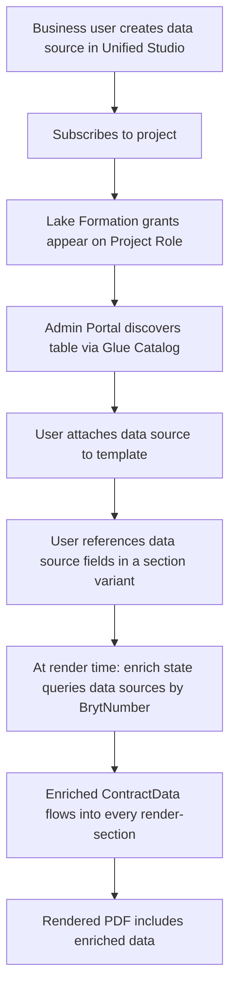
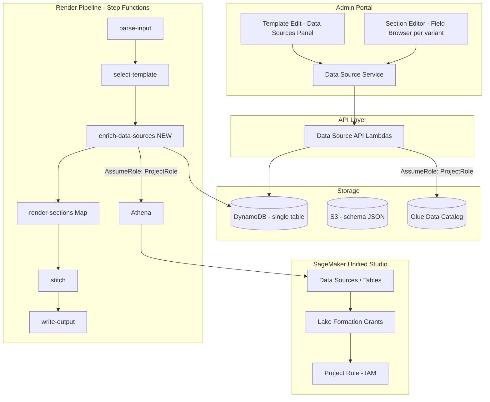

# Design Document: Contract Note Data Source Extensibility

## Overview

This design covers Estimate 3b of the Bryt Energy Contract Note Rework: enabling business users to enrich contract note templates with data from external sources managed in SageMaker Unified Studio, without developer involvement per data source.

The system extends Estimate 1's (now-landed) template management and render pipeline with:
1. Glue Data Catalog discovery via the Unified Studio Project Role
2. Template-level data source attachment (UI + storage)
3. A field browser in the Section Editor (per **variant**) showing data source columns
4. Athena-based enrichment as a **new Step Functions state**, keyed on BrytNumber
5. Shared section dependency tracking derived from **all variants' schemas**

> **Alignment note.** The original 3b draft assumed a single render Lambda, a flat section schema, and no versioning. The landed Estimate 1 implementation differs; this design has been reworked to match it. Where this document references existing code it points at `BrytBusinessServices` (`api/`, `cdk/`, `shared-lib/`) as of `dev` (Jabez's `sqp-4960*`) and the Admin Portal `sqp-4962` branch.

## Existing System Baseline (what Estimate 1 built)

Understanding these is essential because 3b extends them rather than the simplified model in the earlier draft.

### Storage (single-table DynamoDB + S3 schema bucket)
- Table `{prefix}contract-note-templates`, PK/SK plus a `PriorityIndex` GSI (`GSI_PK` = `ALL_TEMPLATES`, sort by `priority`). Defined in `cdk/lib/contract-notes/contract-note-foundation.ts`.
- Entity types (`shared-lib/types.ts::ContractNoteEntityType`): `Template`, `Section`, `SharedSection`, `SectionReference`, `SectionVariant`, `SectionVersion`, `SharedSectionVersion`, `TemplateSelectionRule`, `ChangeLog`.
- pdf-me **Schema_JSON lives in S3** (`{prefix}contract-note-schema-json`), not in DynamoDB. Records hold a `schemaS3Key`. Version schemas are stored at `{sectionId}/versions/{versionId}.json` (`schema-version-utils.ts`).

### Sections, variants and versions
- A `Section` (or shared section) owns one or more `SectionVariant`s. Each variant has its own `schemaS3Key` and an optional `specification` (a `SpecificationNode` rule).
- Each variant has version history (`SectionVersion`, keyed `SECTION_VERSION#{sectionId}#{variantId}`, SK `VERSION#{createdAt}`). A `SectionReference` on a template carries a `pinnedVersionId`.
- At render time (`render/render-section.ts`), the pipeline selects a variant (`render/variant-selection.ts`, first-match-wins on `specification` with an `isDefault` fallback), then renders the **pinned version's** schema for that variant.

### Render pipeline (Step Functions, not a single Lambda)
Defined in `cdk/lib/contract-notes/render-pipeline.ts`. EventBridge fires on XML landing in the input bucket, triggering the state machine:

```
parse-input → select-template → RenderSections (Map, one render-section per section) → stitch → write-output
                                                                                          ↘ (catch on every state) handle-failure
```

- `select-template` only matches `PUBLISHED` templates, walking the priority GSI and evaluating each template's `TemplateSelectionRule`.
- The `RenderSections` Map passes `contractData`, `template`, and the per-item `section` into each `render-section` invocation.

### API + CDK conventions
- One Lambda per operation under `api/src/{templates,sections,rules,render}/`.
- All API Gateway resources are declared centrally in `contract-note-foundation.ts::createRoutes`; each feature construct (`template-api.ts`, `section-api.ts`, `rules-api.ts`) receives its route resources and wires `LambdaIntegration`s.
- Shared logic (spec evaluator, types) lives in `shared-lib/`.

## Architecture

### High-Level Data Source Flow



### System Architecture



### Key Architecture Decisions

| Decision | Choice | Rationale |
|----------|--------|-----------|
| Data source access | Assume Unified Studio Project Role | Inherits all Lake Formation grants automatically; no per-table IAM config needed |
| Catalog discovery | Glue Data Catalog API | Standard AWS metadata layer; Unified Studio uses Glue under the hood |
| Render-time query | Athena | Works with Glue/Iceberg tables; serverless; supports SQL; handles various storage formats |
| **Enrichment placement** | **New Step Functions state between `select-template` and `RenderSections`** | Matches the real pipeline; enriches once and fans the enriched `ContractData` into the render Map; reuses the existing `handle-failure` catch |
| Field namespacing | `{table_name}.{column_name}` | Avoids collisions between data sources and core contract fields; the `.` prefix is also the dependency-scan marker |
| Template-level binding | Explicit attachment | Limits Athena queries to only what's needed; makes dependencies clear |
| BrytNumber constraint | Table must have `bryt_number` column | Enforces join-ability; filters out irrelevant tables |
| **Dependency scope** | **Per shared-section, aggregated across all its variants' schemas** | Variants each have their own schema; a shared section depends on the union of data sources any variant references |
| **Version awareness** | **Dependencies recomputed on schema save / version publish; enrichment reads attachments (not schema) at render** | The render pipeline renders pinned versions; attachments live on the template, so enrichment is version-independent while dependency hints track the edited schema |
| Section dependencies | Auto-tracked from field references in Schema_JSON | No manual config; derived from pdf-me element `name`s in S3 schema |

## Components and Interfaces

### Frontend Changes (Admin Portal, `sqp-4962` baseline)

#### Template Edit Screen (Extended)

New panel added to the existing `template-edit` component:

**Data Sources panel:**
- Header: "Data Sources" with [+ Attach Data Source] button
- List of attached data sources with name and column count
- Detach button per data source (with warning if any variant references its fields)
- Attach action opens a picker showing available (unattached) data sources
- Available regardless of DRAFT/PUBLISHED status

#### Section Editor / pdfme-designer (Extended)

The Section Editor edits a **variant's** schema and embeds the `pdfme-designer` web component (`portal/src/app/web-components/pdfme-designer/`). Extend the field palette:

**Data Source Fields (grouped by data source name):**
- Collapsible group per attached data source
- Each column shown as a draggable field with name and type
- Placed fields use the namespaced name `{table_name}.{column_name}` as the pdf-me element `name`
- Visual distinction from core contract fields (different colour/icon)
- Fields are resolved from the template's attachments; for a shared section open in a template context, the union of that template's attachments applies

### Backend API (`api/src/data-sources/`, one Lambda per operation)

| Method | Route (declared in `contract-note-foundation.ts`) | Handler file | Description |
|--------|----------------------------------------------------|--------------|-------------|
| GET | `/contract-note-data-sources` | `data-sources/list-available.ts` | Lists all Glue tables accessible via Project Role with `bryt_number` column |
| GET | `/contract-note-data-sources/{database}/{table}/columns` | `data-sources/get-columns.ts` | Returns column names and types for a specific table |
| GET | `/contract-note-templates/{templateId}/data-sources` | `data-sources/list-attached.ts` | Returns data sources attached to a template |
| POST | `/contract-note-templates/{templateId}/data-sources` | `data-sources/attach-data-source.ts` | Attaches a data source to a template |
| DELETE | `/contract-note-templates/{templateId}/data-sources/{database}/{table}` | `data-sources/detach-data-source.ts` | Detaches a data source (with variant-field-in-use check) |
| GET | `/contract-note-shared-sections/{sharedSectionId}/data-source-dependencies` | `data-sources/list-shared-section-deps.ts` | Returns a shared section's tracked data source dependencies |

New route resources are added to `TemplateRouteResources`, `SharedSectionRouteResources`, and a new `DataSourceRouteResources` in `ContractNoteApiRoutes`. A new `DataSourceApi` CDK construct (mirroring `TemplateApi`) creates the handlers, grants table/Glue/Athena access, and wires the integrations. The list/columns handlers additionally receive `PROJECT_ROLE_ARN` and Athena config as environment variables.

### Render Pipeline Extension (new Step Functions state)

Add an `enrich-data-sources` Lambda (`api/src/render/enrich-data-sources.ts`) and insert it as a state between `SelectTemplate` and `RenderSections` in `render-pipeline.ts`:

```
Existing:
  parse-input → select-template → RenderSections(Map) → stitch → write-output

Extended:
  parse-input → select-template → enrich-data-sources → RenderSections(Map) → stitch → write-output
                                        ↘ (addCatch) handle-failure
```

The new state is added to the `[parseInput, selectTemplate, renderSections, stitch, writeOutput]` catch-registration array so failures route to `handle-failure` like every other state.

**`enrich-data-sources` handler contract:**
- Input: `SelectTemplateResult` (`{ contractData, template, sections, inputFile, contractSummary }`)
- Behaviour:
  1. Read the template's attached data sources (`DATASOURCE` records) from DynamoDB.
  2. If none, return the event unchanged (no Athena calls — Requirement 5.7).
  3. Extract BrytNumber from `contractData` (`customerreference`).
  4. Assume the Project Role once; for each data source run `SELECT * FROM {database}.{table} WHERE bryt_number = ? LIMIT 1` via Athena (queries issued concurrently).
  5. Merge each result into `contractData` under `{table}.{column}`.
  6. On zero rows: log warning, leave namespace absent/empty. On Athena error/timeout: throw (caught → `handle-failure`).
- Output: the same event shape with an enriched `contractData`, so `RenderSections` and `render-section` need no changes.

### IAM / Trust Policy

The Project Role's trust policy is modified to allow the data source Lambda execution roles (the API list/columns handlers and the `enrich-data-sources` handler) to assume it:

```json
{
  "Version": "2012-10-17",
  "Statement": [
    {
      "Effect": "Allow",
      "Principal": { "Service": "sagemaker.amazonaws.com" },
      "Action": "sts:AssumeRole"
    },
    {
      "Effect": "Allow",
      "Principal": {
        "AWS": [
          "arn:aws:iam::{account}:role/{prefix}list-available-data-sources-role",
          "arn:aws:iam::{account}:role/{prefix}get-data-source-columns-role",
          "arn:aws:iam::{account}:role/{prefix}enrich-data-sources-role"
        ]
      },
      "Action": "sts:AssumeRole"
    }
  ]
}
```

## Data Models

### DynamoDB records (added to the existing single table)

Two new entity types are added to `ContractNoteEntityType` in `shared-lib/types.ts`: `TemplateDataSource` and `SharedSectionDataSourceDependency`.

#### Template Data Source Record

| Attribute | Type | Description |
|-----------|------|-------------|
| PK | `TEMPLATE#{templateId}` | Existing template partition |
| SK | `DATASOURCE#{database}#{tableName}` | Data source attachment |
| entityType | `"TemplateDataSource"` | |
| database | String | Glue database name |
| tableName | String | Glue table name |
| displayName | String | User-friendly name (defaults to table name) |
| attachedAt | String | ISO 8601 timestamp |
| attachedBy | String | Cognito username |

#### Shared Section Dependency Record

Keyed per shared section, aggregated across variants (the dependency is at the shared-section level, not per-variant, so template checks are simple).

| Attribute | Type | Description |
|-----------|------|-------------|
| PK | `SHARED_SECTION#{sharedSectionId}` | Existing shared section partition |
| SK | `DATASOURCE_DEP#{database}#{tableName}` | Dependency |
| entityType | `"SharedSectionDataSourceDependency"` | |
| database | String | Glue database name |
| tableName | String | Glue table name |

### Field Reference Format in pdf-me Schema JSON

Schema JSON is the pdf-me document `{ schemas: [[...pages of elements...]] }` stored in S3. A data source field is a normal pdf-me element whose `name` is namespaced:

```json
{
  "schemas": [
    [
      { "name": "credit_data.credit_score", "type": "text", "position": { "x": 120, "y": 200 }, "width": 50, "height": 12 }
    ]
  ]
}
```

Dependency scanning walks every page array, collects element `name`s containing a `.`, and maps the prefix to an attached/known data source table name. The same namespaced name is the pdf-me input key the enrichment step populates.

### TypeScript Interfaces (added to `shared-lib/types.ts` / API)

```typescript
// Available data source (from Glue catalog)
interface AvailableDataSource {
  database: string;
  tableName: string;
  columns: DataSourceColumn[];
  location?: string;
}

interface DataSourceColumn {
  name: string;
  type: string; // Glue/Athena type: string, int, bigint, double, boolean, etc.
}

// Template data source attachment (DynamoDB projection)
interface TemplateDataSource {
  database: string;
  tableName: string;
  displayName: string;
  attachedAt: string;
  attachedBy: string;
}

// Shared section dependency
interface SectionDataSourceDependency {
  database: string;
  tableName: string;
}

// Enriched data at render time (namespaced under table name)
type EnrichedContractData = ContractData & {
  [tableName: string]: { [columnName: string]: unknown } | unknown;
};
```

## Correctness Properties

### Property 1: Only bryt_number tables are discoverable
*For any* Glue table accessible via the Project Role, it SHALL appear in the available data sources list if and only if it contains a `bryt_number` column.
**Validates: Requirements 1.4, 7.5**

### Property 2: Data source attachment round-trip
*For any* valid data source attachment to a template, listing the template's data sources SHALL include that attachment with correct database, table name, and display name.
**Validates: Requirements 2.1, 2.2**

### Property 3: Detachment with variant-field-in-use warning
*For any* attached data source referenced by fields in any variant of any section in the template, detachment SHALL be blocked or warned with the affected section+variant list.
**Validates: Requirements 2.4**

### Property 4: Field availability scoped to attached data sources
*For any* template with N attached data sources, the section editor for any variant in that template SHALL expose fields from exactly those N data sources (not more, not fewer).
**Validates: Requirements 3.1, 2.5**

### Property 5: Shared section dependency = union across variants
*For any* shared section, its dependency list SHALL equal the set of distinct data sources referenced by the fields across all of its variants' schemas.
**Validates: Requirements 4.1, 4.2, 4.5**

### Property 6: Missing dependency enforcement
*For any* shared section being added to a template, if the section has data source dependencies not present on the template, the system SHALL require those data sources be added before the section can be attached.
**Validates: Requirements 4.3, 4.4**

### Property 7: Enrichment produces namespaced data
*For any* template with attached data sources, and contract data containing a valid BrytNumber, the enrichment state SHALL produce `ContractData` where each data source's columns are accessible under the `{tableName}.{columnName}` namespace.
**Validates: Requirements 5.3, 5.4**

### Property 8: Empty enrichment is a pass-through
*For any* template with no attached data sources, the enrichment state SHALL return the contract data unchanged and issue no Athena queries.
**Validates: Requirements 5.7**

### Property 9: Missing data source rows produce empty fields (not failure)
*For any* data source query that returns zero rows for the given BrytNumber, the enrichment state SHALL continue with those fields empty rather than halting.
**Validates: Requirements 5.5**

### Property 10: Data source query failure routes to handle-failure
*For any* data source query that fails with an Athena error or timeout, the enrichment state SHALL throw so the state machine routes to `handle-failure`.
**Validates: Requirements 5.6**

### Property 11: New subscriptions are immediately discoverable
*For any* data source subscribed to the Unified Studio project, it SHALL appear in the available data sources list without code changes or redeployment.
**Validates: Requirements 1.3, 6.3**

## Error Handling

### API Error Handling

| Scenario | Handling | HTTP Status |
|----------|----------|-------------|
| AssumeRole failure (Project Role) | Log error, return 500 with message | 500 |
| Glue catalog unreachable | Log error, return 503 | 503 |
| Table not found in catalog | Return 404 | 404 |
| Table missing bryt_number column | Return 400 with validation message | 400 |
| Detach blocked by variant field references | Return 409 with affected section+variant list | 409 |

### Render Pipeline Error Handling (`enrich-data-sources` state)

| Scenario | Handling |
|----------|----------|
| AssumeRole failure | Throw → caught by `handle-failure`; error written to error bucket |
| Athena query timeout (>30s) | Throw → `handle-failure` |
| Athena query returns error | Throw with query details → `handle-failure` |
| No rows returned for BrytNumber | Log warning; continue with empty namespace |
| Multiple rows returned | Use first row; log warning |
| No attached data sources | Return event unchanged; no Athena calls |

## Testing Strategy

### Unit Testing
- **Glue catalog client** — table discovery, column extraction, bryt_number filtering
- **Athena query builder** — correct SQL generation, BrytNumber parameterization
- **Data enrichment merger** — correct namespacing, empty result handling, no-attachment pass-through
- **Dependency scanner** — extracting namespaced field references from pdf-me `{ schemas: [[...]] }` across pages and variants
- **Detachment validator** — identifying variant fields in use

### Property-Based Testing
Key generators:
1. **Glue table generator** — random schemas with/without `bryt_number`
2. **Template attachment generator** — random valid attachments
3. **pdf-me schema generator** — random multi-page schemas with variant field references (namespaced and core)
4. **Athena result generator** — random results including empty/null values

### Integration Testing
- **End-to-end discovery** — subscribe a Glue table → verify it appears in the available list
- **Enrichment flow** — attach data source → drop XML → verify `enrich-data-sources` populates namespaced fields → verify they render in the stitched PDF
- **Missing data graceful handling** — render with a BrytNumber that has no matching row → empty fields, no crash, pipeline completes
- **Failure routing** — force an Athena error → verify the state machine reaches `handle-failure` and writes to the error bucket
