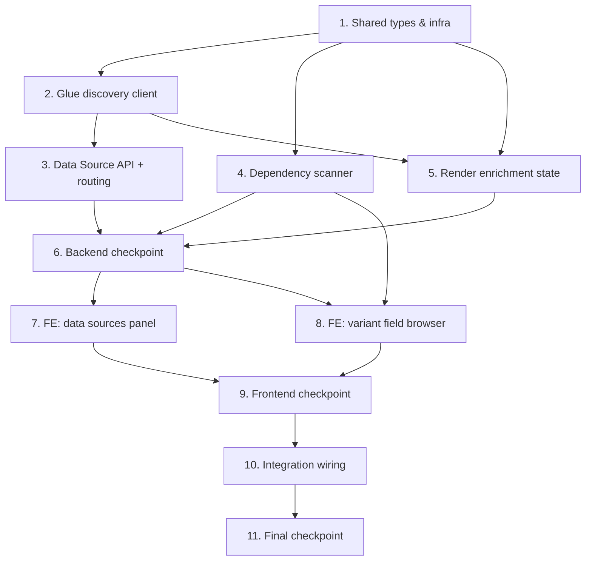

# Implementation Plan: Contract Note Data Source Extensibility

## Overview

Extend the landed contract note template management system (`BrytBusinessServices`) to support external data sources from SageMaker Unified Studio. Business users subscribe data sources in Unified Studio; the system auto-discovers them via Glue Data Catalog, allows attaching them to templates, exposes their fields in the section-variant editor, and queries them at render time via a new Step Functions enrichment state using BrytNumber as the join key.

> Conventions to follow (from Estimate 1): one Lambda per operation under `api/src/`, routes declared in `cdk/lib/contract-notes/contract-note-foundation.ts::createRoutes`, feature CDK constructs mirroring `template-api.ts`, shared types/logic in `shared-lib/`. Schema JSON is pdf-me shape in S3; sections have variants and pinned versions; the render pipeline is a Step Functions state machine.

## Task Dependency Graph



Execution waves (tasks in the same wave have no dependency on each other and may run in parallel):

```json
{
  "waves": [
    { "wave": 1, "tasks": ["1"] },
    { "wave": 2, "tasks": ["2", "4"] },
    { "wave": 3, "tasks": ["3", "5"] },
    { "wave": 4, "tasks": ["6"] },
    { "wave": 5, "tasks": ["7", "8"] },
    { "wave": 6, "tasks": ["9"] },
    { "wave": 7, "tasks": ["10"] },
    { "wave": 8, "tasks": ["11"] }
  ]
}
```

Notes on ordering:
- Task 1 (shared types + infra) underpins everything else.
- Tasks 2 (Glue discovery) and 4 (dependency scanner) depend only on the shared types and can run in parallel.
- Task 5 (enrichment state) depends on the Glue/Athena client (2) and types (1); it is independent of the API (3), so 3 and 5 can proceed in parallel.
- Frontend work (7, 8) depends on the backend checkpoint (6); task 8 also relies on the dependency scanner (4) for the shared-section checks.

## Tasks

- [ ] 1. Shared types and infrastructure setup
  - [ ] 1.1 Extend `shared-lib/types.ts` with data source entities
    - Add `TemplateDataSource` and `SharedSectionDataSourceDependency` to `ContractNoteEntityType`
    - Add records: `TemplateDataSourceRecord` (`PK: TEMPLATE#{id}`, `SK: DATASOURCE#{db}#{table}`) and `SharedSectionDataSourceDependencyRecord` (`PK: SHARED_SECTION#{id}`, `SK: DATASOURCE_DEP#{db}#{table}`)
    - Add `AvailableDataSource`, `DataSourceColumn`, `TemplateDataSource`, `SectionDataSourceDependency` interfaces
    - Add SK type aliases (`DataSourceSortKey`, `DataSourceDepSortKey`) and extend `ContractNoteDynamoDbRecord`
    - _Requirements: 2.1, 4.1_

  - [ ] 1.2 Modify Project Role trust policy to allow Lambda assumption
    - Add the data source API + `enrich-data-sources` Lambda execution roles as trusted principals on the Unified Studio Project Role
    - Ensure those Lambda roles have `sts:AssumeRole` for the Project Role ARN
    - Expose Project Role ARN as a CDK parameter / env var
    - _Requirements: 6.1, 6.2_

  - [ ] 1.3 Configure Athena workgroup and results bucket
    - Create/configure an Athena workgroup for contract note queries and an S3 results location
    - Ensure the Project Role has access to the workgroup and results location
    - _Requirements: 5.3_

- [ ] 2. Glue Data Catalog discovery client (shared module in `api/src/data-sources/`)
  - [ ] 2.1 Implement Glue catalog client (assumes Project Role)
    - AssumeRole → temporary credentials for the Project Role
    - List databases/tables in the project's Glue catalog
    - Filter to tables containing a `bryt_number` column; return structured `AvailableDataSource[]` with columns
    - _Requirements: 1.1, 1.2, 1.4_

  - [ ] 2.2 Implement column detail fetcher
    - Return full column list (name, type) for a specific `{database}/{table}`
    - _Requirements: 3.4, 7.4_

  - [ ]* 2.3 Property tests for discovery
    - **Property 1: Only bryt_number tables are discoverable**
    - **Property 11: New subscriptions are immediately discoverable**
    - _Validates: Requirements 1.3, 1.4, 6.3_

- [ ] 3. Data Source API handlers (one Lambda per operation) + routing
  - [ ] 3.1 Declare routes in `contract-note-foundation.ts`
    - Add a `contract-note-data-sources` root resource (`{database}/{table}/columns`)
    - Add `data-sources` (collection) + `{database}/{table}` under the existing `contract-note-templates/{templateId}` resource
    - Add `data-source-dependencies` under `contract-note-shared-sections/{sharedSectionId}`
    - Extend `ContractNoteApiRoutes` with `DataSourceRouteResources`
    - _Requirements: 7.1, 7.2, 7.3_

  - [ ] 3.2 Implement `list-available` handler
    - Call Glue client; return `[{ database, tableName, columnCount }]`
    - _Requirements: 1.1, 1.2, 7.1_

  - [ ] 3.3 Implement `get-columns` handler
    - Return column names and types for a specific table
    - _Requirements: 7.4_

  - [ ] 3.4 Implement `attach-data-source` handler
    - Validate table exists and has `bryt_number`; write `DATASOURCE` record under the template
    - _Requirements: 2.2, 2.6, 7.2, 7.5_

  - [ ] 3.5 Implement `detach-data-source` handler
    - Scan all sections' variants in the template for fields referencing this data source
    - If referenced: 409 with affected section+variant list; else remove the record
    - _Requirements: 2.3, 2.4, 7.2_

  - [ ] 3.6 Implement `list-attached` handler
    - Query `DATASOURCE` records for a template
    - _Requirements: 2.1, 7.3_

  - [ ] 3.7 Implement `list-shared-section-deps` handler
    - Query `DATASOURCE_DEP` records for a shared section
    - _Requirements: 4.5_

  - [ ] 3.8 Create `DataSourceApi` CDK construct
    - Mirror `template-api.ts`: create per-op `NodejsFunction`s, grant table/Glue/Athena/AssumeRole, wire `LambdaIntegration`s to the routes from 3.1
    - Pass `PROJECT_ROLE_ARN` and Athena config to the Glue/Athena-backed handlers
    - Instantiate the construct in `contract-note-stack.ts`
    - _Requirements: 6.1, 7.6_

  - [ ]* 3.9 Property tests for data source API
    - **Property 2: attachment round-trip**, **Property 3: detachment with variant-field-in-use warning**
    - _Validates: Requirements 2.1, 2.2, 2.4_

- [ ] 4. Dependency scanner (shared util)
  - [ ] 4.1 Implement pdf-me schema field-reference scanner
    - Given schema JSON (`{ schemas: [[...]] }`), walk all pages, collect element `name`s containing `.`, map prefix → table name
    - _Requirements: 4.1_

  - [ ] 4.2 Implement shared section dependency recompute
    - On shared section variant schema save / version publish: scan all variants' current schemas, compute the union of referenced data sources, and reconcile `DATASOURCE_DEP` records (add/remove)
    - Hook into the existing `save-section-schema` / `publish-section-version` flow for shared sections
    - _Requirements: 4.1, 4.2_

  - [ ]* 4.3 Property tests for dependency tracking
    - **Property 5: dependency = union across variants**
    - _Validates: Requirements 4.1, 4.2, 4.5_

- [ ] 5. Render pipeline enrichment (new Step Functions state)
  - [ ] 5.1 Implement Athena query executor (`api/src/render/athena-client.ts`)
    - Assume Project Role; run `SELECT * FROM {db}.{table} WHERE bryt_number = ? LIMIT 1`
    - Await completion; parse to key-value; handle no rows (empty), multiple rows (first + warn), errors (throw)
    - _Requirements: 5.3, 5.5, 5.6_

  - [ ] 5.2 Implement `enrich-data-sources` handler (`api/src/render/enrich-data-sources.ts`)
    - Input = `SelectTemplateResult`; read template `DATASOURCE` records
    - If none → return event unchanged, no Athena calls
    - Extract BrytNumber (`customerreference`); query each data source concurrently; merge under `{table}.{column}`
    - Return the event with enriched `contractData` (render-section untouched)
    - _Requirements: 5.1, 5.2, 5.3, 5.4, 5.7_

  - [ ] 5.3 Wire the state into `render-pipeline.ts`
    - Add `EnrichDataSourcesHandler` `NodejsFunction` (table read, Project Role assume, Athena env)
    - Insert `enrichDataSources` between `selectTemplate` and `renderSections` in the chain
    - Add it to the array that registers the `handle-failure` catch
    - Grant `props.table.grantReadData` and Athena/AssumeRole permissions
    - _Requirements: 5.2, 5.6_

  - [ ]* 5.4 Property tests for enrichment
    - **Property 7: namespaced data**, **Property 8: empty pass-through**, **Property 9: empty rows continue**, **Property 10: failure routes to handle-failure**
    - _Validates: Requirements 5.3–5.7_

- [ ] 6. Checkpoint - Backend complete
  - Ensure all tests pass; run the CDK build; ask the user if questions arise.

- [ ] 7. Frontend: Template Edit data sources panel (`sqp-4962` baseline)
  - [ ] 7.1 Implement `DataSourceService`
    - list available, get columns, attach/detach, list attached, list shared-section deps
    - Wire to the API Gateway endpoints
    - _Requirements: 1.1, 2.1, 2.2, 2.3_

  - [ ] 7.2 Extend the template-edit component with a Data Sources panel
    - Show attached data sources; [+ Attach] opens picker of available (unattached) sources
    - Detach with confirmation warning if any variant references its fields
    - Available regardless of DRAFT/PUBLISHED
    - _Requirements: 2.1, 2.2, 2.3, 2.4, 2.6_

  - [ ] 7.3 Implement data source picker dialog
    - Show available sources (excluding attached) with table, database, column count
    - _Requirements: 2.2_

- [ ] 8. Frontend: Section-variant editor field browser
  - [ ] 8.1 Surface data source fields in the pdfme-designer palette
    - For the variant being edited, fetch the template's attached data sources + columns
    - Show collapsible groups per data source; fields labelled `{table}.{column}` with type; visually distinct from core fields
    - Placed fields use the namespaced `name`
    - _Requirements: 3.1, 3.2, 3.3, 3.4, 3.5_

  - [ ] 8.2 Implement shared section attachment dependency check
    - When adding a shared section to a template, read its `DATASOURCE_DEP` records
    - If the template is missing required data sources, prompt the user to add them first
    - _Requirements: 4.3, 4.4_

  - [ ] 8.3 Display data source dependencies on the shared section detail screen
    - _Requirements: 4.5_

  - [ ]* 8.4 Property tests for frontend logic
    - **Property 4: field availability scoped to attachments**, **Property 6: missing dependency enforcement**
    - _Validates: Requirements 2.5, 3.1, 4.3, 4.4_

- [ ] 9. Checkpoint - Frontend complete
  - Ensure all tests pass; ask the user if questions arise.

- [ ] 10. Integration wiring
  - [ ] 10.1 Finalise CDK deployment
    - Confirm API Gateway routes, Lambda→Project Role assume, Athena workgroup/results bucket, and env vars are all wired in the stack
    - _Requirements: 6.1, 6.2, 6.3_

  - [ ]* 10.2 Integration tests
    - subscribe Glue table → appears in available list
    - attach → drop XML → enriched fields render in output PDF
    - remove `bryt_number` column → filtered from available list
    - force Athena error → state machine reaches `handle-failure`
    - _Requirements: 1.3, 1.4, 5.1, 5.6_

- [ ] 11. Final checkpoint
  - Ensure all tests pass; ask the user if questions arise.

## Notes

- Tasks marked `*` are optional and can be skipped for a faster MVP.
- Enrichment is a **new Step Functions state**, not inline in a single Lambda — it enriches once and the `RenderSections` Map fans the enriched `ContractData` to each `render-section`. This means `render-section`/`variant-selection` need no changes.
- Dependencies are tracked at the **shared-section level** as the union across its variants' schemas; per-template checks stay simple.
- Data source attachments live on the template and are read at render time, so enrichment is independent of section version pinning.
- Field namespacing (`table.column`) both avoids collisions and acts as the dependency-scan marker in pdf-me element names.
- Athena queries are metered per data scanned — consider partition pruning on `bryt_number` for large tables.
- BrytNumber = `customerreference` in the contract payload.
