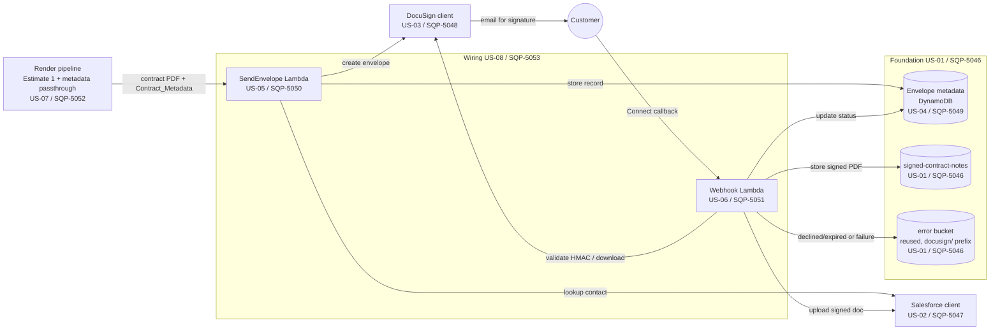

# Handover — enhance the DocuSign Jira tickets with diagrams

_Last updated: 2026-08-17. Purpose: let a fresh session add explanatory diagrams to the
already-pushed `contract-note-docusign-integration` (Estimate 2) Jira tickets without
re-deriving context._

## TL;DR

The full decomposition is **already live in Jira** (project **SQP**) and committed to
`main`. The next piece of work is **purely additive polish**: produce diagrams that explain
what each user story builds and where those components are used, plus a high-level service
interaction diagram on the epic annotated with the delivering stories. Diagrams are authored
as **mermaid** in the repo, rendered to **PNG**, and **attached** to the matching Jira issues
(Jira descriptions don't render mermaid).

## 1. What's already been done

Pipeline `spec-to-stories → decomposition-to-jira → jira-tree → jira-push` is complete and
was pushed to the **SQP** project (Squad Phoenix). Set label
`s2s-contract-note-docusign-integration`.

- **1 epic, 8 stories, 25 sub-tasks** created, all carrying stable identity labels
  (`s2s-contract-note-docusign-integration[-US-xx[-n]]`).
- **14 "Blocks" links** — created, then **corrected** (see gotcha #1) so they now read
  dependency **blocks** dependent (US-01 blocks everything downstream; US-08 is blocked by
  US-05/06/07).
- **Cross-reference rewrite** done: every `US-xx` mention in a description was rewritten to
  the real SQP key, and `jira-tree/_placeholders.md` holds the tree-key → SQP-key map.
- **Mini-specs attached**: each story issue has `requirements.md`, `design.md`, `tasks.md`
  (24 files) from `decomposition/stories/US-xx/`.
- **Estimates scrubbed** from the epic (SQP-5045) description and the local
  `jira-tree/epic.md` — do **not** reintroduce them (gotcha #3).
- Everything under `decomposition/` is **committed and pushed to `main`**.

### Key map (identity → Jira key)

| Story | Key | Sub-tasks (key) |
|-------|-----|-----------------|
| Epic  | **SQP-5045** | — |
| US-01 Foundation (infra, shared types, retry, error-writer) | **SQP-5046** | US-01-1 SQP-5057, US-01-2 SQP-5054, US-01-3 SQP-5055, US-01-4 SQP-5056 |
| US-02 Salesforce client | **SQP-5047** | US-02-1 SQP-5058, US-02-2 SQP-5059, US-02-3 SQP-5060, US-02-4 SQP-5061 |
| US-03 DocuSign client | **SQP-5048** | US-03-1 SQP-5062, US-03-2 SQP-5063, US-03-3 SQP-5064, US-03-4 SQP-5065, US-03-5 SQP-5066 |
| US-04 Metadata service | **SQP-5049** | US-04-1 SQP-5067, US-04-2 SQP-5068 |
| US-05 Send Envelope Lambda | **SQP-5050** | US-05-1 SQP-5069, US-05-2 SQP-5070, US-05-3 SQP-5071 |
| US-06 Webhook Lambda | **SQP-5051** | US-06-1 SQP-5072, US-06-2 SQP-5073, US-06-3 SQP-5074, US-06-4 SQP-5075 |
| US-07 Estimate 1 metadata surfacing | **SQP-5052** | US-07-1 SQP-5076 |
| US-08 Integration wiring & deployment | **SQP-5053** | US-08-1 SQP-5077, US-08-2 SQP-5078 |

The canonical, reviewed content lives at
`.kiro/specs/contract-note-docusign-integration/decomposition/` (`jira-tree/` mirror,
`stories/` mini-specs, `graph.yaml`, `jira-plan.json`, `README.md`). `graph.yaml` already
encodes the component→story mapping and the dependency edges — it is the best single source
for what each story delivers and who consumes it.

## 2. Goal of this session

1. **Per-story diagrams** — for each story that delivers a component (US-01…US-08; the
   test-only sub-tasks don't need one), a small diagram showing **what the story builds** and
   **where it's used** (which sibling stories/components consume it).
2. **Epic service-interaction diagram** — one high-level end-to-end diagram on SQP-5045
   showing the runtime flow (render → send → sign → webhook → store), each participant/
   component **annotated with the US-xx (SQP key) that delivers it**.
3. **Attach** the rendered images to the matching Jira issues and reference them from the
   description.

## 3. Suggested approach

### 3a. Author diagrams as mermaid in the repo (source of truth)
Create `decomposition/diagrams/` and put one `.mmd` per artifact:
`epic-service-interaction.mmd`, `US-01.mmd` … `US-08.mmd`. Keep them in git so they can be
regenerated and reviewed. Ground them in `graph.yaml` (components + `depends_on`/`blocks`
edges) so the "where used" arrows are accurate rather than guessed.

### 3b. Render to PNG
Jira Cloud does **not** render mermaid in descriptions, so images must be pre-rendered and
attached. Reuse the repo's existing diagram tooling as a pattern — see
`analysis/BRYT/contract-note/diagram/render_diagram.py` and
`analysis/BRYT/contract-note/build_statemachine_diagram.py` (Estimate 1 produced
`diagram/service-diagram.png` this way). Options, in order of preference:
- **`mmdc` (mermaid-cli)** if available — deterministic, scriptable PNG/SVG output.
- The **Excalidraw MCP tool** (`create_excalidraw_diagram`) converts a mermaid diagram and
  returns an image + preview — handy for quick, good-looking renders.
- Whichever is used, commit both the `.mmd` source and the rendered `.png`.

### 3c. Attach to Jira + reference in the body
- Upload each PNG with `jira_update_issue(<key>, attachments=[<png path>])`.
- Add a short **`## Architecture`** (story) or **`## Service interaction`** (epic) section to
  the description pointing at the attached image by filename (e.g. `See attached
  US-05.png`). Note Jira stores descriptions as wiki markup — inline image embeds via
  `!filename.png!` sometimes work on Cloud but are inconsistent; a filename reference plus
  the attachment is the reliable baseline.
- **Idempotency:** Jira does not dedupe attachments by name. Before uploading, read existing
  names with `jira_get_issue(<key>, fields="attachment")` and only upload if the diagram
  isn't already there (otherwise you get duplicates). This is the same rule that applied to
  the mini-spec attachments.

### 3d. Update the local mirror (optional but tidy)
If you add an `## Architecture` section to a description, mirror it into the corresponding
`jira-tree/US-xx/story.md` (and `epic.md`) body so the repo copy stays the source of truth,
then commit. Keep bodies free of estimates.

## 4. Concrete diagram plan

### Epic (SQP-5045) — service interaction, annotated with delivering stories
Sequence/flow of the runtime pipeline; label each component with its SQP key. Starting point:

(US-08/SQP-5053 wires the SendEnvelope task + webhook route; annotate it as the assembly that
connects the boxes rather than a runtime participant.)

### Per-story diagrams (what it builds → where used)
Derive the "where used" arrows from `graph.yaml` `blocks:` edges. Intended focus per story:

- **US-01 / SQP-5046** — the `DocuSignPipeline` construct + shared-lib (types, `withRetry`,
  `writeErrorRecord`) + table/GSI/buckets/secrets. Show it as the substrate consumed by
  US-02, US-03, US-04, US-05, US-06.
- **US-02 / SQP-5047** — Salesforce client (auth → lookup → upload); consumed by US-05
  (lookup) and US-06 (upload).
- **US-03 / SQP-5048** — DocuSign client (JWT auth → createEnvelope → downloadSigned →
  validateHmac); consumed by US-05 (auth+create) and US-06 (download+HMAC).
- **US-04 / SQP-5049** — metadata service (create/get/update/queryByGSI over the table);
  consumed by US-05 (create) and US-06 (get+update).
- **US-05 / SQP-5050** — Send Envelope Lambda orchestration (US-02→US-03→US-04); triggered by
  the SendEnvelope task (US-08); consumes US-01 utilities.
- **US-06 / SQP-5051** — Webhook Lambda flows (HMAC gate → completed / declined-expired);
  consumes US-02/US-03/US-04 + US-01 buckets; route bound by US-08.
- **US-07 / SQP-5052** — Estimate 1 render change threading `Contract_Metadata` through the
  state payload; feeds US-05; wired by US-08.
- **US-08 / SQP-5053** — the wiring diagram: SendEnvelope task appended after WriteOutput with
  its own catch, webhook route → Webhook Lambda, env vars + IAM. Effectively a focused view of
  the epic diagram highlighting the connections it introduces.

Optional-test sub-tasks (US-0x-4/5, US-08-2) don't need diagrams.

## 5. Gotchas

1. **MCP link-direction quirk (critical).** The `create_issue_link` MCP tool maps its
   `outward_issue_key`/`inward_issue_key` **opposite** to Jira's Blocks semantics. To create
   "A blocks B" you must call `create_issue_link(link_type="Blocks", outward_issue_key=B,
   inward_issue_key=A)` — i.e. pass the **dependency as `inward_issue_key`**. The 14 links are
   currently correct; if you re-run jira-push or add links, compensate for this swap and
   verify with `jira_get_issue(<key>, fields="issuelinks")` (the foundation US-01/SQP-5046
   must show `outward_issue` entries = "blocks").
2. **Attachments aren't deduped by filename.** Reconcile existing attachment names before
   uploading diagrams, or you'll create duplicates.
3. **Estimates are intentionally removed** from the epic (developer-pressure concern). Don't
   reintroduce the "Est (days)" column or total when editing descriptions. `estimate_days`
   remains only in `jira-plan.json` / story `manifest.yaml` as internal planning data.
4. **Jira renders wiki markup, not markdown/mermaid.** Pre-render diagrams to PNG and attach;
   don't paste mermaid into descriptions expecting it to render.
5. **Writes are not auto-approved** and the MCP is live against real Jira — sanity-check with
   a read (`jira_get_user_profile martin.whipp@d55.co.uk`) before writing; there is no TEST
   round-trip for this polish since the tickets already live in SQP.

## 6. Definition of done

- A committed `decomposition/diagrams/` folder with `.mmd` sources + rendered `.png`s.
- Epic SQP-5045 has the service-interaction diagram attached and referenced.
- Each delivering story (US-01…US-08) has its component diagram attached and referenced.
- No duplicate attachments; no estimates reintroduced; links still correct.
- Local `jira-tree` bodies updated to mirror any new description sections (optional) and the
  whole change committed/pushed to `main`.
