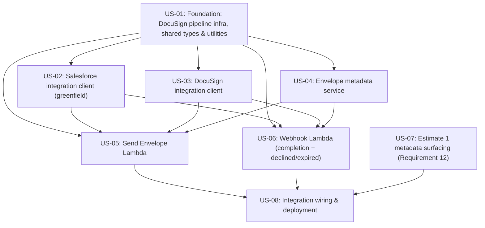

# Decomposition: contract-note-docusign-integration

This folder decomposes the parent spec into independently deliverable user stories. Each `stories/<id>/` folder is a self-contained Kiro spec a developer can copy into their own `.kiro/specs/`. `graph.yaml` holds the machine-readable dependency graph; `jira-import.csv` is ready for Jira's CSV importer.

**Status:** OK - no blocking issues

## Implementation waves

Stories in the same wave have no dependency on each other and can be built in parallel. Each wave depends only on earlier waves.

- **Wave 1:** US-01, US-07
- **Wave 2:** US-02, US-03, US-04
- **Wave 3:** US-05, US-06
- **Wave 4:** US-08

## Dependency graph

## Stories

| Story | Title | Exports | Depends on | Requirements |
|-------|-------|---------|-----------|--------------|
| US-01 | Foundation: DocuSign pipeline infra, shared types & utilities | shared-lib:docusign-types shared-lib:retry shared-lib:error-writer cdk-construct:DocuSignPipeline data-table:DocuSignEnvelopes gsi:SalesforceRefIndex s3-bucket:signed-contract-notes | - | 5, 6, 7, 8, 10, 11 |
| US-02 | Salesforce integration client (greenfield) | service:salesforce-client | shared-lib:docusign-types shared-lib:retry | 2, 8 |
| US-03 | DocuSign integration client | service:docusign-client | shared-lib:docusign-types shared-lib:retry | 3, 4, 6, 7 |
| US-04 | Envelope metadata service | service:metadata-service | shared-lib:docusign-types data-table:DocuSignEnvelopes gsi:SalesforceRefIndex | 5 |
| US-05 | Send Envelope Lambda | lambda:send-envelope | service:salesforce-client service:docusign-client service:metadata-service shared-lib:docusign-types shared-lib:error-writer | 1, 2, 3, 4, 5, 10 |
| US-06 | Webhook Lambda (completion + declined/expired) | lambda:webhook api-endpoint:POST /docusign-webhook | service:salesforce-client service:docusign-client service:metadata-service s3-bucket:signed-contract-notes shared-lib:error-writer cdk-construct:DocuSignPipeline | 6, 7, 8, 9, 10 |
| US-07 | Estimate 1 metadata surfacing (Requirement 12) | state-machine:render-metadata-passthrough | - | 12 |
| US-08 | Integration wiring & deployment | cdk-instance:deployment | lambda:send-envelope lambda:webhook api-endpoint:POST /docusign-webhook state-machine:render-metadata-passthrough | 1, 6, 11 |
