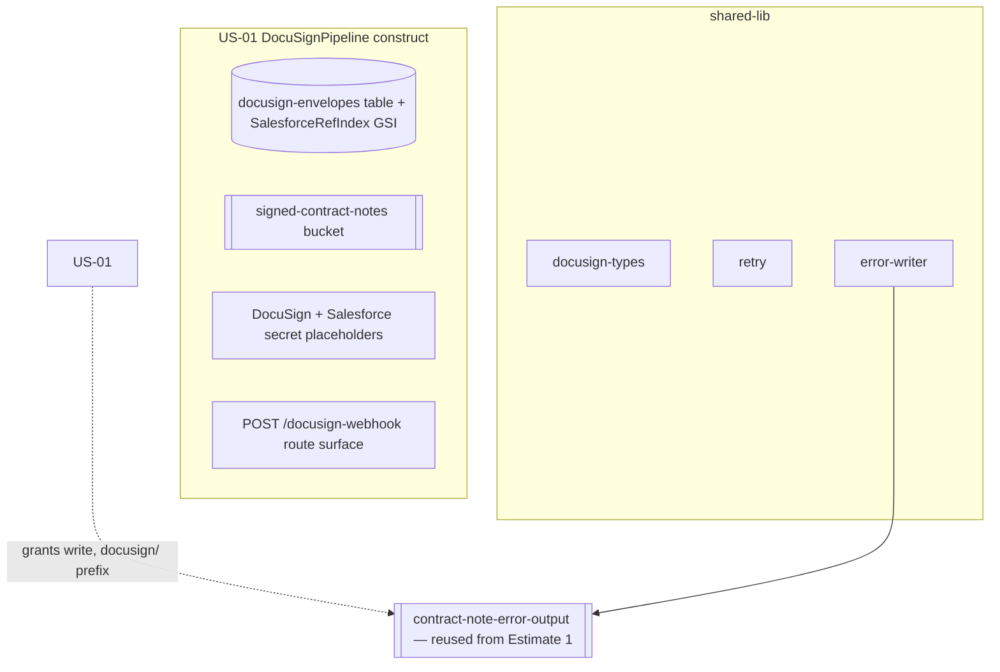

# Design Document

**Story US-01 — Foundation: DocuSign pipeline infra, shared types & utilities**

> Mini-spec derived from parent spec **contract-note-docusign-integration**, story **US-01**.
> This design is an excerpt of the parent design scoped to this story's components.

## Overview

US-01 provisions the foundation the rest of the DocuSign pipeline builds on: the
`DocuSignPipeline` CDK construct (dedicated envelope table + GSI, signed-documents
bucket, credential secret placeholders, webhook API route surface, IAM scaffolding), the
shared TypeScript types, and two utilities (retry + error-writer). It creates no runtime
behaviour of its own — it is the stable substrate for US-02..US-08.

## Architecture

The construct lives at `cdk/lib/contract-notes/docusign-pipeline.ts` and is wired into
`ContractNoteStack` alongside `RenderPipeline` (the final wiring — the `SendEnvelope`
task and route-to-Lambda binding — happens in US-08). It reuses Estimate 1's error
output bucket (passed as a prop) rather than provisioning a new one.



## Components and Interfaces

### cdk-construct:DocuSignPipeline

Provisions and exposes (via `CfnOutput` and construct properties):
- `data-table:DocuSignEnvelopes` — `{resourcePrefix}docusign-envelopes`, on-demand,
  `PK`/`SK`, with the `SalesforceRefIndex` GSI.
- `s3-bucket:signed-contract-notes` — `{resourcePrefix}signed-contract-notes`.
- DocuSign + Salesforce Secrets Manager secret placeholders (Resource_Prefix-scoped).
- A `POST /docusign-webhook` API Gateway route surface (publicly accessible).
- Accepts Estimate 1's `errorOutputBucket` as a prop and grants scoped write (`docusign/`
  prefix); does not create a new error bucket.
- IAM scaffolding for least-privilege grants (finalised when handlers attach in US-08).

### shared-lib:docusign-types

Exports the interfaces in "Data Models" below from `shared-lib/src/index.ts` so both the
`api` and `cdk` workspaces consume one set.

### shared-lib:retry

`withRetry(fn, opts)` — max attempts (default 3), exponential backoff (1s/2s/4s), jitter
(±500ms). Re-throws the last error after the final attempt.

### shared-lib:error-writer

`writeErrorRecord(bucket, record)` — serialises the standard error record to
`docusign/{timestamp}-{envelopeId}.json` in the reused error bucket.

### Interfaces consumed (dependencies)

None — this is a wave-1 foundation story.

### Touch points with other stories

- **US-02 / US-03** consume `docusign-types` and `retry` (Salesforce upload, DocuSign download).
- **US-04** reads/writes `DocuSignEnvelopes` + `SalesforceRefIndex`.
- **US-05 / US-06** use `error-writer` and (US-06) the signed-docs bucket + webhook route surface.
- **US-08** wires the construct into `ContractNoteStack` and binds the webhook route + SendEnvelope task.

## Data Models

### DynamoDB Table: `{resourcePrefix}docusign-envelopes`

| Attribute | Type | Description |
|-----------|------|-------------|
| PK | String | `ENVELOPE#{envelopeId}` |
| SK | String | `METADATA` |
| envelopeId | String | DocuSign envelope ID |
| salesforceRef | String | Customer Salesforce reference |
| contractNoteS3Key | String | S3 key of the original contract note PDF |
| customerEmail | String | Email the envelope was sent to |
| customerName | String | Customer name on the envelope |
| status | String | Envelope status (sent, delivered, completed, declined, expired) |
| signedPdfS3Key | String | (optional) S3 key of signed PDF once downloaded |
| createdAt | String | ISO 8601 creation timestamp |
| updatedAt | String | ISO 8601 last-update timestamp |
| errorMessage | String | (optional) error/decline reason |

GSI `SalesforceRefIndex`: `GSI_PK` = `salesforceRef`, SK = `createdAt`.

### TypeScript interfaces (shared-lib)

```typescript
interface EnvelopeRecord {
  envelopeId: string;
  salesforceRef: string;
  contractNoteS3Key: string;
  customerEmail: string;
  customerName: string;
  status: EnvelopeStatus;
  signedPdfS3Key?: string;
  createdAt: string;
  updatedAt: string;
  errorMessage?: string;
}
type EnvelopeStatus = 'sent' | 'delivered' | 'completed' | 'declined' | 'expired';
interface ContractMetadata {
  salesforceRef: string;
  contractNoteS3Key: string;
  offerReference: string;
  customerName: string;
}
interface SalesforceContact {
  contactId: string; firstName: string; lastName: string; email: string; accountId: string;
}
interface CreateEnvelopeRequest {
  pdfBuffer: Buffer; recipientName: string; recipientEmail: string;
  documentName: string; emailSubject: string; webhookUrl: string;
}
interface DocuSignWebhookEvent { /* event, apiVersion, data.envelopeId, envelopeSummary… */ }
```

### Error record format

```json
{ "timestamp": "ISO-8601", "stage": "…", "envelopeId": "…", "salesforceRef": "…",
  "contractNoteS3Key": "…", "error": "…", "context": {} }
```

## Correctness Properties

US-01 has no natural parent correctness property (the parent's Properties 1–10 belong to
runtime behaviour owned by later stories). One story-local property continues the
parent's numbering (parent 1–10 → 11):

### Property 11: Retry attempts are bounded with increasing backoff

*For any* sequence of transient failures, the `retry` wrapper SHALL make at most the
configured number of attempts (default 3), wait with non-decreasing backoff between
attempts, and re-throw the last error if all attempts fail. **Validates: Requirements 7.3, 8.3**

## Error Handling

| Scenario | Handling |
|----------|----------|
| Retry wrapper exhausts attempts | Re-throw last error; caller writes an error record |
| Error-writer S3 put fails | Log to CloudWatch (best-effort; the write is itself the failure sink) |

## Testing Strategy

- **Unit** — construct synthesises the table + GSI, bucket, secrets, and route with
  Resource_Prefix names (CDK assertions); error-writer produces the exact record shape.
- **Property (fast-check)** — Property 11: bounded attempts + non-decreasing backoff for
  random transient-failure sequences.
