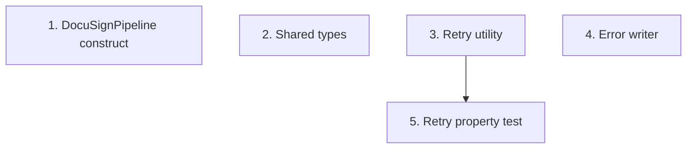

# Implementation Plan: Foundation: DocuSign pipeline infra, shared types & utilities

> Mini-spec derived from parent spec **contract-note-docusign-integration**, story **US-01**.
> This is a wave-1 story with no upstream dependencies.

## Overview

Provision the `DocuSignPipeline` CDK construct (envelope table + GSI, signed-docs bucket,
secret placeholders, webhook route surface, IAM scaffolding), define the shared
TypeScript types, and implement the retry + error-writer utilities. This substrate
unblocks every other backend story.

## Tasks

- [ ] 1. Define the `DocuSignPipeline` CDK construct
  - Create the dedicated `{resourcePrefix}docusign-envelopes` table with `PK`/`SK` and a
    `SalesforceRefIndex` GSI on `GSI_PK`
  - Create the `{resourcePrefix}signed-contract-notes` bucket
  - Accept Estimate 1's `errorOutputBucket` as a prop and grant scoped write (reuse,
    `docusign/` prefix) rather than creating a new error bucket
  - Add the API Gateway `POST /docusign-webhook` route surface (publicly accessible)
  - Create Resource_Prefix-scoped Secrets Manager secret placeholders for DocuSign and
    Salesforce credentials
  - Configure least-privilege IAM scaffolding; expose key resources via `CfnOutput`
  - _Requirements: 1, 2, 3_

- [ ] 2. Create shared TypeScript interfaces and types
  - Define `EnvelopeRecord`, `EnvelopeStatus`, `ContractMetadata`, `SalesforceContact`,
    `CreateEnvelopeRequest`, `DocuSignWebhookEvent`, and the error-record type
  - Place in `shared-lib/src/` (exported from `index.ts`) so `api` and `cdk` consume them
  - _Requirements: 6_

- [ ] 3. Implement the retry utility with exponential backoff
  - Generic wrapper: max attempts, exponential backoff (1s/2s/4s), jitter (±500ms),
    configurable per call; used by the DocuSign download and Salesforce upload
  - _Requirements: 4_

- [ ] 4. Implement the error record writer utility
  - Write JSON error records to the reused error bucket under `docusign/`
  - Standard format: timestamp, stage, envelopeId, salesforceRef, error, context
  - _Requirements: 5_

- [ ]* 5. Property test for the retry utility
  - **Property 11: Retry attempts are bounded with increasing backoff**
  - **Validates: Requirements 7.3, 8.3**

## Task Dependency Graph



Execution waves (tasks in the same wave have no dependency on each other and may run in parallel):

```json
{
  "waves": [
    { "wave": 1, "tasks": ["1", "2", "3", "4"] },
    { "wave": 2, "tasks": ["5"] }
  ]
}
```

## Upstream story dependencies

None — this is a wave-1 story.

## Notes

- Tasks marked with `*` are optional and can be deferred for a faster MVP.
- Task requirement ids are local; they annotate their parent requirement ids for
  traceability back to contract-note-docusign-integration.
- The construct is provisioned here but the `SendEnvelope` task and the webhook
  route-to-Lambda binding are wired in US-08, once the handlers exist.
