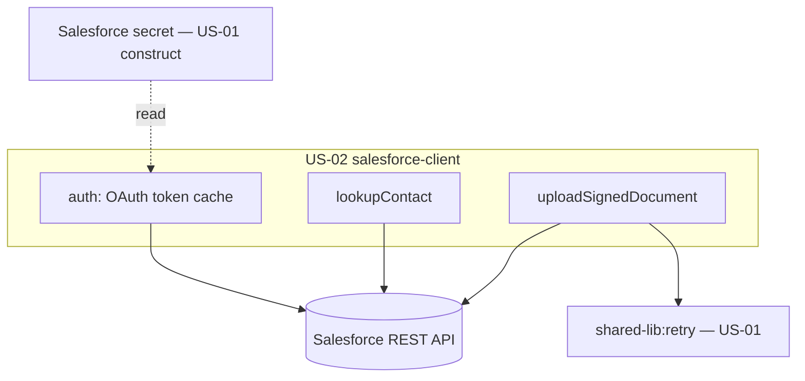

# Design Document

**Story US-02 — Salesforce integration client (greenfield)**

> Mini-spec derived from parent spec **contract-note-docusign-integration**, story **US-02**.
> This design is an excerpt of the parent design scoped to this story's components.

## Overview

US-02 implements the Salesforce client — greenfield, since no reusable Salesforce
OAuth/REST client exists in either repo. It authenticates via OAuth (client credentials),
looks up a customer contact by `customersalesforceref`, and uploads a signed PDF using
the Files API (ContentVersion + ContentDocumentLink). Lookup feeds the send flow (US-05);
upload feeds the completion flow (US-06).

## Architecture

A single client module (`api/src/docusign/salesforce-client.ts`) wrapping the Salesforce
REST API, reading credentials from Secrets Manager and caching the access token.

## Components and Interfaces

### service:salesforce-client

| Operation | Salesforce endpoint | Purpose |
|-----------|---------------------|---------|
| Auth | `POST /services/oauth2/token` | Obtain access token (client credentials) |
| Query contact | `GET /services/data/v58.0/query?q=SELECT…` | Look up customer by Salesforce_Ref |
| Create file | `POST /services/data/v58.0/sobjects/ContentVersion` | Upload signed PDF |
| Link file | `POST /services/data/v58.0/sobjects/ContentDocumentLink` | Attach file to record |

- `authenticate()` — reads `{resourcePrefix}contract-note/salesforce`, obtains + caches
  the token, refreshes before expiry.
- `lookupContact(salesforceRef): SalesforceContact` — throws on not-found, missing email,
  or network error.
- `uploadSignedDocument(salesforceRef, offerReference, pdfBuffer)` — ContentVersion +
  ContentDocumentLink, filename `Contract-Note-{offerReference}-Signed-{date}.pdf`,
  wrapped in `retry`.

### Interfaces consumed (dependencies)

- `shared-lib:docusign-types` (US-01) — `SalesforceContact`.
- `shared-lib:retry` (US-01) — exponential-backoff wrapper for the upload.

### Touch points with other stories

- **US-05 Send Envelope Lambda** calls `lookupContact` to resolve the recipient.
- **US-06 Webhook Lambda** calls `uploadSignedDocument` in the completion flow.
- The Salesforce secret is created by the **US-01** construct; this client reads it.

## Data Models

This story creates no tables. It reads the Salesforce secret and returns a
`SalesforceContact` (`contactId`, `firstName`, `lastName`, `email`, `accountId`). See
US-01 for the shared type definitions.

Salesforce credentials secret (`{resourcePrefix}contract-note/salesforce`):
`salesforceOauthKey`, `salesforceOauthSecret`, `instanceUrl`, `tokenUrl`.

## Correctness Properties

### Property 2: Salesforce lookup correctness

*For any* valid Salesforce_Ref that resolves to a customer record with an email address,
the client SHALL return that email as the contact email. **Validates: Requirements 2.2, 4.2**

### Property 3: Missing contact halts processing

*For any* Salesforce_Ref that either doesn't exist or has no email address, the client
SHALL throw (so the caller creates no envelope) and surface the Salesforce_Ref.
**Validates: Requirements 2.3, 2.4**

## Error Handling

| Scenario | Handling |
|----------|----------|
| Salesforce auth failure | Throw; caller logs to error bucket and halts |
| Record not found | Throw with Salesforce_Ref |
| Customer has no email | Throw indicating missing contact email |
| Upload transient failure | Retry (3×, exponential backoff); on final failure re-throw |

## Testing Strategy

- **Unit** — token cache/refresh, SOQL query construction, upload payload (ContentVersion
  + ContentDocumentLink), filename formatting, error mapping.
- **Property (fast-check)** — Properties 2 and 3 over random contacts with/without email.
