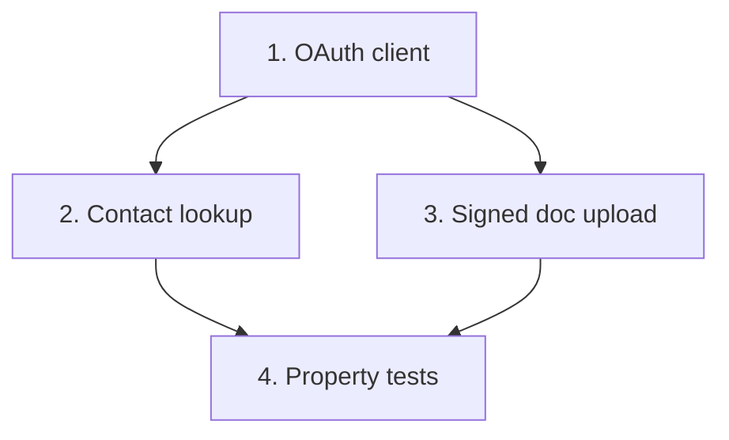

# Implementation Plan: Salesforce integration client (greenfield)

> Mini-spec derived from parent spec **contract-note-docusign-integration**, story **US-02**.
> Implement only after US-01 (foundation) — reuses the shared types and retry utility.

## Overview

Build the greenfield Salesforce client: OAuth authentication, customer contact lookup by
`customersalesforceref`, and signed-document upload (ContentVersion + ContentDocumentLink)
with retries. A wave-2 story that unblocks the send flow (US-05) and completion flow (US-06).

## Tasks

- [ ] 1. Implement the Salesforce OAuth client
  - Read credentials from Secrets Manager (`{resourcePrefix}contract-note/salesforce`)
  - Obtain and cache an access token (client credentials flow); refresh before expiry
  - _Requirements: 1_

- [ ] 2. Implement customer contact lookup
  - Query Salesforce using `customersalesforceref`; return contact name + email
  - Throw on record-not-found, no email on record, and network errors
  - _Requirements: 1_

- [ ] 3. Implement signed document upload
  - Create a ContentVersion with the signed PDF bytes; create a ContentDocumentLink to
    the customer record
  - Set filename `Contract-Note-{offerReference}-Signed-{date}.pdf`; use the retry utility
  - _Requirements: 2_

- [ ]* 4. Property tests for the Salesforce client
  - **Property 2: Salesforce lookup correctness**
  - **Property 3: Missing contact halts processing**
  - **Validates: Requirements 2.2, 2.3, 2.4**

## Task Dependency Graph



Execution waves (tasks in the same wave have no dependency on each other and may run in parallel):

```json
{
  "waves": [
    { "wave": 1, "tasks": ["1"] },
    { "wave": 2, "tasks": ["2", "3"] },
    { "wave": 3, "tasks": ["4"] }
  ]
}
```

## Upstream story dependencies

US-01 — provides `shared-lib:docusign-types` (`SalesforceContact`) and `shared-lib:retry`
(used by the upload). The Salesforce secret is provisioned by the US-01 construct.

## Notes

- Tasks marked with `*` are optional and can be deferred for a faster MVP.
- Task requirement ids are local; they annotate their parent requirement ids for
  traceability back to contract-note-docusign-integration.
- The Salesforce client is greenfield — there is no existing client to reuse; it uses the
  Files pattern (ContentVersion + ContentDocumentLink), not legacy Attachments.
