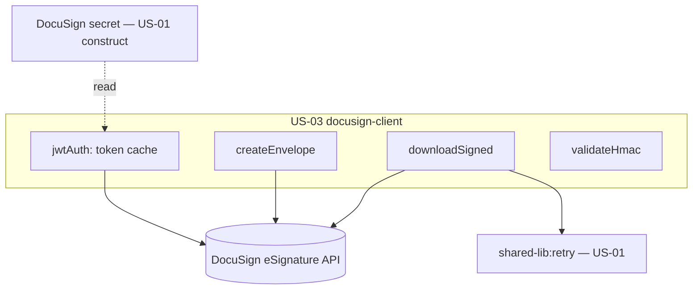

# Design Document

**Story US-03 — DocuSign integration client**

> Mini-spec derived from parent spec **contract-note-docusign-integration**, story **US-03**.
> This design is an excerpt of the parent design scoped to this story's components.

## Overview

US-03 implements the DocuSign client wrapping the eSignature REST API: JWT-grant auth
(cached token), envelope creation (document + sole signer + signing tab + per-envelope
Connect webhook, status "sent"), signed-document download, and HMAC validation of Connect
callbacks. Auth + creation feed the send flow (US-05); download + HMAC feed the webhook
flow (US-06). The `docusign-esign` npm package handles the JWT token exchange.

## Architecture

A single client module (`api/src/docusign/docusign-client.ts`) with an auth/token cache
and four capabilities.

## Components and Interfaces

### service:docusign-client

| Operation | Endpoint | Purpose |
|-----------|----------|---------|
| Auth | `POST /oauth/token` (JWT assertion) | Obtain access token |
| Create envelope | `POST /v2.1/accounts/{accountId}/envelopes` | Create + send envelope |
| Download document | `GET /v2.1/accounts/{accountId}/envelopes/{envelopeId}/documents/combined` | Download signed PDF |

- `authenticate()` — build the JWT assertion (integration key, impersonated user, scope),
  exchange for a token, cache + refresh before expiry.
- `createEnvelope(req: CreateEnvelopeRequest): string` — base64 PDF document, sole signer,
  signing tab, per-envelope `eventNotification` → webhook URL, status "sent"; returns the
  envelope ID.
- `downloadSigned(envelopeId): Buffer` — combined document, wrapped in `retry`.
- `validateHmac(payload, signatureHeader, secret): boolean` — HMAC-SHA256 over the raw body.

### Interfaces consumed (dependencies)

- `shared-lib:docusign-types` (US-01) — `CreateEnvelopeRequest`, `DocuSignWebhookEvent`.
- `shared-lib:retry` (US-01) — exponential-backoff wrapper for download.

### Touch points with other stories

- **US-05** calls `authenticate` + `createEnvelope` (recipient/name from the US-02 lookup).
- **US-06** calls `validateHmac` (webhook gate) and `downloadSigned` (completion flow).
- The DocuSign secret is created by the **US-01** construct; this client reads it.

## Data Models

This story creates no tables. It reads the DocuSign secret
(`{resourcePrefix}contract-note/docusign`: `integrationKey`, `rsaPrivateKey`,
`impersonatedUserGuid`, `accountId`, `authServer`, `hmacSecret`) and operates on the
shared `CreateEnvelopeRequest` / `DocuSignWebhookEvent` types from US-01.

## Correctness Properties

### Property 4: JWT authentication token management

*For any* sequence of API calls, the client SHALL obtain a valid access token and reuse
it within its validity period, only refreshing when expired or near-expiry.
**Validates: Requirements 3.1, 3.2, 3.4**

### Property 5: Envelope contains correct document and recipient

*For any* successfully created envelope, the envelope SHALL contain the supplied PDF as
the document and the supplied customer as the sole signer. **Validates: Requirements 4.1, 4.2, 4.3**

### Property 6: Webhook HMAC validation

*For any* incoming webhook request, `validateHmac` SHALL return true only if the HMAC
signature matches, and false otherwise. **Validates: Requirements 6.2, 6.3**

## Error Handling

| Scenario | Handling |
|----------|----------|
| DocuSign auth failure | Throw; caller logs to error bucket and halts |
| Envelope creation failure | Throw with contract note reference + Salesforce_Ref |
| Download transient failure | Retry (3×, exponential backoff); on final failure re-throw |
| Invalid HMAC | `validateHmac` returns false (caller returns HTTP 401) |

## Testing Strategy

- **Unit** — JWT assertion building, envelope-definition payload, download call, HMAC
  compute over known vectors.
- **Property (fast-check)** — Property 4 (token reuse/refresh), Property 5 (envelope
  contents), Property 6 (valid/invalid HMAC signatures).
