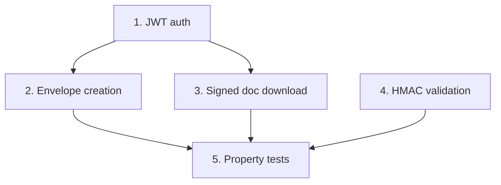

# Implementation Plan: DocuSign integration client

> Mini-spec derived from parent spec **contract-note-docusign-integration**, story **US-03**.
> Implement only after US-01 (foundation) — reuses the shared types and retry utility.

## Overview

Build the DocuSign client: JWT-grant authentication, envelope creation (document +
recipient + signing tab + per-envelope webhook, status "sent"), signed-document download,
and HMAC webhook validation. A wave-2 story that unblocks the send flow (US-05) and the
webhook flow (US-06).

## Tasks

- [ ] 1. Implement DocuSign JWT authentication
  - Read credentials from Secrets Manager (`{resourcePrefix}contract-note/docusign`)
  - Build the JWT assertion (integration key, impersonated user, scope); exchange for a token
  - Cache the token and refresh before expiry
  - _Requirements: 1_

- [ ] 2. Implement envelope creation
  - Build the envelope definition: base64 PDF document, sole signer recipient, signing tab
  - Configure the per-envelope webhook (eventNotification) → webhook endpoint
  - Set status "sent" to trigger immediate email delivery; return the envelope ID
  - _Requirements: 2_

- [ ] 3. Implement signed document download
  - Download the combined document by envelope ID; return the PDF buffer
  - Use the retry utility for transient failures
  - _Requirements: 3_

- [ ] 4. Implement HMAC webhook signature validation
  - Validate `X-DocuSign-Signature-1` against the payload using HMAC-SHA256
  - Return a valid/invalid result
  - _Requirements: 4_

- [ ]* 5. Property tests for the DocuSign client
  - **Property 4: JWT authentication token management**
  - **Property 5: Envelope contains correct document and recipient**
  - **Property 6: Webhook HMAC validation**
  - **Validates: Requirements 3.1, 3.2, 3.4, 4.1, 4.2, 4.3, 6.2, 6.3**

## Task Dependency Graph



Execution waves (tasks in the same wave have no dependency on each other and may run in parallel):

```json
{
  "waves": [
    { "wave": 1, "tasks": ["1", "4"] },
    { "wave": 2, "tasks": ["2", "3"] },
    { "wave": 3, "tasks": ["5"] }
  ]
}
```

## Upstream story dependencies

US-01 — provides `shared-lib:docusign-types` (`CreateEnvelopeRequest`,
`DocuSignWebhookEvent`) and `shared-lib:retry` (used by download). The DocuSign secret is
provisioned by the US-01 construct.

## Notes

- Tasks marked with `*` are optional and can be deferred for a faster MVP.
- Task requirement ids are local; they annotate their parent requirement ids for
  traceability back to contract-note-docusign-integration.
- The `docusign-esign` npm package handles JWT token exchange; HMAC validation is a plain
  HMAC-SHA256 over the raw request body.
