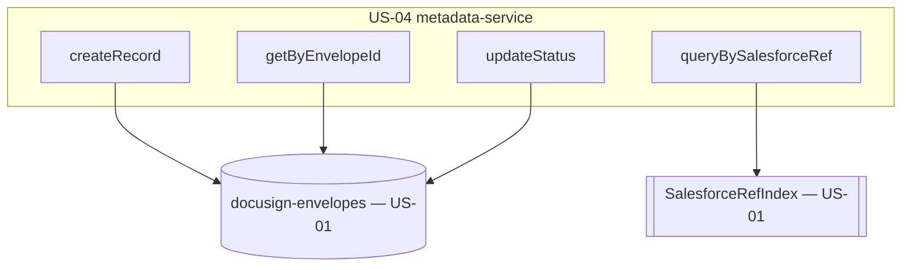

# Design Document

**Story US-04 — Envelope metadata service**

> Mini-spec derived from parent spec **contract-note-docusign-integration**, story **US-04**.
> This design is an excerpt of the parent design scoped to this story's components.

## Overview

US-04 implements the metadata service — a thin, well-tested DynamoDB access layer over the
US-01 `docusign-envelopes` table. It exposes create, get-by-envelope-id, update-status,
and query-by-salesforce-ref (GSI). The send Lambda (US-05) creates records; the webhook
Lambda (US-06) gets and updates them.

## Architecture

## Components and Interfaces

### service:metadata-service

- `createRecord(record: EnvelopeRecord)` — put with `PK = ENVELOPE#{envelopeId}`,
  `SK = METADATA`, `createdAt`/`updatedAt` set.
- `getByEnvelopeId(envelopeId): EnvelopeRecord | undefined` — get by base-table key.
- `updateStatus(envelopeId, status, patch?)` — update `status`, `updatedAt`, and optional
  fields (`signedPdfS3Key`, `errorMessage`).
- `queryBySalesforceRef(salesforceRef): EnvelopeRecord[]` — query `SalesforceRefIndex`.

### Interfaces consumed (dependencies)

- `shared-lib:docusign-types` (US-01) — `EnvelopeRecord`, `EnvelopeStatus`.
- `data-table:DocuSignEnvelopes` + `gsi:SalesforceRefIndex` (US-01) — the store.

### Touch points with other stories

- **US-05** calls `createRecord` after a successful send (and reads for idempotency by
  contract note S3 key — see note below).
- **US-06** calls `getByEnvelopeId` then `updateStatus` on each webhook event.

## Data Models

Reads/writes the `EnvelopeRecord` on the US-01 `docusign-envelopes` table (see US-01
design for the full attribute list). This story adds no new table.

Idempotency note: US-05 needs to detect an existing envelope for a contract note S3 key.
This service exposes a lookup for that check; because the base-table PK is the envelope
ID, the contract note S3 key is matched via the record attributes (a scoped query/scan or
a dedicated lookup helper), keeping the idempotency logic in US-05.

## Correctness Properties

### Property 8: Metadata record reflects current status

*For any* envelope, after applying a status update the stored record SHALL reflect the
most recent status received from DocuSign, with a monotonically newer `updatedAt`.
**Validates: Requirements 5.3**

## Error Handling

| Scenario | Handling |
|----------|----------|
| Put/update conditional failure | Surface to caller; US-05/US-06 log for reconciliation |
| Get miss (unknown envelope) | Return `undefined`; caller decides (US-06 acknowledges 200) |

## Testing Strategy

- **Unit** — create/get/update round-trips and GSI query (DynamoDB local or mock).
- **Property (fast-check)** — Property 8: after any sequence of status updates the record
  reflects the last-applied status.
