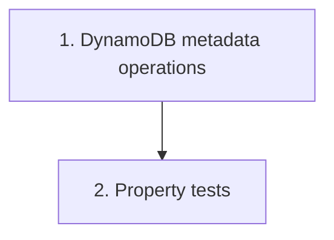

# Implementation Plan: Envelope metadata service

> Mini-spec derived from parent spec **contract-note-docusign-integration**, story **US-04**.
> Implement only after US-01 (foundation) — reuses the shared types and the table + GSI.

## Overview

Build the DynamoDB metadata access layer for envelope records: create on send, get by
envelope ID, update status on webhook events, and query by Salesforce_Ref via the GSI. A
small wave-2 story that unblocks the send flow (US-05) and the webhook flow (US-06).

## Tasks

- [ ] 1. Implement DynamoDB metadata operations
  - Create an envelope record (on successful send)
  - Get an envelope record by envelope ID (for webhook processing)
  - Update envelope status (on webhook events), setting `updatedAt`
  - Query by Salesforce_Ref (for debugging, via `SalesforceRefIndex`)
  - _Requirements: 1_

- [ ]* 2. Property tests for the metadata service
  - **Property 8: Metadata record reflects current status**
  - **Validates: Requirements 5.1, 5.2, 5.3**

## Task Dependency Graph



Execution waves (tasks in the same wave have no dependency on each other and may run in parallel):

```json
{
  "waves": [
    { "wave": 1, "tasks": ["1"] },
    { "wave": 2, "tasks": ["2"] }
  ]
}
```

## Upstream story dependencies

US-01 — provides `shared-lib:docusign-types` (`EnvelopeRecord`, `EnvelopeStatus`),
`data-table:DocuSignEnvelopes` and `gsi:SalesforceRefIndex`.

## Notes

- Tasks marked with `*` are optional and can be deferred for a faster MVP.
- Task requirement ids are local; they annotate their parent requirement ids for
  traceability back to contract-note-docusign-integration.
- The service exposes a lookup used by US-05's idempotency check (by contract note S3
  key); the idempotency decision itself lives in US-05.
