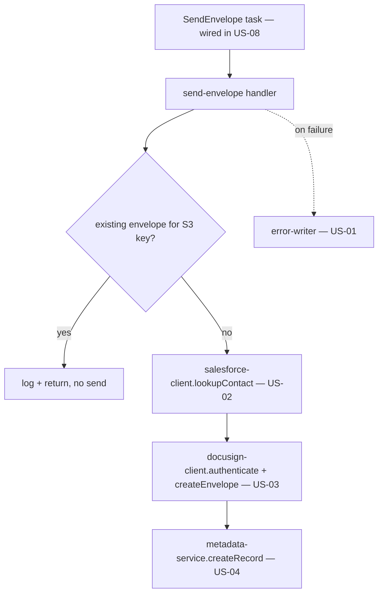

# Design Document

**Story US-05 — Send Envelope Lambda**

> Mini-spec derived from parent spec **contract-note-docusign-integration**, story **US-05**.
> This design is an excerpt of the parent design scoped to this story's components.

## Overview

US-05 implements the Send Envelope Lambda (`api/src/docusign/send-envelope.ts`), invoked
by the `SendEnvelope` state-machine task after `writeOutput`. It reads Contract_Metadata
from the state payload, validates it, performs an idempotency check by contract note S3
key, then orchestrates Salesforce lookup → DocuSign create → metadata store. It composes
the US-02/US-03/US-04 services; it holds orchestration and idempotency logic only.

## Architecture



## Components and Interfaces

### lambda:send-envelope

Input (state payload):
```
{ output: { bucket, key }, contractMetadata: { salesforceRef, offerReference, customerName } }
```
Process:
1. Read + validate Contract_Metadata; halt (log) if missing/invalid Salesforce_Ref.
2. Idempotency: skip if an envelope record already exists for this contract note S3 key.
3. `lookupContact(salesforceRef)` (US-02).
4. `authenticate()` + `createEnvelope(...)` (US-03), passing the webhook URL and PDF.
5. `createRecord(...)` (US-04) with envelope ID, Salesforce_Ref, S3 key, email, name, status "sent".

On any failure: `writeErrorRecord(...)` (US-01) + structured CloudWatch log.

### Interfaces consumed (dependencies)

- `service:salesforce-client` (US-02) — `lookupContact`.
- `service:docusign-client` (US-03) — `authenticate`, `createEnvelope`.
- `service:metadata-service` (US-04) — idempotency lookup, `createRecord`.
- `shared-lib:docusign-types` (US-01) — `ContractMetadata`, `EnvelopeRecord`.
- `shared-lib:error-writer` (US-01) — failure records.

### Touch points with other stories

- **US-07** surfaces the Contract_Metadata this handler reads (Requirement 12).
- **US-08** appends the `SendEnvelope` task and its DocuSign-specific catch (Requirement
  1.4) to the render state machine, and grants this Lambda's IAM.

## Data Models

Creates no tables. Reads the state payload (`ContractMetadata`) and writes an
`EnvelopeRecord` via US-04. The PDF is fetched from the render output location
(`output.bucket`/`output.key`) for envelope creation.

## Correctness Properties

### Property 1: Trigger-to-envelope correlation

*For any* contract note PDF with valid metadata, the handler SHALL cause exactly one
DocuSign envelope and exactly one metadata record linking the S3 key, Salesforce_Ref and
Envelope_ID — even if the task is retried (idempotency by contract note S3 key).
**Validates: Requirements 1.1, 1.5, 4.1, 5.1**

## Error Handling

| Scenario | Handling |
|----------|----------|
| Missing/invalid metadata | Log + write error record; halt (no envelope) |
| Existing envelope for S3 key | Skip creation; log and return without error |
| Salesforce lookup throws | Write error record with Salesforce_Ref; halt |
| DocuSign auth/creation throws | Write error record with contract note reference; halt |
| Metadata write failure | Log; envelope already sent, so record for manual reconciliation |
| Any of the above (task view) | Surfaced to the `SendEnvelope` task's own catch (US-08), not render `handleFailure` |

## Testing Strategy

- **Unit** — payload parsing/validation, idempotency skip path, orchestration happy path,
  error-record writes per stage.
- **Property (fast-check)** — Property 1: a single envelope + record per valid input, and
  no duplicate on a retried invocation.
