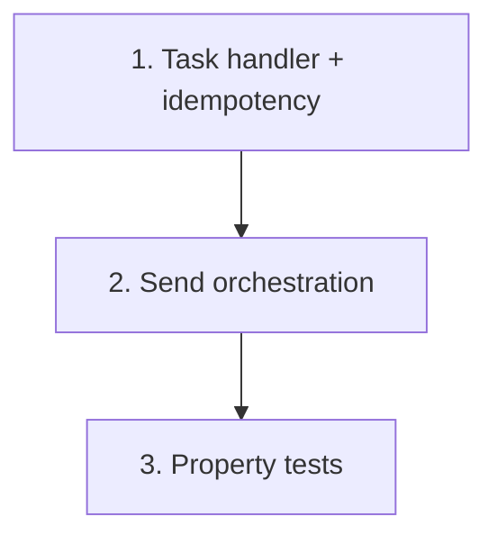

# Implementation Plan: Send Envelope Lambda

> Mini-spec derived from parent spec **contract-note-docusign-integration**, story **US-05**.
> Implement only after US-02, US-03 and US-04 (the services it composes) are complete.

## Overview

Implement the Send Envelope Lambda: parse + validate the state payload, enforce
idempotency by contract note S3 key, then orchestrate Salesforce lookup → DocuSign create
→ metadata store, writing an error record on any failure. A wave-3 story that unblocks the
integration wiring (US-08).

## Tasks

- [ ] 1. Implement the `SendEnvelope` task handler and metadata extraction
  - Read the state payload: PDF location (bucket/key) and Contract_Metadata
  - Extract `customersalesforceref`, `offerReference`, `customerName`
  - Validate required fields present; log error and halt if missing
  - Idempotency: check for an existing envelope record by contract note S3 key; skip if present
  - _Requirements: 1_

- [ ] 2. Implement the send envelope orchestration
  - Orchestrate: metadata → Salesforce lookup (US-02) → DocuSign auth + create (US-03) →
    metadata store (US-04)
  - On any failure: write an error record to the error bucket (US-01), log structured JSON
  - _Requirements: 2_

- [ ]* 3. Property tests for the send envelope flow
  - **Property 1: Trigger-to-envelope correlation**
  - **Validates: Requirements 1.1, 4.1, 5.1**

## Task Dependency Graph



Execution waves (tasks in the same wave have no dependency on each other and may run in parallel):

```json
{
  "waves": [
    { "wave": 1, "tasks": ["1"] },
    { "wave": 2, "tasks": ["2"] },
    { "wave": 3, "tasks": ["3"] }
  ]
}
```

## Upstream story dependencies

- US-02 — `service:salesforce-client` (customer lookup)
- US-03 — `service:docusign-client` (auth + envelope creation)
- US-04 — `service:metadata-service` (idempotency lookup + record create)
- US-01 — `shared-lib:docusign-types`, `shared-lib:error-writer`

## Notes

- Tasks marked with `*` are optional and can be deferred for a faster MVP.
- Task requirement ids are local; they annotate their parent requirement ids for
  traceability back to contract-note-docusign-integration.
- Idempotency (by contract note S3 key) is essential because the `SendEnvelope` task can
  be retried by the render state machine; a retry must not double-send.
- The `SendEnvelope` task and its own DocuSign-specific catch (parent Requirement 1.4) are
  wired at the state-machine level in US-08.
