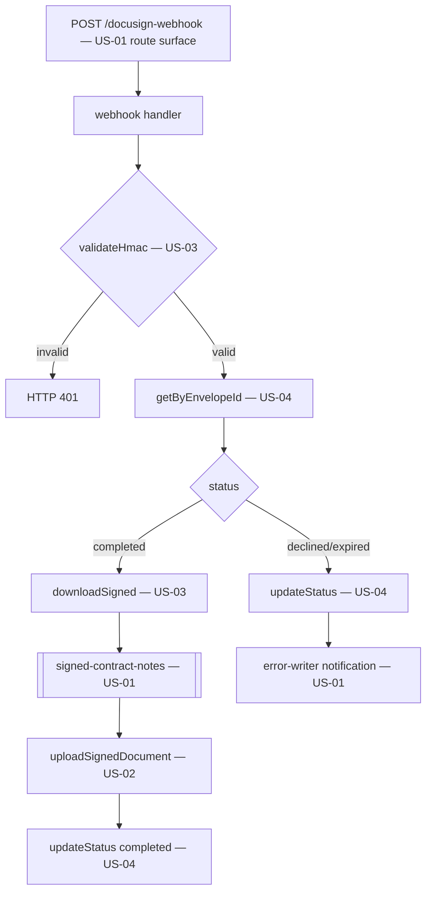

# Design Document

**Story US-06 — Webhook Lambda (completion + declined/expired)**

> Mini-spec derived from parent spec **contract-note-docusign-integration**, story **US-06**.
> This design is an excerpt of the parent design scoped to this story's components.

## Overview

US-06 implements the Webhook Lambda (`api/src/docusign/webhook.ts`) behind the
`POST /docusign-webhook` route. It validates the HMAC signature, parses the Connect event,
looks up the envelope record, and routes by status: completed → download → S3 → Salesforce
→ update; declined/expired → update + notification. It composes US-02/US-03/US-04 and uses
the US-01 signed-docs bucket and error-writer.

## Architecture

## Components and Interfaces

### lambda:webhook + api-endpoint:POST /docusign-webhook

Input: HTTP POST from DocuSign Connect. Process:
1. `validateHmac` (US-03); return 401 on failure.
2. Parse event; `getByEnvelopeId` (US-04). Unknown envelope → log warning, return 200.
3. Route by status:
   - **completed**: `downloadSigned` (US-03, retries) → put to `signed-contract-notes`
     (`{salesforceRef}/{envelopeId}/signed-contract-note.pdf`) → `uploadSignedDocument`
     (US-02, retries) → `updateStatus("completed", { signedPdfS3Key })` (US-04). On final
     retry failure → `writeErrorRecord`.
   - **declined / expired**: `updateStatus(...)` with reason → `writeErrorRecord`
     notification.
4. Return 200 to acknowledge.

### Interfaces consumed (dependencies)

- `service:docusign-client` (US-03) — `validateHmac`, `downloadSigned`.
- `service:salesforce-client` (US-02) — `uploadSignedDocument`.
- `service:metadata-service` (US-04) — `getByEnvelopeId`, `updateStatus`.
- `s3-bucket:signed-contract-notes` (US-01) — signed-document store.
- `shared-lib:error-writer` (US-01) — notifications + failures.
- `cdk-construct:DocuSignPipeline` (US-01) — the webhook route surface.

### Touch points with other stories

- **US-08** binds this handler to the API Gateway route and grants its IAM (DynamoDB, both
  buckets, secrets).
- Shares the US-02/US-03/US-04 services with the send Lambda (US-05) but has no code
  dependency on US-05.

## Data Models

Creates no tables. Reads/updates the `EnvelopeRecord` via US-04. Writes the signed PDF to
`s3://{resourcePrefix}signed-contract-notes/{salesforceRef}/{envelopeId}/signed-contract-note.pdf`
and notification/error records to `docusign/{timestamp}-{envelopeId}.json` in the reused
error bucket.

## Correctness Properties

### Property 7: Completed envelope produces signed PDF in both S3 and Salesforce

*For any* envelope reaching "completed", the handler SHALL store the signed PDF in S3 AND
attach it to the Salesforce record identified by the Salesforce_Ref. **Validates: Requirements 7.1, 7.2, 8.1, 8.2**

### Property 9: Declined/expired produces notification

*For any* envelope reaching "declined" or "expired", the handler SHALL write a
notification record to the error bucket with the envelope details and status.
**Validates: Requirements 9.1, 9.2, 9.3**

### Property 10: Failure produces no partial state

*For any* processing failure at any stage, the handler SHALL not leave the pipeline
inconsistent (e.g. signed PDF in S3 but not in Salesforce without a logged error).
**Validates: Requirements 10.1, 10.4**

## Error Handling

| Scenario | Handling |
|----------|----------|
| Invalid HMAC | Return HTTP 401; log invalid request |
| Unknown envelope ID | Log warning; return HTTP 200 (acknowledge to prevent retries) |
| Signed PDF download failure | Retry 3× exponential backoff; on final failure log to error bucket |
| Salesforce upload failure | Retry 3× exponential backoff; on final failure log to error bucket (PDF still in S3) |
| DynamoDB update failure | Log error; non-critical (PDF already stored) |

## Testing Strategy

- **Unit** — HMAC gate (401), event routing, completion flow (download→S3→SF→update),
  declined/expired notification, unknown-envelope 200.
- **Property (fast-check)** — Properties 7, 9, 10 over random valid/invalid webhook events.
