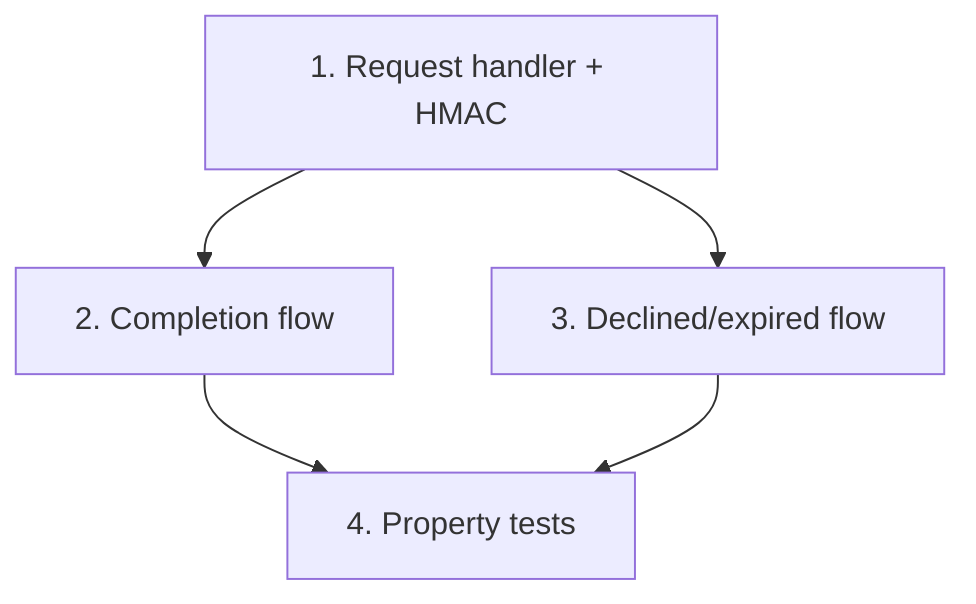

# Implementation Plan: Webhook Lambda (completion + declined/expired)

> Mini-spec derived from parent spec **contract-note-docusign-integration**, story **US-06**.
> Implement only after US-02, US-03 and US-04 (the services it composes) are complete.

## Overview

Implement the Webhook Lambda: validate HMAC, route by envelope status, and run the
completion flow (download → S3 → Salesforce → update) or the declined/expired flow (update
+ notification). A wave-3 story, parallel with the send Lambda (US-05); the route-to-Lambda
binding is finalised in US-08.

## Tasks

- [ ] 1. Implement the webhook request handler
  - Validate the HMAC signature (US-03); return 401 if invalid
  - Parse the webhook event payload; route by status; unknown envelope → 200
  - Return 200 to acknowledge receipt
  - _Requirements: 1_

- [ ] 2. Implement the completion flow
  - Look up envelope metadata by envelope ID (US-04)
  - Download the signed PDF from DocuSign (US-03, with retries)
  - Store the signed PDF in the signed-documents bucket (US-01)
  - Upload the signed PDF to Salesforce (US-02, with retries)
  - Update envelope metadata with "completed" status and signed PDF S3 key
  - On final failure: write to the error bucket
  - _Requirements: 2_

- [ ] 3. Implement the declined/expired flow
  - Look up envelope metadata by envelope ID (US-04)
  - Update metadata with declined/expired status and reason
  - Write a notification record to the error bucket
  - _Requirements: 3_

- [ ]* 4. Property tests for the webhook handler
  - **Property 7: Completed envelope produces signed PDF in both S3 and Salesforce**
  - **Property 9: Declined/expired produces notification**
  - **Property 10: Failure produces no partial state**
  - **Validates: Requirements 7.1, 7.2, 8.1, 9.1, 9.2, 9.3, 10.4**

## Task Dependency Graph



Execution waves (tasks in the same wave have no dependency on each other and may run in parallel):

```json
{
  "waves": [
    { "wave": 1, "tasks": ["1"] },
    { "wave": 2, "tasks": ["2", "3"] },
    { "wave": 3, "tasks": ["4"] }
  ]
}
```

## Upstream story dependencies

- US-03 — `service:docusign-client` (HMAC validation + signed-document download)
- US-02 — `service:salesforce-client` (signed-document upload)
- US-04 — `service:metadata-service` (get + update envelope records)
- US-01 — `s3-bucket:signed-contract-notes`, `shared-lib:error-writer`, and the webhook
  route surface (`cdk-construct:DocuSignPipeline`)

## Notes

- Tasks marked with `*` are optional and can be deferred for a faster MVP.
- Task requirement ids are local; they annotate their parent requirement ids for
  traceability back to contract-note-docusign-integration.
- The webhook endpoint must be publicly accessible for DocuSign Connect; per-envelope
  webhook config (set at envelope creation in US-03) avoids account-level DocuSign setup.
- This story shares services with US-05 but does not depend on its code.
