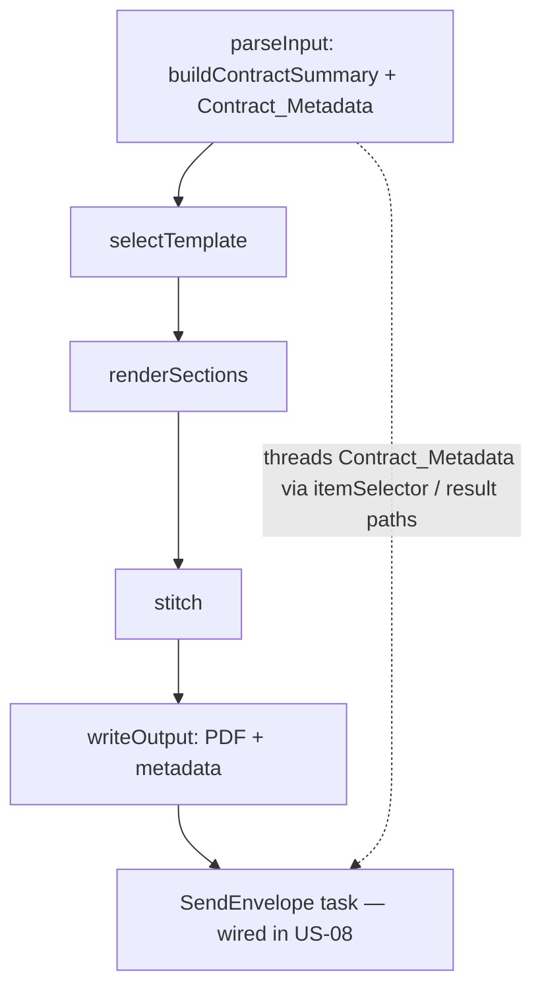

# Design Document

**Story US-07 — Estimate 1 metadata surfacing (Requirement 12)**

> Mini-spec derived from parent spec **contract-note-docusign-integration**, story **US-07**.
> This design is an excerpt of the parent design scoped to this story's components.

## Overview

US-07 is an additive change to Estimate 1's render pipeline: extract
`customersalesforceref`, offer reference, and customer name in `parse-input.ts` and thread
them through the state machine payload to `write-output.ts` and on to the `SendEnvelope`
task. It is greenfield to the DocuSign estimate but touches landed Estimate 1 code, so it
is coordinated with the Estimate 1 owner (Jabez). It has no dependency on any DocuSign
component; US-05 consumes its output and US-08 wires the `SendEnvelope` task.

## Architecture

## Components and Interfaces

### state-machine:render-metadata-passthrough

- `api/src/render/parse-input.ts` — extend `buildContractSummary` to extract
  `customersalesforceref`, `offerReference`, and `customerName` from the parsed
  `ContractData` (in addition to the existing `contractId`).
- Thread these fields through the state machine payload (`itemSelector` / result paths)
  from `parseInput` to `write-output.ts` and on to the `SendEnvelope` task, as the
  `contractMetadata` shape US-05 reads.
- When `customersalesforceref` is absent, still produce the PDF but mark the metadata so
  US-05 halts.

### Interfaces consumed (dependencies)

None — this is a wave-1 change to Estimate 1's code.

### Touch points with other stories

- **US-05** reads the resulting `contractMetadata` from the state payload.
- **US-08** appends the `SendEnvelope` task that receives this payload.
- **Coordination:** review the change against the landed render pipeline with its owner
  (Jabez); keep it additive so render behaviour is unchanged when metadata is absent.

## Data Models

Adds no tables. Extends the in-flight state payload with a `contractMetadata` object
(`salesforceRef`, `offerReference`, `customerName`, `contractNoteS3Key`) matching the
`ContractMetadata` shared type owned by US-01.

## Correctness Properties

Requirement 12 has no parent correctness property; one story-local property continues the
parent's numbering (parent 1–10 → 12; 11 is used by US-01):

### Property 12: Metadata passthrough completeness

*For any* parsed contract data containing `customersalesforceref`, the state payload
delivered to the `SendEnvelope` stage SHALL carry `salesforceRef`, `offerReference`,
`customerName` and the contract note S3 key; when it is absent, the PDF is still produced
and the metadata marks the reference absent. **Validates: Requirements 12.1, 12.3**

## Error Handling

| Scenario | Handling |
|----------|----------|
| `customersalesforceref` absent | Produce PDF; mark Contract_Metadata reference-absent (US-05 halts) |
| Missing offer reference / customer name | Carry what is present; US-05 validates required fields |

## Testing Strategy

- **Unit** — `buildContractSummary` extracts the new fields; payload threading preserves
  them through to the `writeOutput`/`SendEnvelope` stages.
- **Property (fast-check)** — Property 12: presence/absence of `customersalesforceref`
  yields the correct Contract_Metadata shape.
- **Coordination** — reviewed against the landed Estimate 1 pipeline with its owner before merge.
