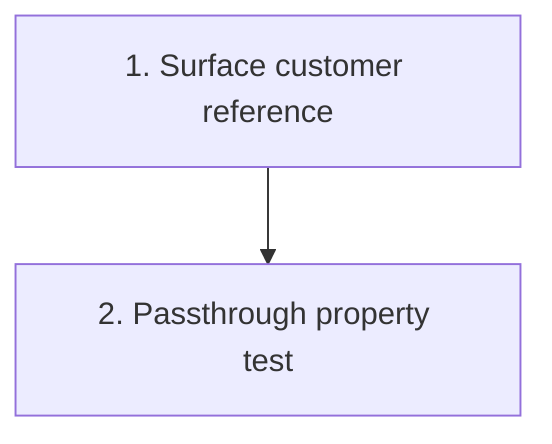

# Implementation Plan: Estimate 1 metadata surfacing (Requirement 12)

> Mini-spec derived from parent spec **contract-note-docusign-integration**, story **US-07**.
> This is a wave-1 story: a self-contained, additive change to Estimate 1's render pipeline.

## Overview

Extend Estimate 1's render pipeline to surface the customer reference and related metadata
so the DocuSign send flow knows the recipient. A wave-1 story, independent of all DocuSign
work, coordinated with the Estimate 1 pipeline owner (Jabez). Its output is consumed by
US-05 and wired into the `SendEnvelope` task by US-08.

## Tasks

- [ ] 1. Surface the customer reference from the render pipeline
  - Extend `api/src/render/parse-input.ts` `buildContractSummary` to extract
    `customersalesforceref`, `offerReference`, and `customerName` from the parsed ContractData
  - Thread those fields through the state machine payload from `parseInput` to
    `write-output.ts` and on to the `SendEnvelope` task
  - When `customersalesforceref` is absent, still produce the PDF but mark the metadata so
    US-05 halts
  - Coordinate with the Estimate 1 pipeline owner (Jabez); review against the landed render pipeline
  - _Requirements: 1_

- [ ]* 2. Property test for metadata passthrough
  - **Property 12: Metadata passthrough completeness**
  - **Validates: Requirements 12.1, 12.3**

## Task Dependency Graph



Execution waves (tasks in the same wave have no dependency on each other and may run in parallel):

```json
{
  "waves": [
    { "wave": 1, "tasks": ["1"] },
    { "wave": 2, "tasks": ["2"] }
  ]
}
```

## Upstream story dependencies

None — this is a wave-1 story (a change to Estimate 1's code, not to any DocuSign component).

## Notes

- Tasks marked with `*` are optional and can be deferred for a faster MVP.
- Task requirement ids are local; they annotate their parent requirement ids for
  traceability back to contract-note-docusign-integration.
- This is a cross-team change: it modifies landed Estimate 1 code owned by Jabez. Keep it
  additive — render behaviour must be unchanged when the reference is absent.
- Must be complete before end-to-end validation (US-08), but can proceed in parallel from
  the start.
