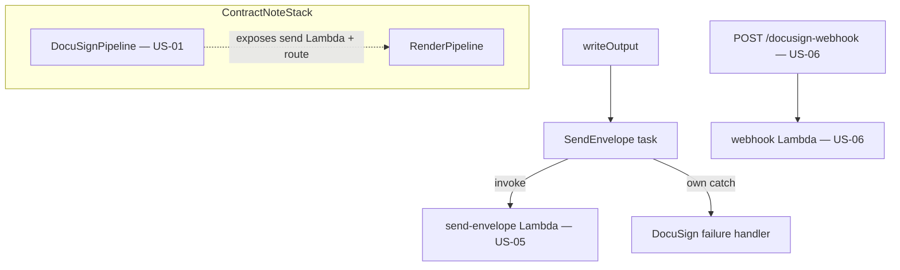

# Design Document

**Story US-08 — Integration wiring & deployment**

> Mini-spec derived from parent spec **contract-note-docusign-integration**, story **US-08**.
> This design is an excerpt of the parent design scoped to this story's components.

## Overview

US-08 is the assembly story. It wires the US-01 `DocuSignPipeline` construct into
`ContractNoteStack`, appends the `SendEnvelope` task to the render state machine after
`writeOutput` with its own DocuSign-specific catch and retry/timeout, binds the webhook
route to the US-06 Lambda, sets environment variables, and finalises least-privilege IAM.
No new runtime component is introduced — this story is the deployable wiring of the parts.

## Architecture

## Components and Interfaces

### cdk-instance:deployment

- Wire `DocuSignPipeline` into `ContractNoteStack`, passing shared resources (the reused
  error output bucket; the send Lambda exposed for the state machine).
- In `cdk/lib/contract-notes/render-pipeline.ts`, append a `SendEnvelope` `LambdaInvoke`
  task after `WriteOutput` invoking the US-05 Lambda with `{ output, contractMetadata }`.
- Give the task its **own** `addCatch(docusignFailureHandler)` (not `handleFailure`) and
  its own retry/timeout.
- Connect the `POST /docusign-webhook` route to the US-06 Lambda.
- Set env vars (table name, signed + error bucket names, webhook URL, secret ARNs) per the
  `NodejsFunction` pattern; finalise least-privilege IAM grants.

### Interfaces consumed (dependencies)

- `lambda:send-envelope` (US-05) — target of the `SendEnvelope` task.
- `lambda:webhook` + `api-endpoint:POST /docusign-webhook` (US-06) — the route binding.
- `state-machine:render-metadata-passthrough` (US-07) — supplies the `contractMetadata`
  the task forwards.

### Touch points with other stories

- Depends on US-05, US-06 and US-07 being complete.
- The `SendEnvelope` task change touches Estimate 1's render pipeline; coordinate with its
  owner (Jabez) alongside US-07, since the idempotent send (US-05) relies on this task
  being retry-safe within the state machine's 15-minute timeout.

## Data Models

Introduces no data models. It configures references to the US-01 table, buckets and
secrets, and the state payload shape produced by US-07 and consumed by US-05.

## Correctness Properties

This wiring story validates the component stories' properties end-to-end (Property 1 in
US-05, Properties 6/7/9/10 in US-03/US-06). It also introduces one story-local property
continuing the parent's numbering (parent 1–10 → 13; 11 is used by US-01, 12 by US-07):

### Property 13: SendEnvelope failure isolation

*For any* failure of the `SendEnvelope` task, the render execution SHALL still complete
successfully and the produced PDF SHALL be retained (the failure is routed to the task's
own DocuSign-specific catch, not the render `handleFailure`). **Validates: Requirements 1.4**

## Error Handling

| Scenario | Handling |
|----------|----------|
| `SendEnvelope` task failure | Routed to the task's own DocuSign failure handler; render execution stays successful, PDF retained |
| `SendEnvelope` retried by the state machine | Safe — US-05 is idempotent by contract note S3 key |
| Webhook route misconfiguration | Caught by integration tests (invalid HMAC → 401, valid → signed PDF in S3) |

## Testing Strategy

This story validates the assembled behaviour rather than introducing new correctness
properties (those live in the component stories: Property 1 in US-05, Properties 6/7/9/10
in US-03/US-06). Integration tests exercise:

- `SendEnvelope` task → DynamoDB envelope record present.
- Valid webhook POST → signed PDF in the signed-documents bucket.
- Invalid HMAC → HTTP 401.
- Declined webhook → notification record in the error bucket.
- CDK synthesis assertions: the `SendEnvelope` task has its own catch (not `handleFailure`)
  and its own retry/timeout; the webhook route is bound; IAM grants are least-privilege.
