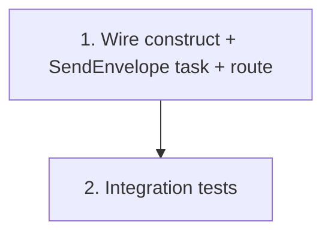

# Implementation Plan: Integration wiring & deployment

> Mini-spec derived from parent spec **contract-note-docusign-integration**, story **US-08**.
> Implement only after US-05, US-06 and US-07 are complete.

## Overview

Assemble and deploy the pipeline: wire the `DocuSignPipeline` construct into
`ContractNoteStack`, append the `SendEnvelope` task with its own DocuSign-specific catch,
bind the webhook route, set env vars, and finalise IAM. The final wave-4 story.

## Tasks

- [ ] 1. Wire the `DocuSignPipeline` construct into `ContractNoteStack`
  - Add the `SendEnvelope` `LambdaInvoke` task to the render state machine after
    `WriteOutput`, invoking the send Lambda (US-05), with its OWN catch to a DocuSign
    failure handler (not render `handleFailure`) and its own retry/timeout
  - Connect the API Gateway `POST /docusign-webhook` route to the Webhook Lambda (US-06)
  - Ensure Lambda functions have correct least-privilege IAM for DynamoDB, S3 (signed +
    reused error bucket), and Secrets Manager
  - Configure Lambda environment variables (table name, bucket names, webhook URL, secret
    ARNs) following the `NodejsFunction` environment pattern used by `RenderPipeline`
  - _Requirements: 1, 2_

- [ ]* 2. Integration tests for the full pipeline flow
  - `SendEnvelope` task → verify envelope metadata in DynamoDB
  - Valid webhook POST → verify signed PDF in S3
  - Invalid HMAC → verify 401 response
  - Declined webhook → verify notification in the error bucket
  - _Requirements: 1, 2_

## Task Dependency Graph



Execution waves (tasks in the same wave have no dependency on each other and may run in parallel):

```json
{
  "waves": [
    { "wave": 1, "tasks": ["1"] },
    { "wave": 2, "tasks": ["2"] }
  ]
}
```

## Upstream story dependencies

- US-05 — `lambda:send-envelope` (invoked by the `SendEnvelope` task)
- US-06 — `lambda:webhook` + `api-endpoint:POST /docusign-webhook` (route binding)
- US-07 — `state-machine:render-metadata-passthrough` (supplies the Contract_Metadata)

## Notes

- Tasks marked with `*` are optional and can be deferred for a faster MVP.
- Task requirement ids are local; they annotate their parent requirement ids for
  traceability back to contract-note-docusign-integration.
- The `SendEnvelope` task touches Estimate 1's render pipeline — coordinate with its owner
  (Jabez) alongside US-07. The task must be retry-safe (US-05 is idempotent) so a retry
  within the state machine's 15-minute timeout cannot double-send.
