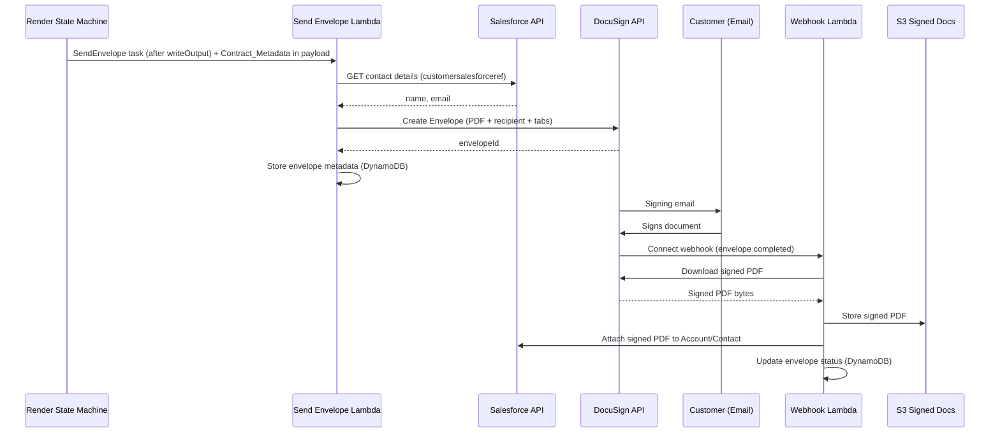

# Design Document: Contract Note DocuSign Integration

## Overview

This design covers Estimate 2 of the Bryt Energy Contract Note Rework: an automated e-signature pipeline that takes rendered contract note PDFs from Estimate 1, sends them to customers via DocuSign for signing, and stores the signed copies back in Salesforce.

### Repository and anchoring

Estimate 2 is delivered inside **`BrytBusinessServices`**, the npm-workspaces monorepo where Estimate 1's backend landed (`api` / `cdk` / `shared-lib`). It follows that repo's conventions:

- Lambda handlers live under `api/src/docusign/` and are bundled as `NodejsFunction` from TypeScript source (matching `api/src/render/`).
- Infrastructure is a new construct `cdk/lib/contract-notes/docusign-pipeline.ts`, wired into `ContractNoteStack` alongside `RenderPipeline`, receiving shared resources (the DynamoDB table if reused, and the error output bucket) as props. Because the trigger is a state machine step, the construct also exposes the send-envelope Lambda so the `RenderPipeline` can invoke it as a `SendEnvelope` task.
- All resources are named with the environment `resourcePrefix` (`dev-ci-bbs-`, `rel-uat-bbs-`, `rel-prod-bbs-`).

Two facts about the landed Estimate 1 code drive this design:

1. The render pipeline is a **Step Functions state machine**, and its output bucket does not currently emit events. **The chosen trigger is a `SendEnvelope` task appended to that state machine** after `writeOutput`, with the customer-reference metadata threaded through the state payload (see "Trigger mechanism" and "Estimate 1 changes" below).
2. There is **no existing Salesforce OAuth/REST client** to reuse in either repo; the Salesforce client here is greenfield.

The system is a headless, event-driven pipeline with no Admin Portal UI. It introduces:
1. A Send Envelope Lambda triggered by S3 events when contract note PDFs are produced
2. A Webhook Lambda receiving DocuSign Connect callbacks for envelope status changes
3. DynamoDB for envelope metadata tracking (debugging/traceability)
4. Integration with Salesforce (customer lookup + signed document attachment)
5. Integration with DocuSign (JWT auth + envelope creation + document download)

## Architecture

### High-Level System Architecture



### Key Architecture Decisions

| Decision | Choice | Rationale |
|----------|--------|-----------|
| DocuSign auth flow | JWT Grant (server-to-server) | No user interaction needed; automated pipeline; token can be cached and refreshed |
| Trigger mechanism | `SendEnvelope` task appended to the render state machine after `writeOutput` | Chosen so the metadata rides the state payload (no sidecar / S3 re-read) and the send is visible in the render execution trace. The task has its own DocuSign-specific catch so a send failure does not fail the render or lose the PDF |
| Status notification | DocuSign Connect (per-envelope webhook) | Real-time notification vs polling (which DocuSign limits to every 15 mins); per-envelope avoids global config |
| Envelope metadata | Dedicated `{resourcePrefix}docusign-envelopes` table | Signing envelopes are a separate bounded context from templates — no shared queries or transactions, so co-locating in Estimate 1's single table buys nothing. A dedicated table keeps the Salesforce-ref GSI, retention/TTL, IAM, and failure blast radius isolated, at the same on-demand cost. Follows the repo's `PK`/`SK`/`GSI_PK` key naming |
| Signed doc storage | S3 + Salesforce | S3 as durable store; Salesforce for business user access |
| Salesforce integration | OAuth client, built fresh | No reusable Salesforce OAuth/REST client exists in `BrytBusinessServices` or `BrytAdminPortal`; this is greenfield work, not a reuse |
| Error handling | Reuse Estimate 1's error output bucket (`docusign/` prefix) + structured CloudWatch logs | Consistent with Estimate 1; avoids a second error bucket; CloudWatch for real-time debugging |
| Retry logic | Exponential backoff (3 attempts) for external API calls | DocuSign and Salesforce can have transient failures; avoids losing signed documents |

### Deployment Architecture

The solution deploys as a new `DocuSignPipeline` construct in `cdk/lib/contract-notes/`, wired into `ContractNoteStack`:
- Two new Lambda functions (`api/src/docusign/send-envelope.ts`, `api/src/docusign/webhook.ts`) as `NodejsFunction`
- New API Gateway route for the webhook endpoint (publicly accessible) — either added to the existing `ContractNoteApi` REST API or a dedicated API
- New dedicated DynamoDB table `{resourcePrefix}docusign-envelopes` for envelope metadata
- New S3 bucket for signed documents (`{resourcePrefix}signed-contract-notes`)
- New Secrets Manager secrets for DocuSign and Salesforce credentials (Resource_Prefix-scoped)
- Trigger wiring: a `SendEnvelope` task added to the render state machine (in `RenderPipeline`) invoking the send-envelope Lambda, with its own catch routing to a DocuSign failure handler
- Reuse of Estimate 1's error output bucket under a `docusign/` prefix
- All resources named with the environment `resourcePrefix`, exposed via `CfnOutput` as per existing stack convention

## Components and Interfaces

### Send Envelope Lambda (`api/src/docusign/send-envelope.ts`)

Invoked by the `SendEnvelope` state machine task after `writeOutput`, receiving the render output and Contract_Metadata in the payload.

```
Input: state payload { output: { bucket, key }, contractMetadata: { salesforceRef, offerReference, customerName } }
Process:
  0. Idempotency check: skip if an envelope already exists for this contract note S3 key
  1. Read Contract_Metadata from the state payload
  2. Extract customersalesforceref
  3. Authenticate to Salesforce (OAuth, credentials from Secrets Manager)
  4. Query Salesforce for customer contact details (name, email)
  5. Authenticate to DocuSign (JWT Grant, credentials from Secrets Manager)
  6. Create envelope: attach PDF, set recipient, place signing tab, set webhook
  7. Store envelope metadata in DynamoDB
Output: Envelope created and sent; metadata stored
```

### Webhook Lambda (`api/src/docusign/webhook.ts`)

Receives DocuSign Connect callbacks via API Gateway.

```
Input: HTTP POST from DocuSign Connect
Process:
  1. Validate HMAC signature
  2. Parse envelope status event
  3. Look up envelope metadata in DynamoDB
  4. Handle by status:
     - completed: download signed PDF → store in S3 → attach to Salesforce → update metadata
     - declined: update metadata → write notification to error bucket
     - expired: update metadata → write notification to error bucket
Output: Signed PDF in S3 + Salesforce (completed) or notification (declined/expired)
```

### External Service Integrations

#### DocuSign eSignature REST API

| Operation | Endpoint | Purpose |
|-----------|----------|---------|
| Auth | `POST /oauth/token` (via JWT assertion) | Obtain access token |
| Create envelope | `POST /v2.1/accounts/{accountId}/envelopes` | Create and send envelope with document |
| Download document | `GET /v2.1/accounts/{accountId}/envelopes/{envelopeId}/documents/combined` | Download signed PDF |

#### Salesforce REST API

| Operation | Endpoint | Purpose |
|-----------|----------|---------|
| Auth | `POST /services/oauth2/token` | Obtain access token (client credentials) |
| Query contact | `GET /services/data/v58.0/query?q=SELECT...` | Look up customer by reference |
| Create attachment | `POST /services/data/v58.0/sobjects/ContentVersion` | Upload signed PDF as file |
| Link to record | `POST /services/data/v58.0/sobjects/ContentDocumentLink` | Attach file to customer record |

### API Gateway Endpoint

| Method | Path | Handler | Description |
|--------|------|---------|-------------|
| POST | /docusign-webhook | docusign-webhook | Receives DocuSign Connect callbacks |

## Data Models

### DynamoDB Table: `{resourcePrefix}docusign-envelopes`

Estimate 2 uses a dedicated table rather than Estimate 1's single table (`{resourcePrefix}contract-note-templates`). Signing envelopes share no access patterns or transactions with templates, so a separate table keeps the Salesforce-ref GSI, retention/TTL, IAM, and failure blast radius isolated at no extra on-demand cost. Key attribute naming (`PK`, `SK`, `GSI_PK`) follows the repo convention.

| Attribute | Type | Description |
|-----------|------|-------------|
| PK | String | `ENVELOPE#{envelopeId}` |
| SK | String | `METADATA` |
| envelopeId | String | DocuSign envelope ID |
| salesforceRef | String | Customer Salesforce reference |
| contractNoteS3Key | String | S3 key of the original contract note PDF |
| customerEmail | String | Email address the envelope was sent to |
| customerName | String | Customer name on the envelope |
| status | String | Current envelope status (sent, completed, declined, expired) |
| signedPdfS3Key | String | (optional) S3 key of signed PDF once downloaded |
| createdAt | String | ISO 8601 timestamp of envelope creation |
| updatedAt | String | ISO 8601 timestamp of last status update |
| errorMessage | String | (optional) Error/decline reason |

#### GSI: SalesforceRefIndex

| Key | Attribute |
|-----|-----------|
| GSI_PK | `salesforceRef` |
| GSI SK | `createdAt` |

Enables: Query all envelopes for a given customer (for debugging).

### S3 Bucket Structure

#### Signed Documents Bucket

```
s3://{resourcePrefix}signed-contract-notes/
  {salesforceRef}/{envelopeId}/signed-contract-note.pdf
```

#### Error Bucket (reused from Estimate 1)

Estimate 1 provisions `{resourcePrefix}contract-note-error-output` (written by `render/handle-failure.ts`). Estimate 2 reuses it under a `docusign/` prefix rather than creating a new bucket.

```
s3://{resourcePrefix}contract-note-error-output/
  docusign/{timestamp}-{envelopeId}.json
```

Error record format:
```json
{
  "timestamp": "ISO-8601",
  "stage": "salesforce-lookup|docusign-auth|envelope-creation|webhook-validation|document-download|salesforce-upload",
  "envelopeId": "uuid (if known)",
  "salesforceRef": "string",
  "contractNoteS3Key": "string",
  "error": "error message",
  "context": {}
}
```

### Secrets Manager Structure

#### DocuSign Credentials

Secret name: `{resourcePrefix}contract-note/docusign`
```json
{
  "integrationKey": "DocuSign Integration Key (client ID)",
  "rsaPrivateKey": "RSA private key PEM string",
  "impersonatedUserGuid": "DocuSign user GUID for impersonation",
  "accountId": "DocuSign API account ID",
  "authServer": "account-d.docusign.com (sandbox) or account.docusign.com (prod)",
  "hmacSecret": "HMAC key for webhook signature validation"
}
```

#### Salesforce Credentials

Secret name: `{resourcePrefix}contract-note/salesforce` (new — no existing Salesforce secret to reuse)
```json
{
  "salesforceOauthKey": "Connected App client ID",
  "salesforceOauthSecret": "Connected App client secret",
  "instanceUrl": "https://bryt.my.salesforce.com",
  "tokenUrl": "https://login.salesforce.com/services/oauth2/token"
}
```

### TypeScript Interfaces

```typescript
// Envelope metadata record
interface EnvelopeRecord {
  envelopeId: string;
  salesforceRef: string;
  contractNoteS3Key: string;
  customerEmail: string;
  customerName: string;
  status: EnvelopeStatus;
  signedPdfS3Key?: string;
  createdAt: string;
  updatedAt: string;
  errorMessage?: string;
}

type EnvelopeStatus = 'sent' | 'delivered' | 'completed' | 'declined' | 'expired';

// Contract data metadata (extracted from S3 event/sidecar)
interface ContractMetadata {
  salesforceRef: string;
  contractNoteS3Key: string;
  offerReference: string;
  customerName: string;
}

// Salesforce customer lookup result
interface SalesforceContact {
  contactId: string;
  firstName: string;
  lastName: string;
  email: string;
  accountId: string;
}

// DocuSign envelope creation request
interface CreateEnvelopeRequest {
  pdfBuffer: Buffer;
  recipientName: string;
  recipientEmail: string;
  documentName: string;
  emailSubject: string;
  webhookUrl: string;
}

// DocuSign Connect webhook payload (simplified)
interface DocuSignWebhookEvent {
  event: string;
  apiVersion: string;
  uri: string;
  retryCount: number;
  configurationId: number;
  data: {
    accountId: string;
    envelopeId: string;
    envelopeSummary: {
      status: string;
      emailSubject: string;
      recipients: {
        signers: Array<{
          name: string;
          email: string;
          status: string;
          declinedReason?: string;
        }>;
      };
    };
  };
}
```

## Estimate 1 Changes (dependency)

This estimate requires two additive changes to the landed Estimate 1 render pipeline in `BrytBusinessServices`:

1. **Surface the customer reference (Requirement 12).** `api/src/render/parse-input.ts` currently derives only `contractId` in `buildContractSummary`. It must also extract `customersalesforceref`, the offer reference, and the customer name from the parsed `ContractData`, and these must be threaded through the state machine payload (`itemSelector` / result paths) to `api/src/render/write-output.ts` and on to the `SendEnvelope` task.

2. **Append the `SendEnvelope` task.** In `cdk/lib/contract-notes/render-pipeline.ts`, add a `SendEnvelope` `LambdaInvoke` task after `WriteOutput`, invoking the send-envelope Lambda (exposed by the `DocuSignPipeline` construct) with the render output and Contract_Metadata in the payload. Unlike the render steps — which `addCatch(handleFailure)` — this task gets its **own catch** routing to a DocuSign-specific failure handler, so a DocuSign/Salesforce outage does not fail the render execution or discard the already-written PDF. Give the task its own retry/timeout so it does not consume the render execution's budget.

Because the send now runs inside the render execution, note the interaction with the state machine's 15-minute timeout and its retries: the send-envelope Lambda must be idempotent (it checks for an existing envelope by contract note S3 key before creating one) so a `SendEnvelope` retry cannot double-send.

These changes are small but real, and should be planned and reviewed with whoever owns the Estimate 1 pipeline (Jabez).

## Correctness Properties

### Property 1: Trigger-to-envelope correlation

*For any* contract note PDF produced by the render pipeline with valid metadata, the `SendEnvelope` task SHALL cause exactly one DocuSign envelope to be created and exactly one metadata record to be stored linking the S3 key, Salesforce_Ref, and Envelope_ID — even if the task is retried (idempotency by contract note S3 key).

**Validates: Requirements 1.1, 1.5, 4.1, 5.1**

### Property 2: Salesforce lookup correctness

*For any* valid Salesforce_Ref that resolves to a customer record with an email address, the system SHALL use that email address as the envelope recipient.

**Validates: Requirements 2.2, 4.2**

### Property 3: Missing contact halts processing

*For any* Salesforce_Ref that either doesn't exist or has no email address, the system SHALL not create a DocuSign envelope and SHALL log an error.

**Validates: Requirements 2.3, 2.4**

### Property 4: JWT authentication token management

*For any* sequence of envelope creation requests, the system SHALL obtain a valid DocuSign access token and reuse it within its validity period, only refreshing when expired or near-expiry.

**Validates: Requirements 3.1, 3.2, 3.4**

### Property 5: Envelope contains correct document and recipient

*For any* successfully created envelope, the envelope SHALL contain the contract note PDF as the document and the Salesforce-resolved customer as the sole signer.

**Validates: Requirements 4.1, 4.2, 4.3**

### Property 6: Webhook HMAC validation

*For any* incoming webhook request, the system SHALL accept it only if the HMAC signature is valid, and reject with HTTP 401 otherwise.

**Validates: Requirements 6.2, 6.3**

### Property 7: Completed envelope produces signed PDF in both S3 and Salesforce

*For any* envelope that reaches "completed" status, the system SHALL store the signed PDF in S3 AND attach it to the Salesforce record identified by the Salesforce_Ref.

**Validates: Requirements 7.1, 7.2, 8.1, 8.2**

### Property 8: Metadata record reflects current status

*For any* envelope, the DynamoDB metadata record SHALL reflect the most recent status received from DocuSign.

**Validates: Requirements 5.3**

### Property 9: Declined/expired produces notification

*For any* envelope that reaches "declined" or "expired" status, the system SHALL write a notification record to the error bucket containing the envelope details and status.

**Validates: Requirements 9.1, 9.2, 9.3**

### Property 10: Failure produces no partial state

*For any* processing failure at any stage, the system SHALL not leave the pipeline in an inconsistent state (e.g., envelope created but no metadata record, or signed PDF in S3 but not in Salesforce without a logged error).

**Validates: Requirements 10.1, 10.4**

## Error Handling

### Send Envelope Lambda

| Scenario | Handling |
|----------|----------|
| State payload missing/invalid metadata | Log error to error bucket; halt (no envelope) |
| Envelope already exists for this S3 key (idempotency) | Skip creation; log and return without error |
| Salesforce auth failure | Log error to error bucket; halt |
| Salesforce record not found | Log error with Salesforce_Ref to error bucket; halt |
| Customer has no email | Log error with Salesforce_Ref to error bucket; halt |
| DocuSign auth failure | Log error to error bucket; halt |
| Envelope creation failure | Log error with contract note reference to error bucket; halt |
| DynamoDB write failure | Log error; attempt retry; envelope already sent so log for manual reconciliation |
| `SendEnvelope` task failure (any of the above) | Caught by the task's DocuSign-specific catch, not the render `handleFailure`; render execution stays successful and the PDF is retained |

### Webhook Lambda

| Scenario | Handling |
|----------|----------|
| Invalid HMAC signature | Return HTTP 401; log invalid request |
| Unknown envelope ID (not in DynamoDB) | Log warning; return HTTP 200 (acknowledge to prevent retries) |
| Signed PDF download failure | Retry up to 3 times with exponential backoff; if all fail, log to error bucket |
| Salesforce upload failure | Retry up to 3 times with exponential backoff; if all fail, log to error bucket (signed PDF still in S3) |
| DynamoDB update failure | Log error; non-critical (PDF already stored) |

### Retry Strategy

External API calls (DocuSign download, Salesforce upload) use:
- Max 3 attempts
- Exponential backoff: 1s, 2s, 4s
- Jitter: ±500ms
- On final failure: write to error bucket for manual investigation

## Testing Strategy

### Unit Testing

Framework: Jest

Unit tests cover:
- **Salesforce client** — auth token management, query construction, error handling
- **DocuSign client** — JWT assertion building, envelope creation payload, document download
- **HMAC validation** — valid/invalid signatures, missing headers
- **Metadata management** — DynamoDB record creation and updates
- **Error record formatting** — correct structure for error bucket writes
- **Contract metadata extraction** — parsing from S3 object metadata or sidecar

### Property-Based Testing

Library: fast-check

Key generators:
1. **Envelope metadata generator** — random valid envelope records
2. **Webhook event generator** — random valid/invalid DocuSign Connect payloads
3. **Salesforce contact generator** — random customer records with/without email
4. **Contract metadata generator** — random valid/invalid contract data

### Integration Testing

- **End-to-end send flow** — drop PDF in S3 → verify envelope metadata in DynamoDB
- **Webhook flow** — POST valid webhook → verify signed PDF in S3 and Salesforce attachment
- **Error scenarios** — invalid HMAC, missing customer, DocuSign failures

### Test Organisation

Tests live under `api/test/docusign/`, matching the repo's existing layout (`api/test/render/`, `shared-lib/test/`) and its `*.test.ts` / `*.property.test.ts` naming convention:

```
api/test/docusign/
  salesforce-client.test.ts
  docusign-client.test.ts
  metadata-service.test.ts
  contract-metadata-parser.test.ts
  hmac-validator.test.ts
  webhook-handler.test.ts
  document-downloader.test.ts
  salesforce-uploader.test.ts
  trigger-to-envelope.property.test.ts
  salesforce-lookup.property.test.ts
  webhook-validation.property.test.ts
  completion-flow.property.test.ts
  failure-handling.property.test.ts
```
