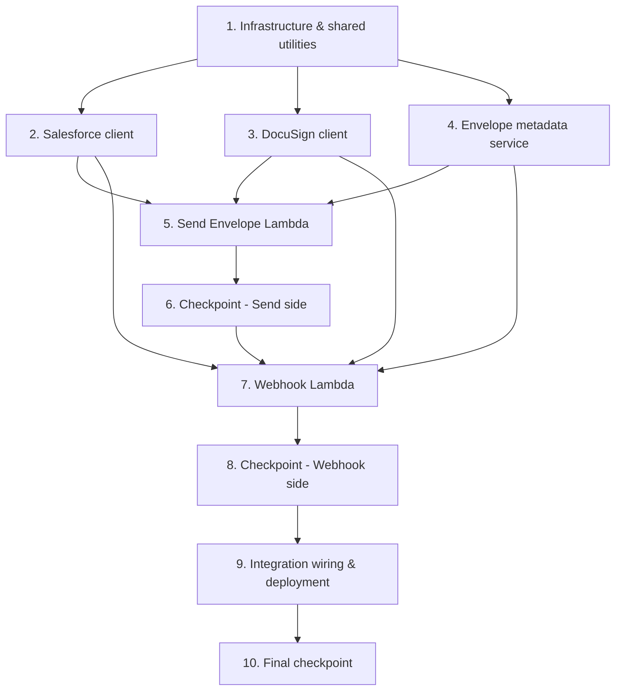

# Implementation Plan: Contract Note DocuSign Integration

## Overview

Implement an automated e-signature pipeline that takes rendered contract note PDFs from Estimate 1, sends them to customers via DocuSign, and stores signed copies in S3 and Salesforce. The implementation uses AWS Lambda (Node.js/TypeScript), API Gateway, DynamoDB, S3, Secrets Manager, and CDK for infrastructure.

**All work is delivered inside the `BrytBusinessServices` monorepo** (where Estimate 1's backend landed), following its conventions: Lambda handlers under `api/src/docusign/`, shared types in `shared-lib/`, infrastructure as a `cdk/lib/contract-notes/docusign-pipeline.ts` construct wired into `ContractNoteStack`, all resources named with the environment `resourcePrefix`, and tests as `api/test/docusign/*.test.ts` (Jest + fast-check, already used in the repo).

**Trigger mechanism (decided):** a `SendEnvelope` task is appended to the Estimate 1 render state machine after `writeOutput`, invoking the send-envelope Lambda with Contract_Metadata in the state payload. The task has its own DocuSign-specific catch (not the render `handleFailure`) so a send failure never fails the render or discards the PDF, and the Lambda is idempotent by contract note S3 key.

**Envelope metadata storage (decided):** a dedicated `{resourcePrefix}docusign-envelopes` table (not Estimate 1's single table), since signing envelopes are a separate bounded context with no shared queries — keeping the Salesforce-ref GSI, retention, IAM, and blast radius isolated at the same on-demand cost.

**Cross-team dependency:** Task 9.2 modifies Estimate 1's render pipeline (owned by Jabez) to surface the customer reference. The Salesforce client (Task 2) is greenfield — there is no existing Salesforce OAuth/REST integration to reuse.

## Tasks

- [ ] 1. Infrastructure and shared utilities
  - [ ] 1.1 Define the `DocuSignPipeline` CDK construct (`cdk/lib/contract-notes/docusign-pipeline.ts`)
    - Create the dedicated `{resourcePrefix}docusign-envelopes` table with `PK`/`SK` and a `SalesforceRefIndex` GSI on `GSI_PK`
    - Create S3 bucket `{resourcePrefix}signed-contract-notes` for signed documents
    - Accept Estimate 1's `errorOutputBucket` as a prop and grant write (reuse, `docusign/` prefix) rather than creating a new error bucket
    - Expose the send-envelope Lambda from the construct so `RenderPipeline` can invoke it as a `SendEnvelope` state machine task
    - Add API Gateway POST route `/docusign-webhook` (on the existing `ContractNoteApi` or a dedicated API) for the webhook handler
    - Create Resource_Prefix-scoped Secrets Manager secret placeholders for DocuSign and Salesforce credentials
    - Configure IAM roles with least-privilege access; expose key resources via `CfnOutput`; wire the construct into `ContractNoteStack`
    - _Requirements: 1.1, 6.1, 11.1, 11.3, 11.4, 11.5, 11.6, 11.7_

  - [ ] 1.2 Create shared TypeScript interfaces and types
    - Define `EnvelopeRecord`, `EnvelopeStatus`, `ContractMetadata`, `SalesforceContact` types
    - Define `CreateEnvelopeRequest`, `DocuSignWebhookEvent` interfaces
    - Define error record structure type
    - Place in `shared-lib/src/` (exported from `index.ts`) so `api` and `cdk` workspaces can consume them, consistent with existing shared types
    - _Requirements: 5.1, 6.4_

  - [ ] 1.3 Implement retry utility with exponential backoff
    - Generic retry wrapper: max attempts, exponential backoff (1s, 2s, 4s), jitter (±500ms)
    - Configurable per-call; used by DocuSign download and Salesforce upload
    - _Requirements: 7.3, 8.3_

  - [ ] 1.4 Implement error record writer utility
    - Write JSON error records to the error S3 bucket
    - Standard format: timestamp, stage, envelopeId, salesforceRef, error, context
    - _Requirements: 10.1_

- [ ] 2. Salesforce integration client (greenfield — no existing client to reuse)
  - [ ] 2.1 Implement Salesforce OAuth client
    - Read credentials from Secrets Manager (`{resourcePrefix}contract-note/salesforce`)
    - Obtain and cache access token using client credentials flow
    - Refresh token before expiry
    - _Requirements: 2.1_

  - [ ] 2.2 Implement customer contact lookup
    - Query Salesforce using `customersalesforceref` to find customer record
    - Return contact name and email address
    - Handle: record not found (throw), no email on record (throw), network errors (throw)
    - _Requirements: 2.2, 2.3, 2.4_

  - [ ] 2.3 Implement signed document upload to Salesforce
    - Create ContentVersion record with signed PDF bytes
    - Create ContentDocumentLink to attach to the customer record
    - Set filename: `Contract-Note-{offerReference}-Signed-{date}.pdf`
    - Use retry utility for transient failures
    - _Requirements: 8.1, 8.2, 8.3_

  - [ ]* 2.4 Write property tests for Salesforce client
    - **Property 2: Salesforce lookup correctness**
    - **Property 3: Missing contact halts processing**
    - **Validates: Requirements 2.2, 2.3, 2.4**

- [ ] 3. DocuSign integration client
  - [ ] 3.1 Implement DocuSign JWT authentication
    - Read credentials from Secrets Manager (`{resourcePrefix}contract-note/docusign`)
    - Build JWT assertion with integration key, impersonated user, scope
    - Exchange JWT for access token
    - Cache token and refresh before expiry
    - _Requirements: 3.1, 3.2, 3.3, 3.4_

  - [ ] 3.2 Implement envelope creation
    - Build envelope definition: document (base64 PDF), recipient (name, email), signing tabs
    - Configure per-envelope webhook (eventNotification) pointing to webhook endpoint
    - Set status to "sent" to trigger immediate email delivery
    - Return envelope ID
    - _Requirements: 4.1, 4.2, 4.3, 4.4, 4.5, 4.6_

  - [ ] 3.3 Implement signed document download
    - Download combined document from envelope using envelope ID
    - Return PDF buffer
    - Use retry utility for transient failures
    - _Requirements: 7.1, 7.3_

  - [ ] 3.4 Implement HMAC webhook signature validation
    - Validate X-DocuSign-Signature-1 header against payload using HMAC-SHA256
    - Return valid/invalid result
    - _Requirements: 6.2, 6.3_

  - [ ]* 3.5 Write property tests for DocuSign client
    - **Property 4: JWT authentication token management**
    - **Property 5: Envelope contains correct document and recipient**
    - **Property 6: Webhook HMAC validation**
    - **Validates: Requirements 3.1, 3.2, 3.4, 4.1, 4.2, 4.3, 6.2, 6.3**

- [ ] 4. Envelope metadata service
  - [ ] 4.1 Implement DynamoDB metadata operations
    - Create envelope record (on successful send)
    - Get envelope record by envelope ID (for webhook processing)
    - Update envelope status (on webhook events)
    - Query by Salesforce_Ref (for debugging, uses GSI)
    - _Requirements: 5.1, 5.2, 5.3_

  - [ ]* 4.2 Write property tests for metadata service
    - **Property 8: Metadata record reflects current status**
    - **Validates: Requirements 5.1, 5.2, 5.3**

- [ ] 5. Send Envelope Lambda handler
  - [ ] 5.1 Implement the `SendEnvelope` task handler and contract metadata extraction
    - Read the state payload passed by the `SendEnvelope` task: PDF location (bucket/key) and Contract_Metadata
    - Extract customersalesforceref, offerReference, customerName
    - Validate required fields present; log error and halt if missing
    - Idempotency: check for an existing envelope record by contract note S3 key and skip creation if present
    - _Requirements: 1.1, 1.2, 1.3, 1.5_

  - [ ] 5.2 Implement send envelope orchestration
    - Orchestrate the full flow: extract metadata → Salesforce lookup → DocuSign auth → create envelope → store metadata
    - On any failure: write error record to error bucket, log to CloudWatch
    - _Requirements: 1.1, 2.1, 3.1, 4.1, 5.1, 10.2_

  - [ ]* 5.3 Write property tests for send envelope flow
    - **Property 1: Trigger-to-envelope correlation**
    - **Validates: Requirements 1.1, 4.1, 5.1**

- [ ] 6. Checkpoint - Send side complete
  - Ensure all tests pass, ask the user if questions arise.

- [ ] 7. Webhook Lambda handler
  - [ ] 7.1 Implement webhook request handler
    - Validate HMAC signature; return 401 if invalid
    - Parse webhook event payload
    - Route by status: completed → completion flow, declined/expired → notification flow
    - Return 200 to acknowledge receipt
    - _Requirements: 6.1, 6.2, 6.3, 6.4_

  - [ ] 7.2 Implement completion flow
    - Look up envelope metadata by envelope ID
    - Download signed PDF from DocuSign (with retries)
    - Store signed PDF in S3 signed documents bucket
    - Upload signed PDF to Salesforce (with retries)
    - Update envelope metadata with "completed" status and signed PDF S3 key
    - On final failure: write to error bucket
    - _Requirements: 7.1, 7.2, 7.3, 8.1, 8.2, 8.3, 8.4_

  - [ ] 7.3 Implement declined/expired flow
    - Look up envelope metadata by envelope ID
    - Update metadata with declined/expired status and reason
    - Write notification record to error bucket
    - _Requirements: 9.1, 9.2, 9.3_

  - [ ]* 7.4 Write property tests for webhook handler
    - **Property 7: Completed envelope produces signed PDF in both S3 and Salesforce**
    - **Property 9: Declined/expired produces notification**
    - **Property 10: Failure produces no partial state**
    - **Validates: Requirements 7.1, 7.2, 8.1, 9.1, 9.2, 9.3, 10.4**

- [ ] 8. Checkpoint - Webhook side complete
  - Ensure all tests pass, ask the user if questions arise.

- [ ] 9. Integration wiring and deployment
  - [ ] 9.1 Wire the `DocuSignPipeline` construct into `ContractNoteStack`
    - Add the `SendEnvelope` task to the render state machine after `WriteOutput`, invoking the send-envelope Lambda, with its own catch to a DocuSign failure handler (not render `handleFailure`) and its own retry/timeout
    - Ensure API Gateway route connects to the Webhook Lambda
    - Ensure Lambda functions have correct IAM permissions for DynamoDB, S3 (signed + reused error bucket), and Secrets Manager
    - Configure Lambda environment variables (table name, bucket names, webhook URL, secret ARNs) following the `NodejsFunction` environment pattern used by `RenderPipeline`
    - _Requirements: 1.1, 6.1, 11.3, 11.6, 11.7_

  - [ ] 9.2 (Estimate 1 dependency) Surface the customer reference from the render pipeline
    - Extend `api/src/render/parse-input.ts` `buildContractSummary` to extract `customersalesforceref`, offerReference, and customerName from the parsed ContractData
    - Thread those fields through the state machine payload from `parseInput` to `write-output.ts` and on to the `SendEnvelope` task
    - Coordinate with the Estimate 1 pipeline owner (Jabez); review the change against the landed render pipeline
    - _Requirements: 12.1, 12.2, 12.3_

  - [ ]* 9.3 Write integration tests for full pipeline flow
    - Test: PDF + sidecar in output bucket → verify envelope metadata in DynamoDB
    - Test: valid webhook POST → verify signed PDF in S3
    - Test: invalid HMAC → verify 401 response
    - Test: declined webhook → verify notification in error bucket
    - _Requirements: 1.1, 6.2, 7.2, 9.3_

- [ ] 10. Final checkpoint
  - Ensure all tests pass, ask the user if questions arise.

## Task Dependency Graph



Execution waves (tasks in the same wave have no dependency on each other and may run in parallel):

```json
{
  "waves": [
    { "wave": 1, "tasks": ["1"] },
    { "wave": 2, "tasks": ["2", "3", "4"] },
    { "wave": 3, "tasks": ["5"] },
    { "wave": 4, "tasks": ["6", "7"] },
    { "wave": 5, "tasks": ["8"] },
    { "wave": 6, "tasks": ["9"] },
    { "wave": 7, "tasks": ["10"] }
  ]
}
```

Notes on ordering:
- Task 1 (the `DocuSignPipeline` CDK construct, shared types, retry + error utilities) underpins everything else.
- Tasks 2, 3, and 4 (Salesforce client, DocuSign client, metadata service) are independent and can run in parallel once task 1 lands.
- Task 5 (Send Envelope Lambda) needs the Salesforce lookup (2.2), DocuSign auth + envelope creation (3.1, 3.2), and the metadata service (4.1).
- Task 7 (Webhook Lambda) needs the DocuSign download + HMAC (3.3, 3.4), Salesforce upload (2.3), and the metadata service (4.1).
- Task 9.2 (surfacing the customer reference) is a change to Estimate 1's render pipeline and should be coordinated with its owner; it can proceed in parallel but must be complete before end-to-end validation.

## Notes

- Tasks marked with `*` are optional and can be skipped for faster MVP
- Each task references specific requirements for traceability
- All handlers live under `api/src/docusign/`; shared types in `shared-lib/src/`; infra in `cdk/lib/contract-notes/docusign-pipeline.ts` — matching the `BrytBusinessServices` layout
- The DocuSign SDK (`docusign-esign`) is available as an npm package and handles JWT token exchange
- Salesforce attachment uses ContentVersion + ContentDocumentLink pattern (Files, not legacy Attachments); the Salesforce client is built fresh (no reusable client exists)
- The webhook endpoint must be publicly accessible for DocuSign Connect to reach it
- Per-envelope webhook config avoids needing DocuSign admin account-level configuration
- Error records reuse Estimate 1's `{resourcePrefix}contract-note-error-output` bucket under a `docusign/` prefix (no new error bucket)
