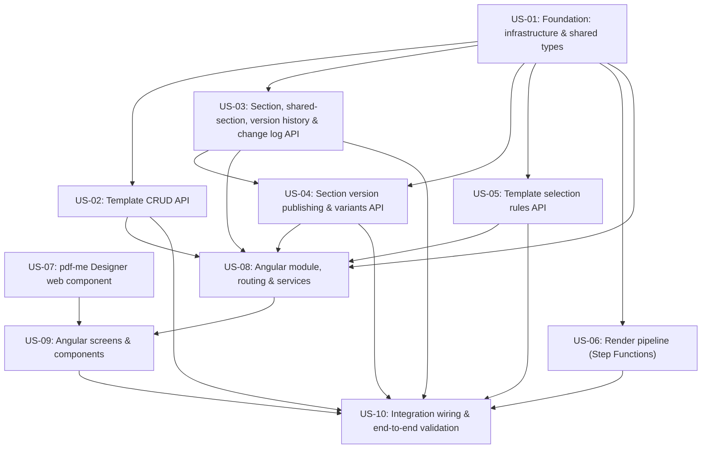

# Decomposition: contract-note-template-management

This folder decomposes the parent spec into independently deliverable user stories. Each `stories/<id>/` folder is a self-contained Kiro spec a developer can copy into their own `.kiro/specs/`. `graph.yaml` holds the machine-readable dependency graph; `jira-import.csv` is ready for Jira's CSV importer.

**Status:** OK - no blocking issues

## Implementation waves

Stories in the same wave have no dependency on each other and can be built in parallel. Each wave depends only on earlier waves.

- **Wave 1:** US-01, US-07
- **Wave 2:** US-02, US-03, US-05, US-06
- **Wave 3:** US-04
- **Wave 4:** US-08
- **Wave 5:** US-09
- **Wave 6:** US-10

## Dependency graph

## Stories

| Story | Title | Exports | Depends on | Requirements |
|-------|-------|---------|-----------|--------------|
| US-01 | Foundation: infrastructure & shared types | shared-lib:types shared-lib:spec-validation data-table:ContractNoteTemplates gsi:PriorityIndex s3-bucket:schema-json s3-bucket:error-output cdk-construct:ApiGatewayRoutes | - | 1, 5, 10, 14 |
| US-02 | Template CRUD API | api-endpoint:GET /contract-note-templates api-endpoint:POST /contract-note-templates api-endpoint:PUT /contract-note-templates/{id} api-endpoint:DELETE /contract-note-templates/{id} api-endpoint:PUT /contract-note-templates/reorder lambda:template-handlers | shared-lib:types data-table:ContractNoteTemplates gsi:PriorityIndex cdk-construct:ApiGatewayRoutes | 1, 2, 3, 4, 5 |
| US-03 | Section, shared-section, version history & change log API | api-endpoint:sections-crud api-endpoint:section-schema api-endpoint:section-versions api-endpoint:shared-sections-crud api-endpoint:template-changelog lambda:section-handlers | shared-lib:types data-table:ContractNoteTemplates s3-bucket:schema-json cdk-construct:ApiGatewayRoutes | 3, 6, 7, 8, 9, 16, 17 |
| US-04 | Section version publishing & variants API | api-endpoint:section-publish api-endpoint:section-variants-crud api-endpoint:variant-rule lambda:variant-publish-handlers | shared-lib:types shared-lib:spec-validation data-table:ContractNoteTemplates api-endpoint:section-versions | 18, 19 |
| US-05 | Template selection rules API | api-endpoint:template-rule lambda:rules-handlers | shared-lib:types shared-lib:spec-validation data-table:ContractNoteTemplates cdk-construct:ApiGatewayRoutes | 10 |
| US-06 | Render pipeline (Step Functions) | state-machine:RenderStateMachine shared-lib:spec-evaluator lambda:parse-input lambda:select-template lambda:render-section lambda:stitch lambda:write-output lambda:handle-failure s3-bucket:input-xml s3-bucket:output-pdf | shared-lib:types data-table:ContractNoteTemplates gsi:PriorityIndex s3-bucket:schema-json s3-bucket:error-output | 11, 12, 13, 14, 18, 19, 20 |
| US-07 | pdf-me Designer web component | web-component:pdfme-designer | - | 7 |
| US-08 | Angular module, routing & services | frontend-component:ContractNoteModule service:TemplateService service:SectionService service:RulesService | shared-lib:types api-endpoint:GET /contract-note-templates api-endpoint:sections-crud api-endpoint:section-versions api-endpoint:section-publish api-endpoint:section-variants-crud api-endpoint:variant-rule api-endpoint:shared-sections-crud api-endpoint:template-rule | 15 |
| US-09 | Angular screens & components | frontend-screen:TemplateList frontend-screen:TemplateEdit frontend-screen:SharedSectionsLibrary frontend-component:RulesConfigComponent frontend-component:SectionEditorComponent frontend-component:SectionVersionHistoryComponent frontend-component:SectionVariantsComponent frontend-component:SectionPublishComponent frontend-component:Navigation | frontend-component:ContractNoteModule service:TemplateService service:SectionService service:RulesService web-component:pdfme-designer | 1, 2, 3, 4, 5, 6, 7, 8, 9, 10, 16, 17, 18, 19, 21 |
| US-10 | Integration wiring & end-to-end validation | cdk-instance:deployment | lambda:template-handlers lambda:section-handlers lambda:variant-publish-handlers lambda:rules-handlers state-machine:RenderStateMachine frontend-component:Navigation | 14, 15, 20 |
