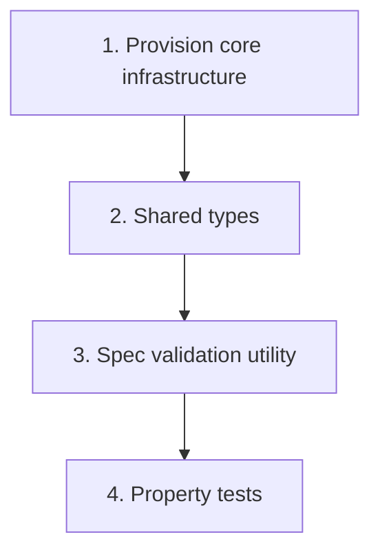

# Implementation Plan: Foundation — infrastructure & shared types

> Mini-spec derived from parent spec **contract-note-template-management**, story **US-01**.
> This is a wave-1 story with no upstream dependencies; start here.

## Overview

Provision the shared foundation for the contract-note template management feature:
the DynamoDB table + priority GSI, the S3 buckets, the API Gateway route surface, the
shared TypeScript types (including the specification tree), and the specification-tree
validator. No user-facing behaviour — this story exists so every downstream story has
a stable contract to build against.

## Tasks

- [ ] 1. Provision core infrastructure (CDK)
  - Create the `ContractNoteTemplates` DynamoDB table (PK/SK) and the `PriorityIndex`
    GSI (GSI PK = `ALL_TEMPLATES`, GSI SK = `priority`)
  - Create the S3 buckets for schema JSON and error output
  - Define the API Gateway route surface for template, section and rules endpoints
  - _Requirements: 1, 4_

- [ ] 2. Create shared TypeScript interfaces and record types
  - Define `SpecificationNode`, `AndOrNode`, `NotNode`, `ComparisonNode`, `InNode`
  - Define `Template`, `Section`, `SectionVariant`, `SharedSection`, `SectionReference`
  - Define the DynamoDB record types; place in a shared `types/` module used by the
    API lambdas, render pipeline and frontend
  - _Requirements: 2_

- [ ] 3. Implement the specification tree validation utility
  - Validate well-formedness (AND/OR operands, NOT operand, comparison field + value/values)
  - Return validation errors with node paths for incomplete nodes
  - _Requirements: 3_

- [ ]* 4. Write property tests for specification validation
  - Property 20: specification tree serialization round-trip
  - Property 21: specification validation rejects malformed trees
  - _Requirements: 2, 3_

## Task Dependency Graph



Execution waves (tasks in the same wave have no dependency on each other and may run in parallel):

```json
{
  "waves": [
    { "wave": 1, "tasks": ["1", "2"] },
    { "wave": 2, "tasks": ["3"] },
    { "wave": 3, "tasks": ["4"] }
  ]
}
```

## Upstream story dependencies

None — this is a wave-1 story. Downstream, US-02/03/04/05/06/08 all depend on it.

## Notes

- Tasks marked with `*` are optional (property tests) and can be deferred for a faster MVP.
- Each task references the local requirement numbers, which annotate their parent
  requirement ids for traceability back to `contract-note-template-management`.
- This is the first story to implement; nothing else can start until its exports exist.
