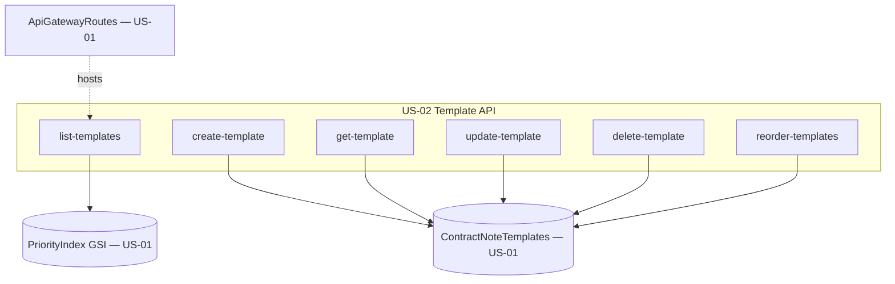

# Design Document

**Story US-02 — Template CRUD API**

> Mini-spec derived from parent spec **contract-note-template-management**, story **US-02**.
> This design is an excerpt of the parent design scoped to this story's components.

## Overview

US-02 implements the Template API — a set of Lambda handlers behind API Gateway that
own template metadata: listing in priority order, creation at lowest priority with
validation, editing, deletion with priority re-compaction, and batch reordering. The
handlers read and write the `ContractNoteTemplates` table provisioned by US-01 and
attach to the route surface it exposes.

## Architecture

This story owns the Template API layer. It sits between the frontend (US-08/09) and
the shared DynamoDB table, attaching handlers to the API Gateway routes declared by
US-01. It performs no rendering and defines no new storage.

## Components and Interfaces

### lambda:template-handlers

The handler set backing the `/contract-note-templates` routes:

| Method | Path | Handler | Description |
|--------|------|---------|-------------|
| GET | /contract-note-templates | list-templates | All templates ordered by priority (GSI query) |
| POST | /contract-note-templates | create-template | Create at lowest priority; validate name/fields |
| GET | /contract-note-templates/{id} | get-template | Template metadata; 404 if absent |
| PUT | /contract-note-templates/{id} | update-template | Update name/description |
| DELETE | /contract-note-templates/{id} | delete-template | Delete + reorder remaining |
| PUT | /contract-note-templates/reorder | reorder-templates | Batch priority update |

`create-template` computes priority as `count(existing) + 1`. `delete-template`
removes the template's `METADATA` and `SECTION#` records and re-compacts the
remaining templates' `priority` to contiguous 1..N-1. `reorder-templates` accepts an
ordered id array and writes contiguous priorities from 1.

### Interfaces consumed (dependencies)

- `shared-lib:types` (US-01) — `Template` interface + DynamoDB record types.
- `data-table:ContractNoteTemplates` (US-01) — `TEMPLATE#{id}` / `METADATA` records.
- `gsi:PriorityIndex` (US-01) — `ALL_TEMPLATES` / `priority` query for ordered listing.
- `cdk-construct:ApiGatewayRoutes` (US-01) — the routes these handlers bind to.

### Touch points with other stories

- **US-08 TemplateService** consumes all five endpoints.
- **US-03 Section API** shares the same table and writes `SECTION#` records under the
  same `TEMPLATE#{id}` partition; `delete-template` must remove those.
- **US-06 Render pipeline** reads templates in priority order via the same GSI.

## Data Models

This story creates no new tables. It reads and writes the Template record owned by
the shared table:

| Attribute | Type | Description |
|-----------|------|-------------|
| PK | String | `TEMPLATE#{templateId}` |
| SK | String | `METADATA` |
| templateId | String | UUID |
| name | String | Template display name (unique) |
| description | String | Template description |
| priority | Number | Evaluation priority (1 = highest) |
| sectionCount | Number | Denormalised count of sections |
| createdAt / updatedAt | String | ISO 8601 timestamps |
| createdBy | String | Cognito username |

Priority ordering is read via **GSI PriorityIndex** (GSI PK = `ALL_TEMPLATES`, GSI SK
= `priority`).

## Correctness Properties

These are carried from the parent spec; this story's handlers validate them.

### Property 1: Template listing returns priority-ordered results

*For any* set of templates, listing SHALL return them sorted by priority ascending.
**Validates: Requirements 1.1, 1.2**

### Property 2: Template creation round-trip

*For any* valid name and description, creating a template then fetching it by id SHALL
return the same name and description. **Validates: Requirements 2.1**

### Property 3: New templates get lowest priority

*For any* existing set of N templates, creating a new template SHALL assign it priority
N+1. **Validates: Requirements 2.2**

### Property 4: Duplicate name rejection

*For any* name that already exists, creating a template with that name SHALL fail with
a validation error. **Validates: Requirements 2.3**

### Property 5: Required field validation

*For any* create request with missing required fields, the handler SHALL return
validation errors identifying exactly the missing fields. **Validates: Requirements 2.4**

### Property 6: Template update round-trip

*For any* existing template and valid updated name/description, saving then fetching
SHALL return the new values. **Validates: Requirements 3.1, 3.2**

### Property 8: Template deletion maintains contiguous priority

*For any* set of N templates with contiguous priorities 1..N, deleting one SHALL leave
the remaining N-1 with contiguous priorities 1..N-1. **Validates: Requirements 4.2**

### Property 9: Shared sections survive template deletion

*For any* template referencing shared sections, deleting it SHALL not affect those
shared sections. **Validates: Requirements 4.3**

### Property 10: Priority reorder produces contiguous ordering

*For any* valid reorder, the resulting priorities SHALL be contiguous integers from 1
and the relative order SHALL match the request. **Validates: Requirements 5.1, 5.2**

## Error Handling

| Scenario | Handling | HTTP Status |
|----------|----------|-------------|
| Missing required fields | Field-level validation errors | 400 |
| Duplicate template name | Specific duplicate error | 409 |
| Template not found | Not found error | 404 |
| DynamoDB write failure | Log error, return 500 | 500 |

## Testing Strategy

- Property tests (fast-check) for Properties 1, 2, 3, 4, 5, 6, 8, 9, 10.
- Unit tests for priority management (create/delete/reorder) edge cases: empty list,
  single template, delete-from-middle re-compaction.
- Handler input parsing / output formatting unit tests.
