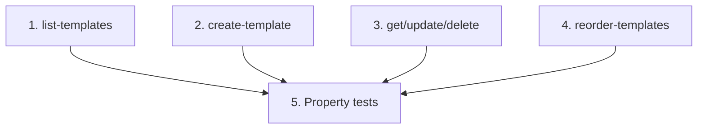

# Implementation Plan: Template CRUD API

> Mini-spec derived from parent spec **contract-note-template-management**, story **US-02**.
> Implement only after US-01 (foundation) is complete — this story attaches handlers
> to the route surface and reads/writes the table US-01 provisions.

## Overview

Implement the Template API Lambda handlers behind the `/contract-note-templates`
routes: priority-ordered listing, creation with validation and lowest-priority
assignment, get/update/delete with priority re-compaction, and batch reorder. This is
a wave-2 story that unblocks the frontend services (US-08) and shares the table read
by the render pipeline (US-06).

## Tasks

- [ ] 1. Implement `list-templates` handler
  - Query the `PriorityIndex` GSI; return all templates ordered by priority ascending
  - Include name, description, sectionCount, priority per template
  - _Requirements: 1_

- [ ] 2. Implement `create-template` handler
  - Validate required fields (name, description); 400 with field-level errors if missing
  - Check for duplicate name; 409 if it exists
  - Assign priority = count of existing templates + 1; write the record
  - _Requirements: 2_

- [ ] 3. Implement `get`/`update`/`delete-template` handlers
  - GET: fetch by `TEMPLATE#{id}` / `METADATA`; 404 if not found
  - PUT: update name and description
  - DELETE: remove the template + its `SECTION#` records, keep shared sections, and
    re-compact remaining priorities to 1..N-1
  - _Requirements: 3, 4_

- [ ] 4. Implement `reorder-templates` handler
  - Accept an ordered array of template ids; batch-update priorities to contiguous
    integers from 1
  - _Requirements: 5_

- [ ]* 5. Write property tests for template API logic
  - Property 1 (priority-ordered listing), 2 (create round-trip), 3 (lowest priority),
    4 (duplicate rejection), 5 (required-field validation), 6 (update round-trip),
    8 (delete keeps contiguous priority), 9 (shared sections survive), 10 (reorder contiguous)
  - _Requirements: 1, 2, 3, 4, 5_

## Task Dependency Graph



Execution waves (tasks in the same wave have no dependency on each other and may run in parallel):

```json
{
  "waves": [
    { "wave": 1, "tasks": ["1", "2", "3", "4"] },
    { "wave": 2, "tasks": ["5"] }
  ]
}
```

## Upstream story dependencies

US-01 — provides `shared-lib:types`, `data-table:ContractNoteTemplates`,
`gsi:PriorityIndex` and `cdk-construct:ApiGatewayRoutes`. Nothing else is required.

## Notes

- Tasks marked with `*` are optional (property tests) and can be deferred for a faster MVP.
- Task requirement ids are local; they annotate their parent requirement ids for
  traceability back to `contract-note-template-management`.
