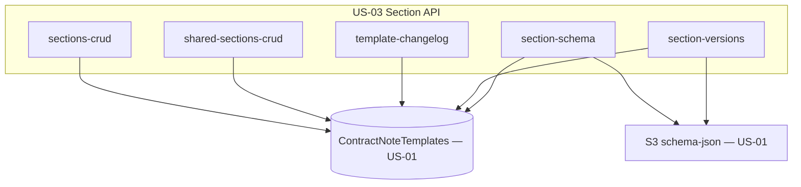

# Design Document

**Story US-03 — Section, shared-section, version history & change log API**

> Mini-spec derived from parent spec **contract-note-template-management**, story **US-03**.
> This design is an excerpt of the parent design scoped to this story's components.

## Overview

US-03 implements the Section API: handlers for composing template sections (add,
remove, reorder, T&C positioning), editing section schema JSON with versioning,
listing/getting/reverting section versions, managing shared sections and their
references, and reading a per-template change log. It reads and writes the shared
`ContractNoteTemplates` table and the `schema-json` S3 bucket from US-01.

## Architecture

This story owns the Section API layer, attached to the US-01 route surface. Section
metadata lives in the shared table; schema JSON blobs live in the `schema-json` S3
bucket; every schema save writes a new Section Version record.

## Components and Interfaces

### lambda:section-handlers

The handler set backing the section routes:

| Group | Handlers | Description |
|-------|----------|-------------|
| sections-crud | list-sections, add-section, remove-section, reorder-sections | Compose template sections; T&C stays last; shared adds create a reference |
| section-schema | get-section-schema, save-section-schema | Read/write schema JSON in S3; save creates a version |
| section-versions | list-section-versions, get-section-version, revert-section-version | Version history; revert is non-destructive |
| shared-sections-crud | list/create/update/delete-shared-section, get-shared-section-refs | Shared section lifecycle with reference protection |
| template-changelog | list-template-changelog | Chronological change log per template |

`add-section` computes `sortOrder = max + 1`; adding a shared section sets `isShared`,
`sharedSectionId` and reuses the shared `schemaS3Key`, and creates a
`SHARED_SECTION#{id}` / `REF#{templateId}` record. `save-section-schema` validates,
writes to S3, and appends a `SECTION_VERSION#{sectionId}#{variantId}` record (variant
`default` for sections without variants). `delete-shared-section` returns 409 with the
referencing templates when references exist.

### Interfaces consumed (dependencies)

- `shared-lib:types` (US-01) — `Section`, `SharedSection`, `SectionReference`, record types.
- `data-table:ContractNoteTemplates` (US-01) — section, shared-section, version,
  reference and change-log records.
- `s3-bucket:schema-json` (US-01) — schema JSON blobs at `{sectionId}/schema.json` and
  per-version keys.
- `cdk-construct:ApiGatewayRoutes` (US-01) — the routes these handlers bind to.

### Touch points with other stories

- **US-04 Publishing & variants** builds on `section-versions` (it exports
  `api-endpoint:section-versions` as a dependency) and on the section/variant records.
- **US-02 Template API** shares the table; `delete-template` removes `SECTION#` records
  this story writes; T&C and metadata edits produce change-log entries.
- **US-08/09 frontend** consume all these endpoints.

## Data Models

This story writes several record shapes on the shared table (owned collectively; this
story creates section/shared-section/version/reference/change-log rows):

| Record | PK | SK |
|--------|----|----|
| Section (template-owned) | `TEMPLATE#{templateId}` | `SECTION#{sortOrder}#{sectionId}` |
| Shared Section | `SHARED_SECTION#{sectionId}` | `METADATA` |
| Shared Section Reference | `SHARED_SECTION#{sectionId}` | `REF#{templateId}` |
| Section Version | `SECTION_VERSION#{sectionId}#{variantId}` | `VERSION#{timestamp}` |
| Template Change Log | `TEMPLATE#{templateId}` | `CHANGELOG#{timestamp}` |

Section records carry `isShared`, `sharedSectionId?`, `schemaS3Key` and
`pinnedVersionId?`. Shared sections carry `isTermsAndConditions`. Schema JSON is stored
in S3 (`s3://{schema-bucket}/{sectionId}/schema.json` plus per-version keys).

## Correctness Properties

These are carried from the parent spec; this story's handlers validate them.

### Property 7: Sections returned in sort order

*For any* template with sections, fetching its sections SHALL return them ordered by
sortOrder ascending. **Validates: Requirements 3.3**

### Property 11: Section addition appends to end

*For any* template with N sections, adding a section SHALL result in N+1 sections where
the new one has the highest sortOrder. **Validates: Requirements 6.1**

### Property 12: Section removal maintains contiguous order

*For any* template with N sections, removing one SHALL result in N-1 sections with
contiguous sortOrder. **Validates: Requirements 6.2**

### Property 13: Shared section reference (no duplication)

*For any* shared section added to a template, the section record SHALL reference it
(sharedSectionId) and reuse its schemaS3Key rather than copying. **Validates: Requirements 6.4**

### Property 14: T&C sections positioned at end

*For any* template with regular and T&C sections, all T&C sections SHALL have a
sortOrder greater than all non-T&C sections. **Validates: Requirements 6.5, 9.2**

### Property 15: Schema JSON save/load round-trip

*For any* valid schema JSON, saving it for a section then loading it SHALL return an
equivalent structure. **Validates: Requirements 7.1, 7.3**

### Property 16: Shared section visibility

*For any* section marked shared (including T&C), it SHALL appear in the shared sections
listing. **Validates: Requirements 8.1, 9.1, 9.4**

### Property 17: Shared section edit propagation

*For any* shared section referenced by multiple templates, updating its schema SHALL be
reflected when loading the schema for any referencing template's section.
**Validates: Requirements 8.2**

### Property 18: Shared section reference tracking

*For any* shared section, querying its references SHALL return exactly the templates
that include it. **Validates: Requirements 8.3**

### Property 19: Referenced shared section deletion protection

*For any* shared section referenced by one or more templates, deletion SHALL be blocked
and the response SHALL list the referencing templates. **Validates: Requirements 8.4**

### Property 28: Section save creates a new version

*For any* section save, the system SHALL create a new version record and preserve the
previous version; the version count SHALL increase by exactly 1.
**Validates: Requirements 16.1, 16.5**

### Property 29: Section version revert creates new version (not destructive)

*For any* revert to historical version V, the system SHALL create a new version N+1 with
V's content, and all intermediate versions SHALL remain accessible.
**Validates: Requirements 16.4**

### Property 30: Template change log records all modifications

*For any* template modification, the system SHALL record a change log entry with
timestamp and user. **Validates: Requirements 17.1, 17.2**

## Error Handling

| Scenario | Handling | HTTP Status |
|----------|----------|-------------|
| Invalid schema JSON format | Validation error | 400 |
| Shared section has references (on delete) | Return reference list | 409 |
| Section/template not found | Not found error | 404 |
| S3 read/write failure | Log error, return 500 | 500 |
| DynamoDB write failure | Log error, return 500 | 500 |

## Testing Strategy

- Property tests (fast-check) for Properties 7, 11, 12, 13, 14, 15, 16, 17, 18, 19, 28,
  29, 30.
- Unit tests for section ordering (add/remove/reorder sort-order management), T&C
  positioning, schema JSON validation edge cases, and reference-count computation.
- Integration tests against DynamoDB Local + localstack S3 for schema round-trips.
