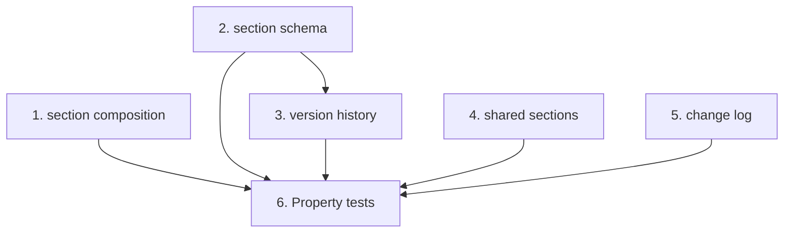

# Implementation Plan: Section, shared-section, version history & change log API

> Mini-spec derived from parent spec **contract-note-template-management**, story **US-03**.
> Implement only after US-01 (foundation) is complete — this story attaches handlers to
> the route surface and reads/writes the table and schema-json bucket US-01 provisions.

## Overview

Implement the Section API Lambda handlers: template-section composition (list/add/
remove/reorder with T&C positioning), section schema get/save (save writes a version),
section version history (list/get/revert), shared-section CRUD with reference
protection, and the per-template change log. Wave-2 story; provides the section and
version handlers that US-04 depends on and the frontend consumes.

## Tasks

- [ ] 1. Implement section composition handlers
  - list-sections (ordered by sortOrder), add-section (append; shared adds create a
    reference without duplication), remove-section (re-compact order), reorder-sections
    (persist order; keep T&C last)
  - _Requirements: 1_

- [ ] 2. Implement `get`/`save-section-schema` handlers
  - GET reads schema JSON from S3; PUT validates, writes to S3, and creates a new
    Section Version record (timestamp + user)
  - _Requirements: 2_

- [ ] 3. Implement section version history handlers
  - list-section-versions (newest first), get-section-version (returns that version's
    schema), revert-section-version (non-destructive: new version from the historical one)
  - _Requirements: 3_

- [ ] 4. Implement shared section CRUD + references
  - list/create/update/delete-shared-section (T&C designation; delete blocked with 409 +
    reference list when referenced), get-shared-section-refs
  - _Requirements: 4_

- [ ] 5. Implement the template change log
  - Write a change log entry on section add/remove/reorder and metadata/rule changes;
    list-template-changelog returns entries newest first
  - _Requirements: 5_

- [ ]* 6. Write property tests for section API logic
  - Property 7 (sort order), 11 (append), 12 (contiguous removal), 13 (shared reference),
    14 (T&C at end), 15 (schema round-trip), 16 (shared visibility), 17 (edit propagation),
    18 (reference tracking), 19 (delete protection), 28 (save creates version),
    29 (non-destructive revert), 30 (change log records modifications)
  - _Requirements: 1, 2, 3, 4, 5_

## Task Dependency Graph



Execution waves (tasks in the same wave have no dependency on each other and may run in parallel):

```json
{
  "waves": [
    { "wave": 1, "tasks": ["1", "2", "4", "5"] },
    { "wave": 2, "tasks": ["3"] },
    { "wave": 3, "tasks": ["6"] }
  ]
}
```

## Upstream story dependencies

US-01 — provides `shared-lib:types`, `data-table:ContractNoteTemplates`,
`s3-bucket:schema-json` and `cdk-construct:ApiGatewayRoutes`.

## Notes

- Tasks marked with `*` are optional (property tests) and can be deferred for a faster MVP.
- Task requirement ids are local; they annotate their parent requirement ids for
  traceability back to `contract-note-template-management`.
- `section-versions` and the section/variant records here are the base that US-04
  (publishing & variants) builds on.
