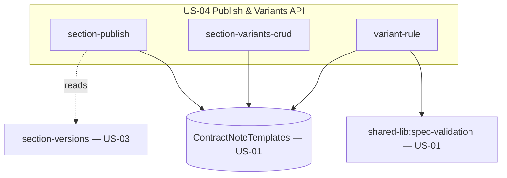

# Design Document

**Story US-04 — Section version publishing & variants API**

> Mini-spec derived from parent spec **contract-note-template-management**, story **US-04**.
> This design is an excerpt of the parent design scoped to this story's components.

## Overview

US-04 adds controlled publishing and section variants on top of the section/version
handlers from US-03. Publishing resolves the set of templates linked to a section,
reports which are behind the latest version, and pushes a chosen version to their
pinned-version references. Variants let a section hold several ordered, rule-guarded
layouts (each independently versioned) with a default fallback, reusing the shared
specification validator from US-01.

## Architecture

This story owns the publish and variant handlers. It writes variant records under
`SECTION#{sectionId}` and updates `pinnedVersionId` on shared-section reference records,
recording change-log entries per affected template. Variant rules are validated with
the US-01 spec-validation utility.

## Components and Interfaces

### lambda:variant-publish-handlers

| Group | Handlers | Description |
|-------|----------|-------------|
| section-publish | get-linked-templates, publish-section-version | List linked templates with pinned version + update-available flag; publish a chosen version to all linked templates and log a change per template |
| section-variants-crud | list/add/reorder/update/delete-section-variant | Ordered variants with at most one default; no variants = single implicit variant |
| variant-rule | get-variant-rule, save-variant-rule | Get/save a variant's specification; save validates via `spec-validation` |

`publish-section-version` defaults the chosen version to the latest and updates the
`pinnedVersionId` on each `SHARED_SECTION#{id}` / `REF#{templateId}` record. Creating a
version (in US-03) must leave pinned versions untouched — publish is the only mutation
of `pinnedVersionId`. Variant version history is keyed `{sectionId}#{variantId}` so each
variant is versioned independently.

### Interfaces consumed (dependencies)

- `shared-lib:types` (US-01) — `SectionVariant`, `SectionReference`, `SpecificationNode`.
- `shared-lib:spec-validation` (US-01) — validates variant rule trees before save.
- `data-table:ContractNoteTemplates` (US-01) — variant, version and reference records.
- `api-endpoint:section-versions` (US-03) — the version list publishing chooses from.

### Touch points with other stories

- **US-06 Render pipeline** resolves the `pinnedVersionId` this story maintains and
  evaluates the variant rules/order it persists (first-match-wins, default fallback).
- **US-03 Section API** owns the base version records; this story must not change pinned
  versions on version creation.
- **US-09 frontend** consumes publish (SectionPublishComponent) and variants
  (SectionVariantsComponent).

## Data Models

This story writes variant records and updates reference pinned versions:

| Record | PK | SK | Notes |
|--------|----|----|-------|
| Section Variant | `SECTION#{sectionId}` | `VARIANT#{variantOrder}#{variantId}` | `isDefault`, `specification?`, `schemaS3Key` |
| Shared Section Reference | `SHARED_SECTION#{sectionId}` | `REF#{templateId}` | `pinnedVersionId` updated on publish |
| Section Version | `SECTION_VERSION#{sectionId}#{variantId}` | `VERSION#{timestamp}` | per-variant history (owned with US-03) |
| Template Change Log | `TEMPLATE#{templateId}` | `CHANGELOG#{timestamp}` | one entry per affected template on publish |

A section with no Section Variant records behaves as a single implicit variant using the
section's own `schemaS3Key` (backwards compatible). The default variant carries no
`specification`.

## Correctness Properties

These are carried from the parent spec; this story's handlers validate them.

### Property 31: New section version does not change pinned versions

*For any* section referenced by templates, creating a new version SHALL leave every
linked template's pinnedVersionId unchanged until a publish. **Validates: Requirements 8.2, 18.2**

### Property 32: Publish updates all linked templates

*For any* publish of version V for a section, every template linked to that section
SHALL have pinnedVersionId = V afterwards. **Validates: Requirements 18.3, 18.4**

### Property 33: Update-available flag correctness

*For any* linked template, the update-available flag SHALL be true if and only if its
pinnedVersionId is older than the section's latest version. **Validates: Requirements 18.5**

### Property 35: Variant first-match-wins with default fallback

*For any* section with ordered variants and any contract data, selection SHALL take the
first variant whose Variant_Rule evaluates true; if none match, the designated default.
**Validates: Requirements 19.4, 19.5**

### Property 36: Section with no variants preserves single-variant behaviour

*For any* section with no variant records, rendering SHALL use the section's own schema
(implicit single variant), identical to pre-variant behaviour. **Validates: Requirements 19.8**

## Error Handling

| Scenario | Handling | HTTP Status |
|----------|----------|-------------|
| Malformed variant specification tree | Validation errors with node paths | 400 |
| Section / variant / version not found | Not found error | 404 |
| More than one default variant requested | Validation error | 400 |
| DynamoDB write failure | Log error, return 500 | 500 |

## Testing Strategy

- Property tests (fast-check) for Properties 31, 32, 33, 35, 36. (Render-time
  first-match-wins/default evaluation, Property 35, is exercised end-to-end in US-06.)
- Unit tests: publish default-to-latest logic, update-available computation, at-most-one
  default enforcement, implicit-single-variant fallback.
- Integration tests against DynamoDB Local for publish updating multiple references.
