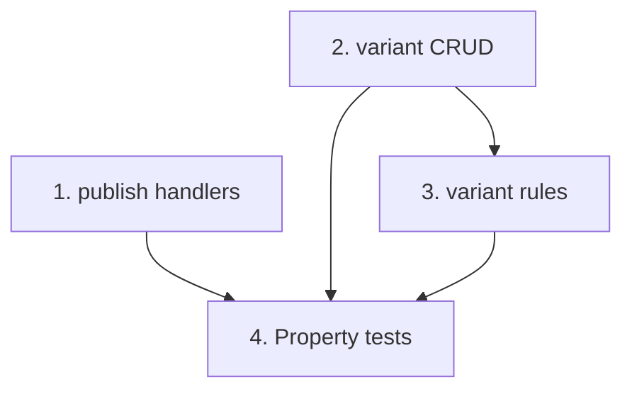

# Implementation Plan: Section version publishing & variants API

> Mini-spec derived from parent spec **contract-note-template-management**, story **US-04**.
> Implement only after US-01 (foundation) and US-03 (section-versions) are complete.

## Overview

Implement controlled section-version publishing and rule-driven section variants:
resolve the templates linked to a section (with update-available flags), publish a
chosen version to all of them, manage ordered variants with a default fallback, and
get/save variant rules reusing the shared specification validator. Wave-3 story that
unblocks the render pipeline's pinned-version resolution and variant selection (US-06).

## Tasks

- [ ] 1. Implement `get-linked-templates` + `publish-section-version` handlers
  - get-linked-templates returns linked templates with pinnedVersionId + update-available
  - publish-section-version updates pinnedVersionId on every linked template (default to
    latest) and writes a change log entry per affected template
  - Ensure creating a version does NOT change any pinnedVersionId (publish is explicit)
  - _Requirements: 1_

- [ ] 2. Implement section variant CRUD handlers
  - list/add/reorder/update/delete variants; enforce at most one default; treat a
    section with no variants as a single implicit variant; key variant history by
    `{sectionId}#{variantId}`
  - _Requirements: 2_

- [ ] 3. Implement variant rule get/save handlers
  - get-variant-rule / save-variant-rule; save validates the specification with the
    shared `spec-validation` utility (US-01)
  - _Requirements: 3_

- [ ]* 4. Write property tests for publishing and variants
  - Property 31 (version doesn't change pinned), 32 (publish updates all linked),
    33 (update-available correctness), 35 (variant first-match + default),
    36 (no-variants preserves behaviour)
  - _Requirements: 1, 2_

## Task Dependency Graph



Execution waves (tasks in the same wave have no dependency on each other and may run in parallel):

```json
{
  "waves": [
    { "wave": 1, "tasks": ["1", "2"] },
    { "wave": 2, "tasks": ["3"] },
    { "wave": 3, "tasks": ["4"] }
  ]
}
```

## Upstream story dependencies

- US-01 — `shared-lib:types`, `shared-lib:spec-validation`, `data-table:ContractNoteTemplates`.
- US-03 — `api-endpoint:section-versions` (the versions publishing chooses from).

## Notes

- Tasks marked with `*` are optional (property tests) and can be deferred for a faster MVP.
- Task requirement ids are local; they annotate their parent requirement ids for
  traceability back to `contract-note-template-management`.
- Variant selection at render time (first-match-wins + default) is implemented in US-06;
  this story persists the order, default and rules it relies on.
